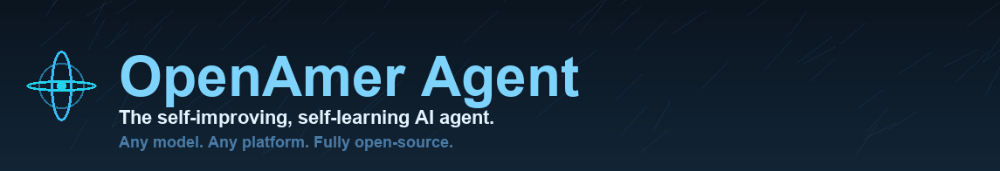

<p align="center">
  
</p>

# OpenAmer Agent
<p align="center">
  <a href="https://github.com/openamer/openamer/">OpenAmer Agent</a> | <a href="https://github.com/openamer/openamer/">OpenAmer Desktop</a>
</p>
<p align="center">
  <a href="https://github.com/openamer/openamer/blob/main/website/docs/"></a>
  <a href="https://discord.gg/openamer"></a>
  <a href="https://github.com/openamer/openamer/blob/main/LICENSE"></a>
  <a href="https://github.com/openamer/openamer/releases"></a>
  <a href="README.zh-CN.md"></a>
  <a href="README.ur-pk.md"></a>
  <a href="README.es.md"></a>
</p>

> **OpenAmer** is a self-improving, self-learning personal AI agent — a
> hardened, independently-developed fork of the
> [Hermes Agent](https://github.com/NousResearch/hermes-agent) architecture
> (MIT, by Nous Research). We say so openly: OpenAmer does not hide its
> lineage. What we build on top of it — robustness, verifiability, and a real
> learning loop — is our own. Read the [Vision](VISION.md).

## Read this in your language

<p align="center">
<a href="README.af.md"></a> <a href="README.am.md"></a> <a href="README.ar.md"></a> <a href="README.as.md"></a> <a href="README.ast.md"></a> <a href="README.ay.md"></a> <a href="README.az.md"></a> <a href="README.ba.md"></a> <a href="README.be.md"></a> <a href="README.bg.md"></a>
<br>
<a href="README.bho.md"></a> <a href="README.bm.md"></a> <a href="README.bn.md"></a> <a href="README.br.md"></a> <a href="README.bs.md"></a> <a href="README.ca.md"></a> <a href="README.ceb.md"></a> <a href="README.ckb.md"></a> <a href="README.co.md"></a> <a href="README.cs.md"></a>
<br>
<a href="README.da.md"></a> <a href="README.de.md"></a> <a href="README.dv.md"></a> <a href="README.ee.md"></a> <a href="README.el.md"></a> <a href="README.en.md"></a> <a href="README.eo.md"></a> <a href="README.es.md"></a> <a href="README.et.md"></a> <a href="README.eu.md"></a>
<br>
<a href="README.fa.md"></a> <a href="README.ff.md"></a> <a href="README.fi.md"></a> <a href="README.fj.md"></a> <a href="README.fo.md"></a> <a href="README.fr.md"></a> <a href="README.frr.md"></a> <a href="README.fy.md"></a> <a href="README.ga.md"></a> <a href="README.gd.md"></a>
<br>
<a href="README.gl.md"></a> <a href="README.gn.md"></a> <a href="README.gsw.md"></a> <a href="README.gu.md"></a> <a href="README.ha.md"></a> <a href="README.haw.md"></a> <a href="README.he.md"></a> <a href="README.hi.md"></a> <a href="README.hmn.md"></a> <a href="README.hne.md"></a>
<br>
<a href="README.hr.md"></a> <a href="README.ht.md"></a> <a href="README.hu.md"></a> <a href="README.hy.md"></a> <a href="README.id.md"></a> <a href="README.ig.md"></a> <a href="README.ilo.md"></a> <a href="README.is.md"></a> <a href="README.it.md"></a> <a href="README.ja.md"></a>
<br>
<a href="README.jv.md"></a> <a href="README.ka.md"></a> <a href="README.kk.md"></a> <a href="README.km.md"></a> <a href="README.kn.md"></a> <a href="README.ko.md"></a> <a href="README.kri.md"></a> <a href="README.ksh.md"></a> <a href="README.ku.md"></a> <a href="README.ky.md"></a>
<br>
<a href="README.la.md"></a> <a href="README.lb.md"></a> <a href="README.lg.md"></a> <a href="README.ln.md"></a> <a href="README.lo.md"></a> <a href="README.lt.md"></a> <a href="README.lv.md"></a> <a href="README.mai.md"></a> <a href="README.mg.md"></a> <a href="README.mi.md"></a>
<br>
<a href="README.mk.md"></a> <a href="README.ml.md"></a> <a href="README.mr.md"></a> <a href="README.ms.md"></a> <a href="README.mt.md"></a> <a href="README.my.md"></a> <a href="README.mzn.md"></a> <a href="README.ne.md"></a> <a href="README.nl.md"></a> <a href="README.no.md"></a>
<br>
<a href="README.nso.md"></a> <a href="README.ny.md"></a> <a href="README.om.md"></a> <a href="README.or.md"></a> <a href="README.pa.md"></a> <a href="README.pap.md"></a> <a href="README.pl.md"></a> <a href="README.ps.md"></a> <a href="README.pt.md"></a> <a href="README.qu.md"></a>
<br>
<a href="README.rm.md"></a> <a href="README.rn.md"></a> <a href="README.ro.md"></a> <a href="README.ru.md"></a> <a href="README.rw.md"></a> <a href="README.sa.md"></a> <a href="README.sco.md"></a> <a href="README.sd.md"></a> <a href="README.sg.md"></a> <a href="README.si.md"></a>
<br>
<a href="README.sk.md"></a> <a href="README.sl.md"></a> <a href="README.sm.md"></a> <a href="README.sn.md"></a> <a href="README.so.md"></a> <a href="README.sq.md"></a> <a href="README.sr.md"></a> <a href="README.st.md"></a> <a href="README.su.md"></a> <a href="README.sv.md"></a>
<br>
<a href="README.sw.md"></a> <a href="README.szl.md"></a> <a href="README.ta.md"></a> <a href="README.te.md"></a> <a href="README.tg.md"></a> <a href="README.tt.md"></a> <a href="README.ur.md"></a> <a href="README.vec.md"></a> <a href="README.vi.md"></a> <a href="README.zh.md"></a>
<br>
<a href="README.zh-hant.md"></a>
</p>

---

## What you get when you install OpenAmer
One command from GitHub gives you a **complete, standalone, private-first AI agent** — installed and working on your own machine:

| What you get | Default |
|---|---|
| **Desktop app** | built by the installer (native chat, terminal, settings) |
| **65 bundled skills** (apple, github, mlops, creative, programming …) | seeded automatically |
| **99 tools** — internet, vision, voice, terminal, browser, files, code, sub-agents | included |
| **Sub-agents & parallel delegation** | built-in (`delegate_task`) |
| **A2A swarm** — every install is an agent node (works over GitHub relay, not localhost) | included; connect via `openamer a2a` |
| **Autonomous learning** | the agent distills lessons from its own turns automatically |
| **Brain data collection** — activity, thinking & tools → local training dataset | autolog ON by default |
| **Privacy-by-default** | phone/password/email/card redacted before anything is stored |
| **System self-knowledge** | your node's OS/hardware/model go into its system prompt |

### Try it right away
```bash
openamer                      # start chatting
openamer system               # what is this node running on?
openamer security check       # your security posture
openamer a2a status           # this node's A2A identity & mesh
openamer a2a brain collect    # build a local training dataset (your first OpenAmer brain data)
openamer a2a relay post <peer> "question"   # ask another node over GitHub, not localhost
```

> **Honest note:** OpenAmer *collects* training material automatically (locally,
> privacy-scrubbed) for a future **OpenAmer brain** fine-tune. It does **not** silently
> train or upload a model: raw stays on your machine; only curated, signed, leak-free knowledge is shared.




**OpenAmer is the agent that does not break, and that provably improves with use.**

It runs on your own machine, meets you in the channels you already use, and gets
better the longer you use it. Two things set it apart:

1. **It does not break.** Self-update is hardened against the failure modes that
   leave other agents half-installed — file-locks, interrupted installs, stale
   recovery markers. The agent verifies before it claims, and reports real errors
   instead of inventing results.
2. **It provably improves with use.** Memory persists across sessions, skills are
   distilled from hard tasks and refined on reuse, and the A2A swarm shares curated,
   signed, leak-free knowledge between nodes. This is learning you can observe,
   not a marketing claim.

Use any model you want — OpenRouter, OpenAI, your own endpoint, and
[many others](https://github.com/openamer/openamer/blob/main/website/docs/integrations/providers).
Switch with `openamer model` — no code changes, no lock-in.

<table>
<tr><td><b>A real terminal interface</b></td><td>Full TUI with multiline editing, slash-command autocomplete, conversation history, interrupt-and-redirect, and streaming tool output.</td></tr>
<tr><td><b>Lives where you do</b></td><td>Telegram, Discord, Slack, WhatsApp, Signal, and CLI — all from a single gateway process. Voice memo transcription, cross-platform conversation continuity.</td></tr>
<tr><td><b>A closed learning loop</b></td><td>Agent-curated memory with periodic nudges. Autonomous skill creation after complex tasks. Skills self-improve during use. FTS5 session search with LLM summarization for cross-session recall. <a href="https://github.com/plastic-labs/honcho">Honcho</a> dialectic user modeling. Compatible with the <a href="https://agentskills.io">agentskills.io</a> open standard.</td></tr>
<tr><td><b>Scheduled automations</b></td><td>Built-in cron scheduler with delivery to any platform. Daily reports, nightly backups, weekly audits — all in natural language, running unattended.</td></tr>
<tr><td><b>Delegates and parallelizes</b></td><td>Spawn isolated subagents for parallel workstreams. Write Python scripts that call tools via RPC, collapsing multi-step pipelines into zero-context-cost turns.</td></tr>
<tr><td><b>Runs anywhere, not just your laptop</b></td><td>Six terminal backends — local, Docker, SSH, Singularity, Modal, and Daytona. Daytona and Modal offer serverless persistence — your agent's environment hibernates when idle and wakes on demand, costing nearly nothing between sessions. Run it on a $5 VPS or a GPU cluster.</td></tr>
<tr><td><b>Research-ready</b></td><td>Batch trajectory generation, trajectory compression for training the next generation of tool-calling models.</td></tr>
</table>

---

## Quick Install

### Linux, macOS, WSL2, Termux

```bash
curl -fsSL https://raw.githubusercontent.com/openamer/openamer/main/scripts/install.sh | bash
```

### Windows (native, PowerShell)

> **Heads up:** Native Windows runs OpenAmer without WSL — CLI, gateway, TUI, and tools all work natively. If you'd rather use WSL2, the Linux/macOS one-liner above works there too. Found a bug? Please [file issues](https://github.com/openamer/openamer/issues).

Run this in PowerShell:

```powershell
iex (irm https://raw.githubusercontent.com/openamer/openamer/main/scripts/install.ps1)
```

The installer handles everything: uv, Python 3.11, Node.js, ripgrep, ffmpeg, **and a portable Git Bash** (MinGit, unpacked to `%LOCALAPPDATA%\openamer\git` — no admin required, completely isolated from any system Git install). OpenAmer uses this bundled Git Bash to run shell commands.

If you already have Git installed, the installer detects it and uses that instead. Otherwise a ~45MB MinGit download is all you need — it won't touch or interfere with any system Git.

> **Android / Termux:** The tested manual path is documented in the [Termux guide](https://github.com/openamer/openamer/blob/main/website/docs/getting-started/termux). On Termux, OpenAmer installs a curated `.[termux]` extra because the full `.[all]` extra currently pulls Android-incompatible voice dependencies.
>
> **Windows:** Native Windows is fully supported — the PowerShell one-liner above installs everything. If you'd rather use WSL2, the Linux command works there too. Native Windows install lives under `%LOCALAPPDATA%\openamer`; WSL2 installs under `~/.openamer` as on Linux.

After installation:

```bash
source ~/.bashrc    # reload shell (or: source ~/.zshrc)
openamer              # start chatting!
```

### Troubleshooting

#### Windows Defender or antivirus flags `uv.exe` as malware

If your antivirus (Bitdefender, Windows Defender, etc.) quarantines `uv.exe` from the OpenAmer `bin` folder (`%LOCALAPPDATA%\openamer\bin\uv.exe`), this is a **false positive**. The file is Astral's `uv` — the Rust Python package manager OpenAmer bundles to manage its Python environment. ML-based antivirus engines commonly flag unsigned Rust binaries that download and install packages.

**To verify your copy is authentic:**

```powershell
# Install GitHub CLI if needed
winget install --id GitHub.cli

# Login to GitHub
gh auth login

# Run verification
$uv = "$env:LOCALAPPDATA\openamer\bin\uv.exe"
$ver = (& $uv --version).Split(' ')[1]
[Net.ServicePointManager]::SecurityProtocol = [Net.SecurityProtocolType]::Tls12
$zip = "$env:TEMP\uv.zip"
Invoke-WebRequest "https://github.com/astral-sh/uv/releases/download/$ver/uv-x86_64-pc-windows-msvc.zip" -OutFile $zip -UseBasicParsing
gh attestation verify $zip --repo astral-sh/uv
Expand-Archive $zip "$env:TEMP\uv_x" -Force
(Get-FileHash "$env:TEMP\uv_x\uv.exe").Hash -eq (Get-FileHash $uv).Hash
```

If attestation says "Verification succeeded" and the last line prints `True`, you're good.

**To whitelist OpenAmer:**
- **Windows Defender:** Run PowerShell as Admin → `Add-MpPreference -ExclusionPath "$env:LOCALAPPDATA\openamer\bin"`
- **Bitdefender:** Add an exception in the Bitdefender console (Protection > Antivirus > Settings > Manage Exceptions)
- Whitelist the **folder**, not the file hash — OpenAmer updates `uv` and the hash changes every version

For more context, see the upstream Astral reports: [astral-sh/uv#13553](https://github.com/astral-sh/uv/issues/13553), [astral-sh/uv#15011](https://github.com/astral-sh/uv/issues/15011), [astral-sh/uv#10079](https://github.com/astral-sh/uv/issues/10079).

### Troubleshooting: Installation fails

#### PowerShell says "Die Verbindung wurde unerwartet getrennt" / connection dropped

This is almost always a **transient GitHub rate-limit or a dropped TLS connection**, not a problem with OpenAmer itself. GitHub was throttling the raw file host for a stretch. Wait 1–2 minutes and retry:

```powershell
iex (irm https://raw.githubusercontent.com/openamer/openamer/main/scripts/install.ps1)
```

Still failing? Download the installer first and confirm it's non-empty (~190 KB) before running:

```powershell
$install = "$env:TEMP\openamer-install.ps1"
Invoke-WebRequest "https://raw.githubusercontent.com/openamer/openamer/main/scripts/install.ps1" -OutFile $install -UseBasicParsing
(Get-Item $install).Length   # expect ~190,000+ bytes
iex (Get-Content $install -Raw)
```

> **Legacy URL:** older README copies used
> `https://github.com/openamer/openamer/raw/main/scripts/install.ps1`. That form
> returns **404** and fails the install. Use the `raw.githubusercontent.com` URL above.

#### PowerShell "Could not create SSL/TLS secure channel"

Force TLS 1.2 (common on older Windows / PowerShell 5.1), then retry:

```powershell
[Net.ServicePointManager]::SecurityProtocol = [Net.SecurityProtocolType]::Tls12
iex (irm https://raw.githubusercontent.com/openamer/openamer/main/scripts/install.ps1)
```

#### Install aborts early or "Access is denied"

The installer writes under `%LOCALAPPDATA%\openamer` and extracts a portable Git Bash. If your user lacks write permission there (corporate policy, a previous partial install locked the folder, or the path was created under another account):

1. Close PowerShell.
2. Reopen PowerShell as administrator.
3. If this is a fresh attempt (no data yet), remove any half-finished install:
   `Remove-Item -Recurse -Force "$env:LOCALAPPDATA\openamer"`
4. Run the installer again.

#### Python/Node step fails mid-way

A network hiccup fetching packages. The installer is resumable: run the full command again — it continues from where it stopped. If it fails at the same package repeatedly, a proxy/firewall may be filtering registries; allow `pypi.org` and `registry.npmjs.org`.

#### Behind a proxy or strict corporate network

Set the proxy for the session before installing:

```powershell
$env:HTTP_PROXY  = "http://proxy:port"
$env:HTTPS_PROXY = "http://proxy:port"
iex (irm https://raw.githubusercontent.com/openamer/openamer/main/scripts/install.ps1)
```

#### Nothing above helped

After a successful install, run `openamer doctor` to diagnose the environment, and file an issue at https://github.com/openamer/openamer/issues with the exact error text (redact tokens/paths), your Windows version, and whether you're on a corporate network.


---

## Getting Started

```bash
openamer              # Interactive CLI — start a conversation
openamer model        # Choose your LLM provider and model
openamer tools        # Configure which tools are enabled
openamer config set   # Set individual config values
openamer config get   # Print individual config values
openamer gateway      # Start the messaging gateway (Telegram, Discord, etc.)
openamer setup        # Run the full setup wizard (configures everything at once)
openamer claw migrate # Migrate from OpenClaw (if coming from OpenClaw)
openamer update       # Update to the latest version
openamer doctor       # Diagnose any issues
```

## Updating OpenAmer

OpenAmer keeps itself current automatically. On every launch it checks (in the
background, max a few times a day) whether a newer version is available on
`github.com/openamer/openamer` — if so, the **welcome banner shows
`⚠ N commits behind — run 'openamer update'`** right inside the chat.

When you see that (or whenever you feel like it), update in one step:

```bash
openamer update
```

What it does, automatically:
1. **Backs up** your `OPENAMER_HOME` data (sessions, config, skills) so nothing is lost.
2. **Pulls** the latest code from `github.com/openamer/openamer`.
3. **Reinstalls** Python + Node dependencies and rebuilds the app — including the
   **OpenAmer desktop app** (icon, background, and all assets) when they change.

Useful variants:

```bash
openamer update --check       # Check for an update without installing anything
openamer update -y           # Skip interactive prompts (assumes yes)
openamer update --branch main  # Update against main explicitly (default)
```

You're then always on the latest, best version of OpenAmer.

📖 **[Full documentation →](https://github.com/openamer/openamer/blob/main/website/docs/)**

---

## Bring your own keys

OpenAmer works with whatever provider you want — that's not changing. Configure each tool you use (model, web search, image generation, TTS, cloud browser) with whichever API keys you choose. The tools are wired per-backend, not all-or-nothing.

---

## CLI vs Messaging Quick Reference

OpenAmer has two entry points: start the terminal UI with `openamer`, or run the gateway and talk to it from Telegram, Discord, Slack, WhatsApp, Signal, or Email. Once you're in a conversation, many slash commands are shared across both interfaces.

| Action                         | CLI                                           | Messaging platforms                                                              |
| ------------------------------ | --------------------------------------------- | -------------------------------------------------------------------------------- |
| Start chatting                 | `openamer`                                      | Run `openamer gateway setup` + `openamer gateway start`, then send the bot a message |
| Start fresh conversation       | `/new` or `/reset`                            | `/new` or `/reset`                                                               |
| Change model                   | `/model [provider:model]`                     | `/model [provider:model]`                                                        |
| Set a personality              | `/personality [name]`                         | `/personality [name]`                                                            |
| Retry or undo the last turn    | `/retry`, `/undo`                             | `/retry`, `/undo`                                                                |
| Compress context / check usage | `/compress`, `/usage`, `/insights [--days N]` | `/compress`, `/usage`, `/insights [days]`                                        |
| Browse skills                  | `/skills` or `/<skill-name>`                  | `/<skill-name>`                                                                  |
| Interrupt current work         | `Ctrl+C` or send a new message                | `/stop` or send a new message                                                    |
| Platform-specific status       | `/platforms`                                  | `/status`, `/sethome`                                                            |

For the full command lists, see the [CLI guide](https://github.com/openamer/openamer/blob/main/website/docs/user-guide/cli) and the [Messaging Gateway guide](https://github.com/openamer/openamer/blob/main/website/docs/user-guide/messaging).

---

## Documentation

All documentation lives at **[OpenAmer Docs](https://github.com/openamer/openamer/blob/main/website/docs/)**:

| Section                                                                                             | What's Covered                                             |
| --------------------------------------------------------------------------------------------------- | ---------------------------------------------------------- |
| [Quickstart](https://github.com/openamer/openamer/blob/main/website/docs/getting-started/quickstart)                 | Install → setup → first conversation in 2 minutes          |
| [CLI Usage](https://github.com/openamer/openamer/blob/main/website/docs/user-guide/cli)                              | Commands, keybindings, personalities, sessions             |
| [Configuration](https://github.com/openamer/openamer/blob/main/website/docs/user-guide/configuration)                | Config file, providers, models, all options                |
| [Messaging Gateway](https://github.com/openamer/openamer/blob/main/website/docs/user-guide/messaging)                | Telegram, Discord, Slack, WhatsApp, Signal, Home Assistant |
| [Security](https://github.com/openamer/openamer/blob/main/website/docs/user-guide/security)                          | Command approval, DM pairing, container isolation          |
| [Tools & Toolsets](https://github.com/openamer/openamer/blob/main/website/docs/user-guide/features/tools)            | 40+ tools, toolset system, terminal backends               |
| [Skills System](https://github.com/openamer/openamer/blob/main/website/docs/user-guide/features/skills)              | Procedural memory, Skills Hub, creating skills             |
| [Memory](https://github.com/openamer/openamer/blob/main/website/docs/user-guide/features/memory)                     | Persistent memory, user profiles, best practices           |
| [MCP Integration](https://github.com/openamer/openamer/blob/main/website/docs/user-guide/features/mcp)               | Connect any MCP server for extended capabilities           |
| [Cron Scheduling](https://github.com/openamer/openamer/blob/main/website/docs/user-guide/features/cron)              | Scheduled tasks with platform delivery                     |
| [Context Files](https://github.com/openamer/openamer/blob/main/website/docs/user-guide/features/context-files)       | Project context that shapes every conversation             |
| [Architecture](https://github.com/openamer/openamer/blob/main/website/docs/developer-guide/architecture)             | Project structure, agent loop, key classes                 |
| [Contributing](https://github.com/openamer/openamer/blob/main/website/docs/developer-guide/contributing)             | Development setup, PR process, code style                  |
| [CLI Reference](https://github.com/openamer/openamer/blob/main/website/docs/reference/cli-commands)                  | All commands and flags                                     |
| [Environment Variables](https://github.com/openamer/openamer/blob/main/website/docs/reference/environment-variables) | Complete env var reference                                 |

---

## Migrating from OpenClaw

If you're coming from OpenClaw, OpenAmer can automatically import your settings, memories, skills, and API keys.

**During first-time setup:** The setup wizard (`openamer setup`) automatically detects `~/.openclaw` and offers to migrate before configuration begins.

**Anytime after install:**

```bash
openamer claw migrate              # Interactive migration (full preset)
openamer claw migrate --dry-run    # Preview what would be migrated
openamer claw migrate --preset user-data   # Migrate without secrets
openamer claw migrate --overwrite  # Overwrite existing conflicts
```

What gets imported:

- **SOUL.md** — persona file
- **Memories** — MEMORY.md and USER.md entries
- **Skills** — user-created skills → `~/.openamer/skills/openclaw-imports/`
- **Command allowlist** — approval patterns
- **Messaging settings** — platform configs, allowed users, working directory
- **API keys** — allowlisted secrets (Telegram, OpenRouter, OpenAI, Anthropic, ElevenLabs)
- **TTS assets** — workspace audio files
- **Workspace instructions** — AGENTS.md (with `--workspace-target`)

See `openamer claw migrate --help` for all options, or use the `openclaw-migration` skill for an interactive agent-guided migration with dry-run previews.

---

## Contributing

We welcome contributions! See the [Contributing Guide](https://github.com/openamer/openamer/blob/main/website/docs/developer-guide/contributing) for development setup, code style, and PR process.

Quick start for contributors — use the standard installer, then work from the
full git checkout it creates at `$OPENAMER_HOME/openamer-agent` (usually
`~/.openamer/openamer-agent`). This matches the layout used by `openamer update`, the
managed venv, lazy dependencies, gateway, and docs tooling.

```bash
curl -fsSL https://raw.githubusercontent.com/openamer/openamer/main/scripts/install.sh | bash
cd "${OPENAMER_HOME:-$HOME/.openamer}/openamer-agent"
uv pip install -e ".[all,dev]"
scripts/run_tests.sh
```

Manual clone fallback (for throwaway clones/CI where you intentionally do not
want the managed install layout):

Create the venv outside the cloned source tree — a venv inside the directory
the agent operates from can be wiped by a relative-path command the agent runs
against its own checkout, destroying the running runtime mid-session.

```bash
curl -LsSf https://astral.sh/uv/install.sh | sh
uv venv ~/.openamer/venvs/openamer-dev --python 3.11
source ~/.openamer/venvs/openamer-dev/bin/activate
uv pip install -e ".[all,dev]"
scripts/run_tests.sh
```

---

## Community

- 💬 [Discord](https://discord.gg/openamer)
- 📚 [Skills Hub](https://agentskills.io)
- 🐛 [Issues](https://github.com/openamer/openamer/issues)
- 🔌 [computer-use-linux](https://github.com/avifenesh/computer-use-linux) — Linux desktop-control MCP server for OpenAmer and other MCP hosts, with AT-SPI accessibility trees, Wayland/X11 input, screenshots, and compositor window targeting.
- 🔌 [OpenAmerClaw](https://github.com/AaronWong1999/openamerclaw) — Community WeChat bridge: Run OpenAmer Agent and OpenClaw on the same WeChat account.

---

## License

Apache License 2.0 — see [LICENSE](LICENSE).

OpenAmer Agent.
