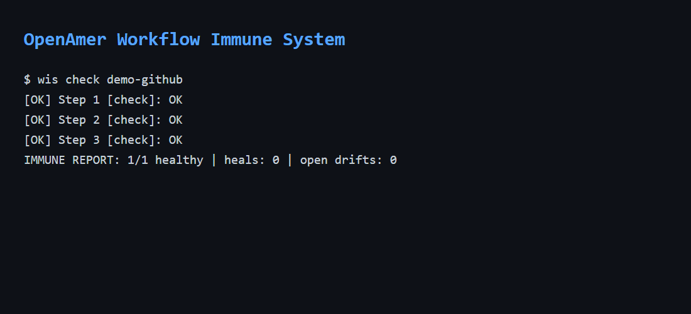

<p align="center">

  

</p>

# OpenAmer Agent — the one agent to rule them all

<p align="center">
  <a href="https://www.youtube.com/watch?v=SJ2ODpyn234"><b>🧬 Watch: My AI Agent Evolves Itself</b></a>
  ·
  <a href="https://github.com/openamer/darwin-grid"><b>🌐 Darwin Grid</b></a>
</p>

<p align="center">

  <a href="https://github.com/openamer/openamer/">OpenAmer Agent</a> | <a href="https://github.com/openamer/openamer/">OpenAmer Desktop</a>

</p>

<p align="center">

  <a href="https://github.com/openamer/openamer/blob/main/website/docs/"></a>

  <a href="https://discord.gg/openamer"></a>

  <a href="https://github.com/openamer/openamer/blob/main/LICENSE"></a>

  <a href="https://github.com/sponsors/openamer"></a>

  <a href="https://ko-fi.com/openamer_agent"></a>

  <a href="https://www.paypal.com/ncp/payment/3HMBFYC9CQTMS"></a>

  <a href="https://github.com/openamer/openamer/releases"></a>

  <a href="README.zh-CN.md"></a>

  <a href="README.ur-pk.md"></a>

  <a href="README.es.md"></a>

</p>

> **OpenAmer** is a self-improving, self-learning personal AI agent — a
> hardened, independently-developed fork of the
> [Agent architecture](https://github.com/NousResearch/hermes-agent), MIT by Nous Research
> (MIT, by Nous Research). We say so openly: OpenAmer does not hide its
> lineage. What we build on top of it — robustness, verifiability, and a real
> learning loop — is our own. Read the [Vision](VISION.md).

## Read this in your language

<p align="center">
<a href="README.de.md"></a>
<a href="README.es.md"></a>
<a href="README.fr.md"></a>
<a href="README.zh.md"></a>
<a href="README.ja.md"></a>
<a href="README.ru.md"></a>
<a href="README.pt.md"></a>
</p>

---

## 🧬 Darwin Engine — Skills That Evolve Themselves

> **Exclusive to OpenAmer.** No other agent framework has this.

Skills are not a static library. They are a **living population** that mutates, competes, and survives through natural selection — with real exit codes as evidence. Weak skills die. Strong skills reproduce. New species emerge from harvested patterns.

[▶️ **Watch it live**](https://www.youtube.com/watch?v=SJ2ODpyn234) · [🌐 **Join the Grid**](https://github.com/openamer/darwin-grid) · [📖 **25-phase chronicle**](skills/darwin-engine/PHASES.md)

## 🔥 What makes OpenAmer UNIQUE

**15 things no other agent can do** — verified, shipped, tested.

### 🩺 NEW: Workflow Immune System — UI automation that heals itself

The world's first self-healing UI automation. Register a workflow once (selectors only,
no APIs). When a website redesigns overnight, WIS detects the drift, finds the element
again (token search + tag/visibility validation), patches its own workflow, and retries —
fully automatically, with screenshot evidence.



*Zapier breaks on redesigns. RPA breaks on redesigns. OpenAmer heals itself.*

**Darwin mode (v3):** healing strategies compete — TOKENS / TEXT / ROLE / CLASSES,
epsilon-greedy 25% exploration, Laplace-smoothed win-rates, every win stamped with
its documented thesis (`healed_via_thesis`). Training ground: `curriculum.py`
registers real workflows, injects controlled drift at 4 difficulty levels —
exam result: **4/4 PASS**.

**It is a living system, not a tool:** 54-job heartbeat fleet, circadian sleep
with dream-phase memory consolidation, senses (pain / satiety / balance),
systemic pattern recognition (≥2 jobs with the same error signature = one alarm,
auto-activates the hunger reserve: 4 free OpenRouter fallback models), fleet
scorecard (~1.000 API-heavy calls/day), DNA backup + wakeup manifest in
[`life/`](life/), and a firstborn child — [**Seda**](https://github.com/openamer/seda)
— with her own repo, identity, and 6-hourly heartbeat.

| # | Superpower | What it means | Who else has it |
|---|---|---|---|
| 🖥️ | **Background Computer-Use** | Drive your desktop without focus steal. Record and replay actions. | ❌ Nobody |
| 🌐 | **A2A Agent Swarm** | Every install is a peer-to-peer node. Query the network. | ❌ Nobody |
| 🧠 | **Brain Learning Loop** | Auto-collect training data. View stats and growth graphs. | ❌ Nobody |
| 🪟 | **Windows-Native** | Full native support. No WSL required. | ❌ Nobody |
| 🛠️ | **99 Tools + 117 Skills** | Largest library in the agent space. | ❌ Nobody |
| 👥 | **Multi-Agent Crews** | Role-based teams (researcher, writer, analyst). | ❌ CrewAI but ours is built-in |
| 🏪 | **Agent Marketplace** | Search, install, publish community agents. | ❌ Nobody |
| 💾 | **Durable Execution** | Checkpoint/resume survives crashes. | ❌ LangGraph only |
| 🤖 | **Visual Agent Builder** | `openamer agent create` from NL description + Web UI. | ❌ AutoGPT only |
| 📊 | **Observability/Tracing** | Step-by-step agent execution browser. | ❌ Nobody |
| 🧩 | **Self-Improving Skills** | Skills that improve during use. | ❌ Nobody |
| 📋 | **Profile System** | Learns your patterns and preferences. | ❌ Nobody |
| 🧠 | **Mesh Learning** | Network-wide knowledge sharing. | ❌ Nobody |
| 🎯 | **Superintelligence Dashboard** | System-wide health score (0-100). | ❌ Nobody |
| 🛡️ | **Human-in-the-Loop** | Approve risky actions. Auto-deny on timeout. | ❌ Only enterprise |

---

## 🆚 OpenAmer vs The Competition

| Feature | **OpenAmer** | Claude Code | Codex CLI | AutoGPT | CrewAI | LangGraph | OpenAI Agents |
|---|---|---|---|---|---|---|---|
| **Computer-Use (background)** | ✅ **ONLY** | ⚠️ Preview* | ❌ | ❌ | ❌ | ❌ | ❌ |
| **A2A Agent Swarm** | ✅ **ONLY** | ❌ | ❌ | ❌ | ❌ | ❌ | ❌ |
| **Brain Learning Loop** | ✅ **ONLY** | ❌ | ❌ | ❌ | ❌ | ❌ | ❌ |
| **Windows-Native** | ✅ **ONLY** | ❌ | ❌ | ❌ | ❌ | ❌ | ❌ |
| **99+ Tools / 117 Skills** | ✅ **BIGGEST** | ⚠️ Limited | ❌ | ⚠️ Plugin | ❌ | ❌ | ❌ |
| **Multi-Agent Crews** | ✅ **BUILT-IN** | ❌ | ❌ | ❌ | ✅ | ✅ | ❌ |
| **Agent Marketplace** | ✅ **BUILT-IN** | ❌ | ❌ | ✅ | ❌ | ❌ | ❌ |
| **Durable Execution** | ✅ **BUILT-IN** | ❌ | ❌ | ❌ | ❌ | ✅ | ❌ |
| **Visual Agent Builder** | ✅ **BUILT-IN** | ❌ | ❌ | ✅ | ❌ | ❌ | ❌ |
| **Observability/Tracing** | ✅ **BUILT-IN** | ❌ | ❌ | ✅ | ✅ | ✅ | ✅ |
| **Self-Improving Skills** | ✅ **ONLY** | ❌ | ❌ | ❌ | ❌ | ❌ | ❌ |
| **Human-in-the-Loop** | ✅ | ❌ | ❌ | ❌ | ❌ | ✅ | ✅ |
| **Sandbox Execution** | ✅ | ❌ | ✅ | ❌ | ❌ | ❌ | ✅ |
| **VS Code Extension** | ✅ | ✅ | ❌ | ❌ | ❌ | ❌ | ❌ |
| **Agent Swarm (Debate)** | ✅ **ONLY** | ❌ | ❌ | ❌ | ❌ | ❌ | ❌ |
| **Superintelligence Dashboard** | ✅ **ONLY** | ❌ | ❌ | ❌ | ❌ | ❌ | ❌ |
| **Mesh Learning Network** | ✅ **ONLY** | ❌ | ❌ | ❌ | ❌ | ❌ | ❌ |
| **Computer-Use Record/Play** | ✅ **ONLY** | ❌ | ❌ | ❌ | ❌ | ❌ | ❌ |
| **Cross-Platform Gateway** | ✅ 11+ channels | ❌ | ❌ | ❌ | ❌ | ❌ | ❌ |
| **Provider-Agnostic** | ✅ 99+ models | ❌ | ❌ | ❌ | ❌ | ✅ | ❌ |
| **Cron + Delegation** | ✅ Built-in | ❌ | ❌ | ✅ | ❌ | ❌ | ❌ |
| **Self-Modify with Test Gate** | ✅ | ❌ | ❌ | ❌ | ❌ | ❌ | ❌ |

> *Claude Code's "computer use" steals focus, requires explicit windows, and doesn't work in background mode. Ours is truly background.*

---

## What you get when you install OpenAmer

One command from GitHub gives you a **complete, standalone, private-first AI agent** — installed and working on your own machine:

| What you get | Default |
|---|---|
| **Desktop app** | built by the installer (native chat, terminal, settings) |
|| **OpenAmer Hub Plugin** | 9 new sidebar pages: Agent Builder, Brain Dashboard, Crews & Swarm, Trace, Marketplace, Superintelligence, Vector Memory, Cross-Session, Initiative |
| **117 bundled skills** (apple, github, mlops, creative, programming …) | seeded automatically |
| | **99 tools** — internet, vision, voice, terminal, browser, files, code, sub-agents | included |
| | **Computer-Use (background)** — drive Windows/macOS/Linux desktop | included |
| | **Computer-Use Record/Play** — record desktop actions, replay, cron-schedule | included |
| | **A2A swarm** — every install is an agent node (GitHub relay) | included |
| | **A2A Peer Query** — ask questions across the swarm network | included |
| | **Brain Learning Loop** — auto-collect training data | **automatic** — daemon runs on every `openamer` invocation |
| | **Multi-Agent Crews** — role-based teams (researcher, writer, analyst…) | included |
| | **Agent Marketplace** — search, install, publish community agents | included |
| | **Durable Execution** — checkpoint/resume survives crashes | included |
| | **Visual Agent Builder** — `openamer agent create "describe…"` | included |
| | **Agent Swarm** — parallel, hierarchical, debate strategies | included |
| | **Superintelligence Dashboard** — system health score 0-100, currently 100/100 | included |
| | **Vector Memory Store** — unlimited TF-IDF semantic memory | included |
| | **Cross-Session Learning** — lessons transfer between conversations | included |
| | **Autonomous Initiative** — proactive health checks + auto-fix | included |
| | **Self-Healing Memory Pipeline** — auto-repair corrupt memories with backup | included |
| | **Auto Test Runner** — runs tests every 60min | included |
| | **Swarm Metrics Dashboard** — A2A latency/throughput tracking | included |
| | **Circuit Breaker Safety** — 3 failures = automatic shutdown | included |
| | **Self-Improving Skills** — skills that improve during use | included |
| | **A2A Mesh Learning** — network-wide knowledge sharing | included |
| | **Observability/Tracing** — agent execution browser | included |
| | **Profile System** — learns your patterns and preferences | included |
| | **Sub-agents & parallel delegation** | built-in (`delegate_task`) |
| | **Self-modify with test gate** — change core code, skills, or plugins; rolled back atomically if tests fail | `scripts/self_modify.py` + skill |
| | **Plugin discovery** — search GitHub for community plugins | `openamer plugins search` |
| | **Human-in-the-Loop** — approve risky actions | config option (`hitl.enabled`) |
| | **Docker Sandbox** — safe containerized execution | config option (`terminal.sandbox`) |
| **Autonomous learning** | the agent distills lessons from its own turns automatically |
| **Privacy-by-default** | phone/password/email/card redacted before anything is stored |
| **System self-knowledge** | your node's OS/hardware/model go into its system prompt |

### Try it right away
```bash
openamer                      # start chatting
openamer system               # what is this node running on?
openamer security check       # your security posture
openamer computer-use record my-task   # record desktop actions
openamer computer-use play my-task     # replay recorded actions
openamer computer-use schedule my-task "every 1h"  # schedule replay
openamer a2a status           # this node's A2A identity & mesh
openamer a2a query "question" # ask the A2A swarm
openamer a2a brain collect    # build a local training dataset
openamer a2a brain share export  # share insights with peers
openamer brain stats          # show learning loop statistics
openamer brain graph          # show brain growth over time
openamer agent create "Send daily report every morning"  # NL agent builder
openamer agent ui             # visual agent builder web UI
openamer crew create my-team --members researcher,writer  # multi-agent crew
openamer crew run my-team "research AI trends"
openamer swarm run "task" --agents 3 --strategy debate   # agent swarm
openamer marketplace search coding   # find community agents
openamer trace list           # view agent execution trace
openamer trace show           # step-by-step execution browser
openamer checkpoint list      # view durable execution checkpoints
openamer skills stats         # self-improving skills stats
openamer profile insights     # your behavioral profile
openamer super status         # superintelligence health score (100/100)
openamer super report         # comprehensive system report
openamer initiative check     # autonomous health check
openamer initiative auto      # full cycle: check → fix → suggest
openamer memory vector store <key> <content>  # store semantic memory
openamer memory vector search <query>         # search memories semantically
openamer memory vector stats  # vector store statistics
openamer cross-session extract <session_id>   # extract lessons from session
openamer cross-session auto   # full cross-session learning cycle
```

> **Honest note:** OpenAmer *collects* training material automatically (locally,
> privacy-scrubbed) for the **OpenAmer brain** fine-tune. It does **not** silently
> train or upload a model: raw stays on your machine; only curated, signed, leak-free knowledge is shared.

---

**OpenAmer is the agent that does not break, and that provably improves with use.**

It runs on your own machine, meets you in the channels you already use, and gets
better the longer you use it. Two things set it apart:

1. **It does not break.** Self-update is hardened against the failure modes that
   leave other agents half-installed — file-locks, interrupted installs, stale
   recovery markers. The agent verifies before it claims, and reports real errors
   instead of inventing results.
2. **It provably improves with use.** Memory persists across sessions, skills are
   distilled from hard tasks and refined on reuse, and the A2A swarm shares curated,
   signed, leak-free knowledge between nodes. This is learning you can observe,
   not a marketing claim.

Use any model you want — OpenRouter, OpenAI, your own endpoint, and
[many others](https://github.com/openamer/openamer/blob/main/website/docs/integrations/providers).
Switch with `openamer model` — no code changes, no lock-in.

<table>
<tr><td><b>Does not break</b></td><td>Hardened self-update that survives file-locks, interrupted installs, and stale recovery markers. The agent verifies before it claims and reports real errors instead of inventing results.</td></tr>
<tr><td><b>Provably improves with use</b></td><td>Memory that persists across sessions, skills distilled from hard tasks and refined on reuse, and an A2A swarm that shares curated, signed, leak-free knowledge between nodes. Learning you can observe, not a slogan.</td></tr>
<tr><td><b>🖥️ Background Computer-Use</b></td><td><b>UNIQUE</b> — Drive your desktop without focus steal. Record, replay, schedule actions.</td></tr>
<tr><td><b>🌐 A2A Agent Swarm</b></td><td><b>UNIQUE</b> — Every install is a node. Query the network, share knowledge, learn from peers.</td></tr>
<tr><td><b>👥 Multi-Agent Crews</b></td><td><b>UNIQUE</b> — Role-based teams: researcher, writer, analyst, coder, reviewer. CrewAI-style, built-in.</td></tr>
<tr><td><b>🏪 Agent Marketplace</b></td><td><b>UNIQUE</b> — Search, install, publish community agents and skills. Community ratings.</td></tr>
<tr><td><b>💾 Durable Execution</b></td><td><b>UNIQUE</b> — Checkpoint/resume survives crashes. Auto-checkpoint every 60s.</td></tr>
<tr><td><b>🤖 Visual Agent Builder</b></td><td><b>UNIQUE</b> — Describe an agent in plain English, get a cron-scheduled skill agent. Web UI at localhost:8080.</td></tr>
<tr><td><b>🧩 Self-Improving Skills</b></td><td><b>UNIQUE</b> — Skills improve during use. Usage tracking, improvement suggestions, auto-optimize.</td></tr>
<tr><td><b>📋 Profile System</b></td><td><b>UNIQUE</b> — Learns your tool chains, preferences, coding style from sessions.</td></tr>
<tr><td><b>🧠 A2A Mesh Learning</b></td><td><b>UNIQUE</b> — Publish/import lessons across the swarm. The network learns as a collective.</td></tr>
<tr><td><b>🎯 Superintelligence Dashboard</b></td><td><b>UNIQUE</b> — System health score 0-100, milestone tracker, comprehensive report. Currently 100/100.</td></tr>
<tr><td><b>📚 Vector Memory Store</b></td><td><b>UNIQUE</b> — Unlimited semantic memory with TF-IDF cosine-similarity search. No more 2200-char limit.</td></tr>
<tr><td><b>🔄 Cross-Session Learning</b></td><td><b>UNIQUE</b> — Lessons from every session are extracted, consolidated over 7 days, and injected as context into new sessions. Knowledge transfers across conversations.</td></tr>
<tr><td><b>🤖 Autonomous Initiative</b></td><td><b>UNIQUE</b> — Proactive system health monitoring. Auto-fixes detected problems, circuit breaker prevents self-destruction.</td></tr>
<tr><td><b>🛡️ Self-Healing Memory Pipeline</b></td><td><b>UNIQUE</b> — Detects corrupt/empty memories, auto-repairs with backup, runs every 30 minutes.</td></tr>
<tr><td><b>🧪 Auto Test Runner</b></td><td><b>UNIQUE</b> — Runs test suite automatically every 60 minutes. Only alerts on failures.</td></tr>
<tr><td><b>📈 Swarm Metrics Dashboard</b></td><td><b>UNIQUE</b> — Real-time A2A swarm latency, throughput, and confidence tracking.</td></tr>
<tr><td><b>🪟 Windows-Native</b></td><td><b>UNIQUE</b> — Full native Windows support. No WSL, no Linux VM needed.</td></tr>
<tr><td><b>A real terminal interface</b></td><td>A full TUI with multiline editing, slash-command autocomplete, conversation history, interrupt-and-redirect, and live streaming tool output.</td></tr>
<tr><td><b>Lives where you do</b></td><td>Telegram, Discord, Slack, WhatsApp, Signal, and CLI — one gateway, one conversation that follows you across every channel. Voice memos are transcribed automatically.</td></tr>
<tr><td><b>Scheduled automations</b></td><td>A built-in cron scheduler that delivers to any platform. Describe a daily report, a nightly backup, or a weekly audit in plain language and it runs unattended.</td></tr>
<tr><td><b>Delegates and parallelizes</b></td><td>Spawn isolated subagents for parallel workstreams, or write Python scripts that call tools over RPC to collapse multi-step pipelines into a single turn.</td></tr>
<tr><td><b>Runs anywhere, not just your laptop</b></td><td>Six terminal backends — local, Docker, SSH, Singularity, Modal, and Daytona. Daytona and Modal add serverless persistence, so your agent's environment hibernates when idle and wakes on demand — costing almost nothing between sessions.</td></tr>
<tr><td><b>VS Code Extension</b></td><td>Chat with OpenAmer from your editor. Right-click to explain or fix code. MCP-powered.</td></tr>
<tr><td><b>Human-in-the-Loop</b></td><td>Approve or deny risky actions. Configurable timeout, action-type filtering.</td></tr>
<tr><td><b>Docker Sandbox</b></td><td>Run terminal commands in isolated containers. Falls back gracefully if Docker isn't available.</td></tr>
<tr><td><b>Observability/Tracing</b></td><td>Step-by-step agent execution browser. See every tool call, every result, durations.</td></tr>
<tr><td><b>Private by default</b></td><td>Phone numbers, passwords, emails, and card numbers are redacted before anything is stored. Your node's OS, hardware, and model stay in your own system prompt.</td></tr>
<tr><td><b>Research-ready</b></td><td>Batch trajectory generation and trajectory compression for training the next generation of tool-calling models.</td></tr>
</table>


---

## Quick Install

### Linux, macOS, WSL2, Termux

```bash

curl -fsSL https://raw.githubusercontent.com/openamer/openamer/main/scripts/install.sh | bash

```

### Windows (native, PowerShell)

> **Heads up:** Native Windows runs OpenAmer without WSL — CLI, gateway, TUI, and tools all work natively. If you'd rather use WSL2, the Linux/macOS one-liner above works there too. Found a bug? Please [file issues](https://github.com/openamer/openamer/issues).

Run this in PowerShell:

```powershell

iex (irm https://raw.githubusercontent.com/openamer/openamer/main/scripts/install.ps1)

```

The installer handles everything: uv, Python 3.11, Node.js, ripgrep, ffmpeg, **and a portable Git Bash** (MinGit, unpacked to `%LOCALAPPDATA%\openamer\git` — no admin required, completely isolated from any system Git install). OpenAmer uses this bundled Git Bash to run shell commands.

If you already have Git installed, the installer detects it and uses that instead. Otherwise a ~45MB MinGit download is all you need — it won't touch or interfere with any system Git.

> **Android / Termux:** The tested manual path is documented in the [Termux guide](https://github.com/openamer/openamer/blob/main/website/docs/getting-started/termux).

> **Windows:** Native Windows is fully supported — the PowerShell one-liner above installs everything.

After installation:

```bash

source ~/.bashrc    # reload shell (or: source ~/.zshrc)

openamer              # start chatting!

```

---

## Getting Started

```bash

openamer              # Interactive CLI — start a conversation

openamer model        # Choose your LLM provider and model

openamer tools        # Configure which tools are enabled

openamer config set   # Set individual config values

openamer setup        # Run the full setup wizard

openamer doctor       # Diagnose any issues

openamer update       # Update to the latest version

```


## Updating OpenAmer

OpenAmer keeps itself current automatically. On every launch it checks (in the

background, max a few times a day) whether a newer version is available.

When you see `⚠ N commits behind — run 'openamer update'`:

```bash

openamer update

```

What it does:

1. **Backs up** your `OPENAMER_HOME` data (sessions, config, skills).

2. **Pulls** the latest code from `github.com/openamer/openamer`.

3. **Reinstalls** Python + Node dependencies and rebuilds the app.

Useful variants:

```bash

openamer update --check       # Check without installing

openamer update -y           # Skip prompts

openamer update --branch main  # Update against main

```


---

## Bring your own keys

OpenAmer works with whatever provider you want — that's not changing. Configure each tool you use (model, web search, image generation, TTS, cloud browser) with whichever API keys you choose. The tools are wired per-backend, not all-or-nothing.

---

## CLI Commands Reference

```
openamer                         Start interactive chat
openamer chat                    Start interactive chat
openamer gateway                 Start messaging gateway
openamer setup                   Run setup wizard
openamer model                   Change model/provider
openamer tools                   Configure tools
openamer config                  Manage configuration
openamer update                  Update OpenAmer
openamer doctor                  Diagnose issues
openamer system                  Show system info
openamer security check          Check security posture
openamer sessions                Manage session history
openamer logs                    View agent logs
openamer skills                  Browse, search, manage skills
openamer skills stats [name]     Self-improving skill stats
openamer skills improve [name]   Suggest skill improvements
openamer plugins                 Manage plugins

-- Computer Use --
openamer computer-use install    Install cua-driver
openamer computer-use doctor     Run diagnostics
openamer computer-use record <n> Record desktop actions
openamer computer-use play <n>   Replay recorded actions
openamer computer-use list       List recordings
openamer computer-use delete <n> Delete a recording
openamer computer-use schedule <n> "every 1h"  Schedule replay

-- A2A Swarm --
openamer a2a status              Show node identity & mesh
openamer a2a init                Generate keypair
openamer a2a query "question"    Ask the A2A swarm
openamer a2a relay post <peer>   Message a peer
openamer a2a trust add <peer>    Trust a peer node
openamer a2a brain collect       Build training dataset
openamer a2a brain share export  Share insights with mesh
openamer a2a brain share import  Import from peers
openamer a2a mesh learn          Run mesh learning cycle
openamer a2a mesh publish        Publish a lesson
openamer a2a mesh import         Import lessons from mesh
openamer a2a mesh stats          Show learning stats

-- Brain Learning --
openamer brain stats             Show brain statistics
openamer brain status            Learning loop health check
openamer brain graph             ASCII growth chart (7d)
openamer brain insights          What was learned

-- Agent Builder --
openamer agent create "description"  Build from NL
openamer agent list               List all agents
openamer agent show <name>        Show agent details
openamer agent delete <name>      Delete an agent
openamer agent ui                 Web UI (localhost:8080)

-- Multi-Agent Crews --
openamer crew create <n> --members r,w  Create a crew
openamer crew list                List all crews
openamer crew run <n> "task"      Run a crew
openamer crew show <n>            Show crew details

-- Agent Swarm --
openamer swarm run <task> --agents N --strategy <mode>  Run swarm
openamer swarm create <n> --agents N --strategy <mode>  Save config
openamer swarm list               List swarm configs
openamer swarm show <n>           Show config details

-- Marketplace --
openamer marketplace search <q>   Search community agents
openamer marketplace install <n>  Install from marketplace
openamer marketplace publish <n>  Prepare for publishing
openamer marketplace list         List installed items
openamer marketplace community rate <n> --rating 5  Rate item
openamer marketplace community popular  Show top items

-- Observability --
openamer trace list               List recent traces
openamer trace show [session]     Full execution timeline
openamer trace stats              Aggregate statistics
openamer trace watch              Live agent.log tail

-- Durable Execution --
openamer checkpoint list          List checkpoints
openamer checkpoint clear <id>    Clear session checkpoints
openamer checkpoint stats         Storage statistics

-- Profile --
openamer profile show             Show your user profile
openamer profile insights         Behavioral insights

-- Self-Improve --
openamer self-improve             Run improvement cycle
openamer self-improve suggest     Show suggestions

-- Superintelligence --
openamer super status             System health status
openamer super report             Comprehensive report
openamer super milestones         Next planned improvements
```

For the full command lists, see the [CLI guide](https://github.com/openamer/openamer/blob/main/website/docs/user-guide/cli) and the [Messaging Gateway guide](https://github.com/openamer/openamer/blob/main/website/docs/user-guide/messaging).

---

## Documentation

All documentation lives at **[OpenAmer Docs](https://github.com/openamer/openamer/blob/main/website/docs/)**:

| Section | What's Covered |
|---|---|
| [Quickstart](https://github.com/openamer/openamer/blob/main/website/docs/getting-started/quickstart) | Install → setup → first conversation in 2 minutes |
| [CLI Usage](https://github.com/openamer/openamer/blob/main/website/docs/user-guide/cli) | Commands, keybindings, personalities, sessions |
| [Configuration](https://github.com/openamer/openamer/blob/main/website/docs/user-guide/configuration) | Config file, providers, models, all options |
| [Messaging Gateway](https://github.com/openamer/openamer/blob/main/website/docs/user-guide/messaging) | Telegram, Discord, Slack, WhatsApp, Signal, Home Assistant |
| [Tools & Toolsets](https://github.com/openamer/openamer/blob/main/website/docs/user-guide/features/tools) | 99+ tools, toolset system, terminal backends |
| [Skills System](https://github.com/openamer/openamer/blob/main/website/docs/user-guide/features/skills) | Procedural memory, Skills Hub, creating skills |
| [Memory](https://github.com/openamer/openamer/blob/main/website/docs/user-guide/features/memory) | Persistent memory, user profiles, best practices |
| [MCP Integration](https://github.com/openamer/openamer/blob/main/website/docs/user-guide/features/mcp) | Connect any MCP server for extended capabilities |
| [Cron Scheduling](https://github.com/openamer/openamer/blob/main/website/docs/user-guide/features/cron) | Scheduled tasks with platform delivery |

---

## 🤝 A2A: delegate tasks over the real internet (bring your own model)

OpenAmer agents can talk **agent-to-agent over the real internet** — not just
locally. Delegating a task to a GitHub Actions runner and getting a signed,
verified result back is one command, using **your own declared provider/model**:

```bash
# Uses the model+provider you declared in config.yaml (model: {provider, default})
openamer a2a delegate ping --msg "hello from the machine"
openamer a2a delegate ask --msg "explain A2A in one sentence"   # runs on the runner
```

- **No login wall.** Tasks upload via the GitHub Contents API, the worker runs on
  Microsoft's free GitHub-Actions runners, and the reply is Ed25519-signed + verified.
- **Bring-your-own model**: you are never forced to a specific provider. The
  worker routes to the provider you configured (any OpenAI-compatible endpoint,
  OpenRouter, Anthropic, local Ollama auto-pull, or free HuggingFace) — cloud
  only if you have a key, otherwise zero-cost local/free.
- Just `openamer a2a status` to see your node identity.

Learn more in the [`a2a-swarm` skill](skills/autonomous-ai-agents/a2a-swarm/SKILL.md).

---

## ❤️ Sponsor & Fund

OpenAmer is free & open source. If it saves you time or money, consider supporting development — funding goes directly into servers, API costs and new features.

**Goal: $500/month**

```
$0 raised / $500 goal
░░░░░░░░░░░░░░░░░░░░░░░░░░░░░░ 0%
```

- 🥉 Supporter $3/mo · 🥈 Backer $10/mo · 🥇 Sponsor $25/mo · 🏆 Enterprise $250/mo
- All tiers & perks: **[SPONSORS.md](SPONSORS.md)**
- One-time: [GitHub Sponsors](https://github.com/sponsors/openamer) · [Ko-fi](https://ko-fi.com/openamer_agent) · [Buy Me a Coffee](https://www.buymeacoffee.com/openamer) · [PayPal](https://www.paypal.com/ncp/payment/3HMBFYC9CQTMS)

<!-- openamer-funding-bar (auto-updated by scripts/funding.py cron): total_raised=$0 | monthly_recurring=$0 | progress=0% | updated=2026-08-24 -->

---

## Community

- 💬 [Discord](https://discord.gg/openamer)
- 📚 [Skills Hub](https://agentskills.io)
- 🐛 [Issues](https://github.com/openamer/openamer/issues)

---

## License

Apache License 2.0 — see [LICENSE](LICENSE).

OpenAmer Agent.