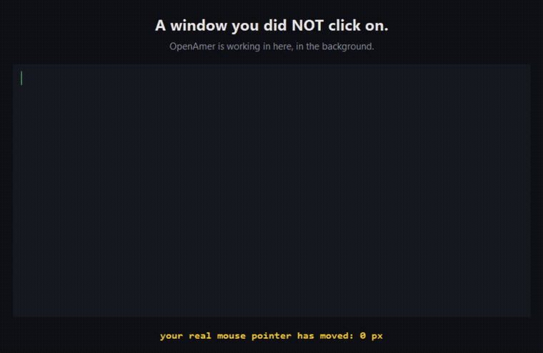

# The background-computer-use demo — the wedge, as evidence



*Above: a real, unedited screen recording (Windows, 125 % DPI). The only window
in frame is a target we built ourselves — nothing personal is ever on screen.*

## What this proves

The wedge sentence is:

> **OpenAmer drives your Windows desktop in the background — without taking
> your mouse.**

This clip is that sentence measured, not asserted:

| Claim | How the clip shows it |
|---|---|
| It acts on a window you never clicked | The window's own heading says so, and it is true — it was never focused by hand |
| The agent has its own cursor | The **pink/magenta overlay pointer** is the agent's; your OS pointer is elsewhere |
| Your real mouse is untouched | The yellow line is read live from `GetCursorPos`: **`your real mouse pointer has moved: 0 px`** |
| The click was not a cursor hijack | The driver reports `Posted click to pid …` — a window message, not `SendInput` at a screen position |

## Reproduce it yourself

```bash
# 1. the target window (self-contained, no personal content)
python scripts/demo_target.py &

# 2. measure its client rect in PHYSICAL pixels (DPI-aware)
python scripts/demo_window_rect.py
#   -> gdigrab=-offset_x N -offset_y N -video_size WxH

# 3. record only that region
ffmpeg -y -f gdigrab -framerate 20 \
  -offset_x N -offset_y N -video_size WxH \
  -i desktop -t 20 -pix_fmt yuv420p demo.mp4

# 4. drive it (while recording)
#    a background click + a foreground type, via the computer_use tool
```

## Honest limits found while recording it (all measured)

- **Text input needed a focus switch on this surface.** The driver answered the
  background attempt with `background_unavailable` for window class
  `TkTopLevel`; a *click* is delivered in the background, *text* was not. The
  typing in the clip therefore used `delivery_mode: foreground`. What stays true
  either way: **the real pointer did not move (0 px)**. Do not claim "fully
  background typing" for Tk windows — it is not what happened.
- **The recording is 125 % DPI.** `gdigrab` counts physical pixels while
  `GetWindowRect` counts logical ones; without `SetProcessDpiAwareness` the
  region lands ~40 px off and leaks neighbouring windows. `demo_window_rect.py`
  sets it.
- **Odd region widths break the encoder.** `libx264` + `yuv420p` requires even
  dimensions; `1071x696` failed with `Conversion failed`, `1070x696` worked.
- **The window must be on top while recording**, or the clip captures whatever
  covers it. `demo_target.py` sets `-topmost` for exactly this reason.

## Why this and not a feature list

Twenty features do not persuade in ten seconds; this does. The full capability
table stays below the fold as supporting evidence — see
[`../positioning.md`](../positioning.md).