# Darwin Engine Report
_2026-09-17T12:32:16.730121+00:00 — evolutionary skill ecosystem_

**Population:** 103 Skills | **Offspring:** 5 | **Competitions:** 25

## Top 10 (fittest skills)

| Skill | Fitness | Usage | Age (days) | Mutationen W/L |
|---|---|---|---|---|
| auto-env-checker | 2036.0 | 2032 | 0 | 4/14 |
| autonomous-learning-architecture | 1806.0 | 1793 | 0 | 0/0 |
| cdp-social-posting | 846.0 | 833 | 0 | 0/0 |
| train-from-usage | 619.53 | 613 | 14 | 0/4 |
| plugin-api | 611.13 | 602 | 26 | 0/0 |
| asi-identity | 237.97 | 228 | 1 | 0/0 |
| asi-capability-summary | 224.97 | 215 | 1 | 0/0 |
| self-rewriter | 99.13 | 154 | 26 | 3/70 |
| mini-openamer | 98.53 | 89 | 14 | 0/0 |
| darwin-harvested-openamer-cli-main-py | 97.63 | 45 | 11 | 28/13 |

## Bottom 5 (selection candidates)

- **darwin-harvested-darwin-swarm-tasks-json** (Fitness 16.0, 0 days old)
- **darwin-harvested-git-index-lock** (Fitness 16.0, 0 days old)
- **darwin-harvested-openamer-repo-no-such-file-or-direct** (Fitness 16.0, 0 days old)
- **darwin-harvested-pfade** (Fitness 16.0, 0 days old)
- **darwin-harvested-r-n-10x-pass-fds** (Fitness 16.0, 0 days old)

## New mutations

- auto-env-checker → `auto-env-checker__mutbroaden_trigger` (op=broaden_trigger, applied=True)
- autonomous-learning-architecture → `autonomous-learning-architecture__mutbroaden_trigger` (op=broaden_trigger, applied=True)
- cdp-social-posting → `cdp-social-posting__muttighten_trigger` (op=tighten_trigger, applied=True)
- train-from-usage → `train-from-usage__mutbroaden_trigger` (op=broaden_trigger, applied=True)
- plugin-api → `plugin-api__muttighten_trigger` (op=tighten_trigger, applied=True)

## Competitions

- ⏳ `asi-capability-summary+asi-identity` (0) vs `None` (0)
- ⏳ `asi-identity+auto-env-checker` (0) vs `None` (0)
- ⏳ `auto-env-checker+autonomous-learning-architecture` (0) vs `None` (0)
- ⏳ `auto-env-checker+cdp-social-posting` (0) vs `None` (0)
- ⏳ `auto-env-checker__mutbroaden_trigger` (2036.0) vs `auto-env-checker` (2036.0)
- ⏳ `auto-env-checker__muttighten_trigger` (2036.0) vs `auto-env-checker` (2036.0)
- ⏳ `autonomous-learning-architecture__mutbroaden_trigger` (1806.0) vs `autonomous-learning-architecture` (1806.0)
- ⏳ `autonomous-learning-architecture__muttighten_trigger` (1806.0) vs `autonomous-learning-architecture` (1806.0)
- ⏳ `cdp-social-posting__muttighten_trigger` (846.0) vs `cdp-social-posting` (846.0)
- ⏳ `discord-server-management__mutadd_verification_step` (33.0) vs `discord-server-management` (33.0)
- ⏳ `discord-server-management__mutbroaden_trigger` (33.0) vs `discord-server-management` (33.0)
- ⏳ `discord-server-management__muttighten_trigger` (33.0) vs `discord-server-management` (33.0)
- ⏳ `github-readme-summary__mutbroaden_trigger` (28.13) vs `github-readme-summary` (28.13)
- ⏳ `github-readme-summary__muttighten_trigger` (28.13) vs `github-readme-summary` (28.13)
- ⏳ `openamer-plugin-development__muttighten_trigger` (27.4) vs `openamer-plugin-development` (27.4)
- ⏳ `plugin-api__mutbroaden_trigger` (611.13) vs `plugin-api` (611.13)
- ⏳ `plugin-api__muttighten_trigger` (611.13) vs `plugin-api` (611.13)
- ⏳ `self-rewriter__mutadd_verification_step` (99.13) vs `self-rewriter` (99.13)
- ⏳ `self-rewriter__muttighten_trigger` (99.13) vs `self-rewriter` (99.13)
- ⏳ `train-from-usage__mutadd_pitfall` (619.53) vs `train-from-usage` (619.53)
- ⏳ `train-from-usage__mutadd_verification_step` (619.53) vs `train-from-usage` (619.53)
- ⏳ `train-from-usage__mutbroaden_trigger` (619.53) vs `train-from-usage` (619.53)
- ⏳ `train-from-usage__muttighten_trigger` (619.53) vs `train-from-usage` (619.53)
- ⏳ `undetectable-browsing__muttighten_trigger` (30.2) vs `undetectable-browsing` (30.2)
- ⏳ `vscode-extension-scaffold__mutbroaden_trigger` (31.13) vs `vscode-extension-scaffold` (31.13)

## Evolution Tree

```mermaid
graph TD
    cdp-social-posting["cdp-social-posting"] --> cdp-social-posting__muttighten_trigger["cdp-social-posting__muttighten_trigger"]
    train-from-usage["train-from-usage"] --> train-from-usage__mutbroaden_trigger["train-from-usage__mutbroaden_trigger"]
    plugin-api["plugin-api"] --> plugin-api__muttighten_trigger["plugin-api__muttighten_trigger"]
    asi-capability-summary["asi-capability-summary"] ==> asi-capability-summary+asi-identity["asi-capability-summary+asi-identity"]
    auto-env-checker["auto-env-checker"] --> auto-env-checker__mutbroaden_trigger["auto-env-checker__mutbroaden_trigger"]
    autonomous-learning-architecture["autonomous-learning-architecture"] --> autonomous-learning-architecture__mutbroaden_trigger["autonomous-learning-architecture__mutbroaden_trigger"]
    cdp-social-posting["cdp-social-posting"] --> cdp-social-posting__muttighten_trigger["cdp-social-posting__muttighten_trigger"]
    train-from-usage["train-from-usage"] --> train-from-usage__mutbroaden_trigger["train-from-usage__mutbroaden_trigger"]
    plugin-api["plugin-api"] --> plugin-api__muttighten_trigger["plugin-api__muttighten_trigger"]
    asi-capability-summary["asi-capability-summary"] ==> asi-capability-summary+asi-identity["asi-capability-summary+asi-identity"]
    auto-env-checker["auto-env-checker"] --> auto-env-checker__mutbroaden_trigger["auto-env-checker__mutbroaden_trigger"]
    autonomous-learning-architecture["autonomous-learning-architecture"] --> autonomous-learning-architecture__mutbroaden_trigger["autonomous-learning-architecture__mutbroaden_trigger"]
    cdp-social-posting["cdp-social-posting"] --> cdp-social-posting__muttighten_trigger["cdp-social-posting__muttighten_trigger"]
    train-from-usage["train-from-usage"] --> train-from-usage__mutbroaden_trigger["train-from-usage__mutbroaden_trigger"]
    plugin-api["plugin-api"] --> plugin-api__muttighten_trigger["plugin-api__muttighten_trigger"]
    asi-capability-summary["asi-capability-summary"] ==> asi-capability-summary+asi-identity["asi-capability-summary+asi-identity"]
    auto-env-checker["auto-env-checker"] --> auto-env-checker__mutbroaden_trigger["auto-env-checker__mutbroaden_trigger"]
    autonomous-learning-architecture["autonomous-learning-architecture"] --> autonomous-learning-architecture__mutbroaden_trigger["autonomous-learning-architecture__mutbroaden_trigger"]
    cdp-social-posting["cdp-social-posting"] --> cdp-social-posting__muttighten_trigger["cdp-social-posting__muttighten_trigger"]
    train-from-usage["train-from-usage"] --> train-from-usage__mutbroaden_trigger["train-from-usage__mutbroaden_trigger"]
    plugin-api["plugin-api"] --> plugin-api__muttighten_trigger["plugin-api__muttighten_trigger"]
    asi-capability-summary["asi-capability-summary"] ==> asi-capability-summary+asi-identity["asi-capability-summary+asi-identity"]
    auto-env-checker["auto-env-checker"] --> auto-env-checker__mutbroaden_trigger["auto-env-checker__mutbroaden_trigger"]
    autonomous-learning-architecture["autonomous-learning-architecture"] --> autonomous-learning-architecture__mutbroaden_trigger["autonomous-learning-architecture__mutbroaden_trigger"]
    cdp-social-posting["cdp-social-posting"] --> cdp-social-posting__muttighten_trigger["cdp-social-posting__muttighten_trigger"]
    train-from-usage["train-from-usage"] --> train-from-usage__mutbroaden_trigger["train-from-usage__mutbroaden_trigger"]
    plugin-api["plugin-api"] --> plugin-api__muttighten_trigger["plugin-api__muttighten_trigger"]
    asi-capability-summary["asi-capability-summary"] ==> asi-capability-summary+asi-identity["asi-capability-summary+asi-identity"]
    auto-env-checker["auto-env-checker"] --> auto-env-checker__mutbroaden_trigger["auto-env-checker__mutbroaden_trigger"]
    autonomous-learning-architecture["autonomous-learning-architecture"] --> autonomous-learning-architecture__mutbroaden_trigger["autonomous-learning-architecture__mutbroaden_trigger"]
    cdp-social-posting["cdp-social-posting"] --> cdp-social-posting__muttighten_trigger["cdp-social-posting__muttighten_trigger"]
    train-from-usage["train-from-usage"] --> train-from-usage__mutbroaden_trigger["train-from-usage__mutbroaden_trigger"]
    plugin-api["plugin-api"] --> plugin-api__muttighten_trigger["plugin-api__muttighten_trigger"]
    asi-capability-summary["asi-capability-summary"] ==> asi-capability-summary+asi-identity["asi-capability-summary+asi-identity"]
    auto-env-checker["auto-env-checker"] --> auto-env-checker__mutbroaden_trigger["auto-env-checker__mutbroaden_trigger"]
    autonomous-learning-architecture["autonomous-learning-architecture"] --> autonomous-learning-architecture__mutbroaden_trigger["autonomous-learning-architecture__mutbroaden_trigger"]
    cdp-social-posting["cdp-social-posting"] --> cdp-social-posting__muttighten_trigger["cdp-social-posting__muttighten_trigger"]
    train-from-usage["train-from-usage"] --> train-from-usage__mutbroaden_trigger["train-from-usage__mutbroaden_trigger"]
    plugin-api["plugin-api"] --> plugin-api__muttighten_trigger["plugin-api__muttighten_trigger"]
    asi-capability-summary["asi-capability-summary"] ==> asi-capability-summary+asi-identity["asi-capability-summary+asi-identity"]
```

