# Darwin Engine Report
_2026-09-18T23:30:40.967529+00:00 — evolutionary skill ecosystem_

**Population:** 110 Skills | **Offspring:** 5 | **Competitions:** 24

## Top 10 (fittest skills)

| Skill | Fitness | Usage | Age (days) | Mutationen W/L |
|---|---|---|---|---|
| auto-env-checker | 2081.0 | 2080 | 0 | 7/23 |
| autonomous-learning-architecture | 1847.97 | 1835 | 1 | 0/0 |
| cdp-social-posting | 889.97 | 877 | 1 | 0/0 |
| train-from-usage | 662.47 | 656 | 16 | 0/4 |
| plugin-api | 653.07 | 644 | 28 | 0/0 |
| asi-capability-summary | 310.9 | 301 | 3 | 0/0 |
| asi-identity | 310.9 | 301 | 3 | 0/0 |
| self-rewriter | 133.37 | 187 | 19 | 4/71 |
| darwin-harvested-package-lock-json | 103.9 | 55 | 3 | 27/15 |
| darwin-harvested-openamer-cli-main-py | 98.6 | 47 | 12 | 28/14 |

## Bottom 5 (selection candidates)

- **darwin-harvested-memory-darwin-status-latest-json** (Fitness 16.97, 1 days old)
- **darwin-harvested-tmp-om-base-no-such-file-or-director** (Fitness 16.97, 1 days old)
- **darwin-harvested-darwin-trial-state-json** (Fitness 16.0, 0 days old)
- **darwin-harvested-darwin-gate-queue-json** (Fitness 15.0, 0 days old)
- **darwin-harvested-darwin-promoted** (Fitness 11.0, 0 days old)

## New mutations

- auto-env-checker → `auto-env-checker__mutbroaden_trigger` (op=broaden_trigger, applied=True)
- autonomous-learning-architecture → `autonomous-learning-architecture__mutbroaden_trigger` (op=broaden_trigger, applied=True)
- cdp-social-posting → `cdp-social-posting__muttighten_trigger` (op=tighten_trigger, applied=True)
- train-from-usage → `train-from-usage__mutbroaden_trigger` (op=broaden_trigger, applied=True)
- plugin-api → `plugin-api__muttighten_trigger` (op=tighten_trigger, applied=True)

## Competitions

- ⏳ `a2a-brain-meshlearn-verify+asi-capability-summary` (0) vs `None` (0)
- ⏳ `asi-capability-summary+asi-identity` (0) vs `None` (0)
- ⏳ `asi-identity+auto-env-checker` (0) vs `None` (0)
- ⏳ `auto-env-checker+autonomous-learning-architecture` (0) vs `None` (0)
- ⏳ `auto-env-checker+cdp-social-posting` (0) vs `None` (0)
- ⏳ `auto-env-checker__mutbroaden_trigger` (2081.0) vs `auto-env-checker` (2081.0)
- ⏳ `autonomous-learning-architecture__mutbroaden_trigger` (1847.97) vs `autonomous-learning-architecture` (1847.97)
- ⏳ `autonomous-learning-architecture__muttighten_trigger` (1847.97) vs `autonomous-learning-architecture` (1847.97)
- ⏳ `cdp-social-posting__muttighten_trigger` (889.97) vs `cdp-social-posting` (889.97)
- ⏳ `discord-server-management__mutadd_verification_step` (33.97) vs `discord-server-management` (33.97)
- ⏳ `discord-server-management__mutbroaden_trigger` (33.97) vs `discord-server-management` (33.97)
- ⏳ `discord-server-management__muttighten_trigger` (33.97) vs `discord-server-management` (33.97)
- ⏳ `github-readme-summary__mutbroaden_trigger` (28.07) vs `github-readme-summary` (28.07)
- ⏳ `github-readme-summary__muttighten_trigger` (28.07) vs `github-readme-summary` (28.07)
- ⏳ `openamer-plugin-development__muttighten_trigger` (27.37) vs `openamer-plugin-development` (27.37)
- ⏳ `plugin-api__mutbroaden_trigger` (653.07) vs `plugin-api` (653.07)
- ⏳ `plugin-api__muttighten_trigger` (653.07) vs `plugin-api` (653.07)
- ⏳ `self-rewriter__muttighten_trigger` (133.37) vs `self-rewriter` (133.37)
- ⏳ `train-from-usage__mutadd_pitfall` (662.47) vs `train-from-usage` (662.47)
- ⏳ `train-from-usage__mutadd_verification_step` (662.47) vs `train-from-usage` (662.47)
- ⏳ `train-from-usage__mutbroaden_trigger` (662.47) vs `train-from-usage` (662.47)
- ⏳ `train-from-usage__muttighten_trigger` (662.47) vs `train-from-usage` (662.47)
- ⏳ `undetectable-browsing__muttighten_trigger` (30.13) vs `undetectable-browsing` (30.13)
- ⏳ `vscode-extension-scaffold__mutbroaden_trigger` (31.07) vs `vscode-extension-scaffold` (31.07)

## Evolution Tree

```mermaid
graph TD
    train-from-usage["train-from-usage"] --> train-from-usage__mutbroaden_trigger["train-from-usage__mutbroaden_trigger"]
    plugin-api["plugin-api"] --> plugin-api__muttighten_trigger["plugin-api__muttighten_trigger"]
    a2a-brain-meshlearn-verify["a2a-brain-meshlearn-verify"] ==> a2a-brain-meshlearn-verify+asi-capability-summary["a2a-brain-meshlearn-verify+asi-capability-summary"]
    auto-env-checker["auto-env-checker"] --> auto-env-checker__mutbroaden_trigger["auto-env-checker__mutbroaden_trigger"]
    autonomous-learning-architecture["autonomous-learning-architecture"] --> autonomous-learning-architecture__mutbroaden_trigger["autonomous-learning-architecture__mutbroaden_trigger"]
    cdp-social-posting["cdp-social-posting"] --> cdp-social-posting__muttighten_trigger["cdp-social-posting__muttighten_trigger"]
    train-from-usage["train-from-usage"] --> train-from-usage__mutbroaden_trigger["train-from-usage__mutbroaden_trigger"]
    plugin-api["plugin-api"] --> plugin-api__muttighten_trigger["plugin-api__muttighten_trigger"]
    a2a-brain-meshlearn-verify["a2a-brain-meshlearn-verify"] ==> a2a-brain-meshlearn-verify+asi-capability-summary["a2a-brain-meshlearn-verify+asi-capability-summary"]
    auto-env-checker["auto-env-checker"] --> auto-env-checker__mutbroaden_trigger["auto-env-checker__mutbroaden_trigger"]
    autonomous-learning-architecture["autonomous-learning-architecture"] --> autonomous-learning-architecture__mutbroaden_trigger["autonomous-learning-architecture__mutbroaden_trigger"]
    cdp-social-posting["cdp-social-posting"] --> cdp-social-posting__muttighten_trigger["cdp-social-posting__muttighten_trigger"]
    train-from-usage["train-from-usage"] --> train-from-usage__mutbroaden_trigger["train-from-usage__mutbroaden_trigger"]
    plugin-api["plugin-api"] --> plugin-api__muttighten_trigger["plugin-api__muttighten_trigger"]
    a2a-brain-meshlearn-verify["a2a-brain-meshlearn-verify"] ==> a2a-brain-meshlearn-verify+asi-capability-summary["a2a-brain-meshlearn-verify+asi-capability-summary"]
    auto-env-checker["auto-env-checker"] --> auto-env-checker__mutbroaden_trigger["auto-env-checker__mutbroaden_trigger"]
    autonomous-learning-architecture["autonomous-learning-architecture"] --> autonomous-learning-architecture__mutbroaden_trigger["autonomous-learning-architecture__mutbroaden_trigger"]
    cdp-social-posting["cdp-social-posting"] --> cdp-social-posting__muttighten_trigger["cdp-social-posting__muttighten_trigger"]
    train-from-usage["train-from-usage"] --> train-from-usage__mutbroaden_trigger["train-from-usage__mutbroaden_trigger"]
    plugin-api["plugin-api"] --> plugin-api__muttighten_trigger["plugin-api__muttighten_trigger"]
    a2a-brain-meshlearn-verify["a2a-brain-meshlearn-verify"] ==> a2a-brain-meshlearn-verify+asi-capability-summary["a2a-brain-meshlearn-verify+asi-capability-summary"]
    auto-env-checker["auto-env-checker"] --> auto-env-checker__mutbroaden_trigger["auto-env-checker__mutbroaden_trigger"]
    autonomous-learning-architecture["autonomous-learning-architecture"] --> autonomous-learning-architecture__mutbroaden_trigger["autonomous-learning-architecture__mutbroaden_trigger"]
    cdp-social-posting["cdp-social-posting"] --> cdp-social-posting__muttighten_trigger["cdp-social-posting__muttighten_trigger"]
    train-from-usage["train-from-usage"] --> train-from-usage__mutbroaden_trigger["train-from-usage__mutbroaden_trigger"]
    plugin-api["plugin-api"] --> plugin-api__muttighten_trigger["plugin-api__muttighten_trigger"]
    a2a-brain-meshlearn-verify["a2a-brain-meshlearn-verify"] ==> a2a-brain-meshlearn-verify+asi-capability-summary["a2a-brain-meshlearn-verify+asi-capability-summary"]
    auto-env-checker["auto-env-checker"] --> auto-env-checker__mutbroaden_trigger["auto-env-checker__mutbroaden_trigger"]
    autonomous-learning-architecture["autonomous-learning-architecture"] --> autonomous-learning-architecture__mutbroaden_trigger["autonomous-learning-architecture__mutbroaden_trigger"]
    cdp-social-posting["cdp-social-posting"] --> cdp-social-posting__muttighten_trigger["cdp-social-posting__muttighten_trigger"]
    train-from-usage["train-from-usage"] --> train-from-usage__mutbroaden_trigger["train-from-usage__mutbroaden_trigger"]
    plugin-api["plugin-api"] --> plugin-api__muttighten_trigger["plugin-api__muttighten_trigger"]
    a2a-brain-meshlearn-verify["a2a-brain-meshlearn-verify"] ==> a2a-brain-meshlearn-verify+asi-capability-summary["a2a-brain-meshlearn-verify+asi-capability-summary"]
    auto-env-checker["auto-env-checker"] --> darwin-harvested-darwin-promoted["darwin-harvested-darwin-promoted"]
    auto-env-checker["auto-env-checker"] --> auto-env-checker__mutbroaden_trigger["auto-env-checker__mutbroaden_trigger"]
    autonomous-learning-architecture["autonomous-learning-architecture"] --> autonomous-learning-architecture__mutbroaden_trigger["autonomous-learning-architecture__mutbroaden_trigger"]
    cdp-social-posting["cdp-social-posting"] --> cdp-social-posting__muttighten_trigger["cdp-social-posting__muttighten_trigger"]
    train-from-usage["train-from-usage"] --> train-from-usage__mutbroaden_trigger["train-from-usage__mutbroaden_trigger"]
    plugin-api["plugin-api"] --> plugin-api__muttighten_trigger["plugin-api__muttighten_trigger"]
    a2a-brain-meshlearn-verify["a2a-brain-meshlearn-verify"] ==> a2a-brain-meshlearn-verify+asi-capability-summary["a2a-brain-meshlearn-verify+asi-capability-summary"]
```

