# Darwin Engine Report
_2026-09-20T11:46:34.220492+00:00 — evolutionary skill ecosystem_

**Population:** 118 Skills | **Offspring:** 5 | **Competitions:** 24

## Top 10 (fittest skills)

| Skill | Fitness | Usage | Age (days) | Mutationen W/L |
|---|---|---|---|---|
| auto-env-checker | 2111.0 | 2126 | 0 | 7/39 |
| autonomous-learning-architecture | 1893.93 | 1881 | 2 | 0/0 |
| cdp-social-posting | 937.9 | 925 | 3 | 0/0 |
| train-from-usage | 704.43 | 698 | 17 | 0/4 |
| plugin-api | 695.03 | 686 | 29 | 0/0 |
| asi-capability-summary | 400.0 | 390 | 0 | 0/0 |
| asi-identity | 316.0 | 306 | 0 | 0/0 |
| self-rewriter | 161.33 | 213 | 20 | 5/71 |
| a2a-brain-meshlearn-verify | 106.97 | 97 | 1 | 0/0 |
| darwin-harvested-package-lock-json | 106.83 | 58 | 5 | 27/15 |

## Bottom 5 (selection candidates)

- **darwin-harvested-kanban-db-py-l725-n-except-block-wit** (Fitness 15.0, 0 days old)
- **darwin-harvested-guardrails-py-l31-n-function** (Fitness 14.0, 0 days old)
- **darwin-harvested-tmp-vtmp-txt-ok** (Fitness 14.0, 0 days old)
- **darwin-harvested-was-created-by-the-uv-installer-seed** (Fitness 13.97, 1 days old)
- **darwin-harvested-reports-darwin-promoted** (Fitness 12.0, 0 days old)

## New mutations

- auto-env-checker → `auto-env-checker__mutbroaden_trigger` (op=broaden_trigger, applied=True)
- autonomous-learning-architecture → `autonomous-learning-architecture__mutbroaden_trigger` (op=broaden_trigger, applied=True)
- cdp-social-posting → `cdp-social-posting__muttighten_trigger` (op=tighten_trigger, applied=True)
- train-from-usage → `train-from-usage__mutbroaden_trigger` (op=broaden_trigger, applied=True)
- plugin-api → `plugin-api__muttighten_trigger` (op=tighten_trigger, applied=True)

## Competitions

- ⏳ `a2a-brain-meshlearn-verify+asi-capability-summary` (0) vs `None` (0)
- ⏳ `asi-capability-summary+asi-identity` (0) vs `None` (0)
- ⏳ `asi-identity+auto-env-checker` (0) vs `None` (0)
- ⏳ `auto-env-checker+autonomous-learning-architecture` (0) vs `None` (0)
- ⏳ `auto-env-checker+cdp-social-posting` (0) vs `None` (0)
- ⏳ `auto-env-checker__mutbroaden_trigger` (2111.0) vs `auto-env-checker` (2111.0)
- ⏳ `autonomous-learning-architecture__mutbroaden_trigger` (1893.93) vs `autonomous-learning-architecture` (1893.93)
- ⏳ `autonomous-learning-architecture__muttighten_trigger` (1893.93) vs `autonomous-learning-architecture` (1893.93)
- ⏳ `cdp-social-posting__muttighten_trigger` (937.9) vs `cdp-social-posting` (937.9)
- ⏳ `discord-server-management__mutadd_verification_step` (36.9) vs `discord-server-management` (36.9)
- ⏳ `discord-server-management__mutbroaden_trigger` (36.9) vs `discord-server-management` (36.9)
- ⏳ `discord-server-management__muttighten_trigger` (36.9) vs `discord-server-management` (36.9)
- ⏳ `github-readme-summary__mutbroaden_trigger` (28.03) vs `github-readme-summary` (28.03)
- ⏳ `github-readme-summary__muttighten_trigger` (28.03) vs `github-readme-summary` (28.03)
- ⏳ `openamer-plugin-development__muttighten_trigger` (27.3) vs `openamer-plugin-development` (27.3)
- ⏳ `plugin-api__mutbroaden_trigger` (695.03) vs `plugin-api` (695.03)
- ⏳ `plugin-api__muttighten_trigger` (695.03) vs `plugin-api` (695.03)
- ⏳ `self-rewriter__muttighten_trigger` (161.33) vs `self-rewriter` (161.33)
- ⏳ `train-from-usage__mutadd_pitfall` (704.43) vs `train-from-usage` (704.43)
- ⏳ `train-from-usage__mutadd_verification_step` (704.43) vs `train-from-usage` (704.43)
- ⏳ `train-from-usage__mutbroaden_trigger` (704.43) vs `train-from-usage` (704.43)
- ⏳ `train-from-usage__muttighten_trigger` (704.43) vs `train-from-usage` (704.43)
- ⏳ `undetectable-browsing__muttighten_trigger` (30.1) vs `undetectable-browsing` (30.1)
- ⏳ `vscode-extension-scaffold__mutbroaden_trigger` (31.03) vs `vscode-extension-scaffold` (31.03)

## Evolution Tree

```mermaid
graph TD
    cdp-social-posting["cdp-social-posting"] --> cdp-social-posting__muttighten_trigger["cdp-social-posting__muttighten_trigger"]
    train-from-usage["train-from-usage"] --> train-from-usage__mutbroaden_trigger["train-from-usage__mutbroaden_trigger"]
    plugin-api["plugin-api"] --> plugin-api__muttighten_trigger["plugin-api__muttighten_trigger"]
    a2a-brain-meshlearn-verify["a2a-brain-meshlearn-verify"] ==> a2a-brain-meshlearn-verify+asi-capability-summary["a2a-brain-meshlearn-verify+asi-capability-summary"]
    auto-env-checker["auto-env-checker"] --> auto-env-checker__mutbroaden_trigger["auto-env-checker__mutbroaden_trigger"]
    autonomous-learning-architecture["autonomous-learning-architecture"] --> autonomous-learning-architecture__mutbroaden_trigger["autonomous-learning-architecture__mutbroaden_trigger"]
    cdp-social-posting["cdp-social-posting"] --> cdp-social-posting__muttighten_trigger["cdp-social-posting__muttighten_trigger"]
    train-from-usage["train-from-usage"] --> train-from-usage__mutbroaden_trigger["train-from-usage__mutbroaden_trigger"]
    plugin-api["plugin-api"] --> plugin-api__muttighten_trigger["plugin-api__muttighten_trigger"]
    a2a-brain-meshlearn-verify["a2a-brain-meshlearn-verify"] ==> a2a-brain-meshlearn-verify+asi-capability-summary["a2a-brain-meshlearn-verify+asi-capability-summary"]
    auto-env-checker["auto-env-checker"] --> auto-env-checker__mutbroaden_trigger["auto-env-checker__mutbroaden_trigger"]
    autonomous-learning-architecture["autonomous-learning-architecture"] --> autonomous-learning-architecture__mutbroaden_trigger["autonomous-learning-architecture__mutbroaden_trigger"]
    cdp-social-posting["cdp-social-posting"] --> cdp-social-posting__muttighten_trigger["cdp-social-posting__muttighten_trigger"]
    train-from-usage["train-from-usage"] --> train-from-usage__mutbroaden_trigger["train-from-usage__mutbroaden_trigger"]
    plugin-api["plugin-api"] --> plugin-api__muttighten_trigger["plugin-api__muttighten_trigger"]
    a2a-brain-meshlearn-verify["a2a-brain-meshlearn-verify"] ==> a2a-brain-meshlearn-verify+asi-capability-summary["a2a-brain-meshlearn-verify+asi-capability-summary"]
    auto-env-checker["auto-env-checker"] --> auto-env-checker__mutbroaden_trigger["auto-env-checker__mutbroaden_trigger"]
    autonomous-learning-architecture["autonomous-learning-architecture"] --> autonomous-learning-architecture__mutbroaden_trigger["autonomous-learning-architecture__mutbroaden_trigger"]
    cdp-social-posting["cdp-social-posting"] --> cdp-social-posting__muttighten_trigger["cdp-social-posting__muttighten_trigger"]
    train-from-usage["train-from-usage"] --> train-from-usage__mutbroaden_trigger["train-from-usage__mutbroaden_trigger"]
    plugin-api["plugin-api"] --> plugin-api__muttighten_trigger["plugin-api__muttighten_trigger"]
    a2a-brain-meshlearn-verify["a2a-brain-meshlearn-verify"] ==> a2a-brain-meshlearn-verify+asi-capability-summary["a2a-brain-meshlearn-verify+asi-capability-summary"]
    auto-env-checker["auto-env-checker"] --> auto-env-checker__mutbroaden_trigger["auto-env-checker__mutbroaden_trigger"]
    autonomous-learning-architecture["autonomous-learning-architecture"] --> autonomous-learning-architecture__mutbroaden_trigger["autonomous-learning-architecture__mutbroaden_trigger"]
    cdp-social-posting["cdp-social-posting"] --> cdp-social-posting__muttighten_trigger["cdp-social-posting__muttighten_trigger"]
    train-from-usage["train-from-usage"] --> train-from-usage__mutbroaden_trigger["train-from-usage__mutbroaden_trigger"]
    plugin-api["plugin-api"] --> plugin-api__muttighten_trigger["plugin-api__muttighten_trigger"]
    a2a-brain-meshlearn-verify["a2a-brain-meshlearn-verify"] ==> a2a-brain-meshlearn-verify+asi-capability-summary["a2a-brain-meshlearn-verify+asi-capability-summary"]
    auto-env-checker["auto-env-checker"] --> auto-env-checker__mutbroaden_trigger["auto-env-checker__mutbroaden_trigger"]
    autonomous-learning-architecture["autonomous-learning-architecture"] --> autonomous-learning-architecture__mutbroaden_trigger["autonomous-learning-architecture__mutbroaden_trigger"]
    cdp-social-posting["cdp-social-posting"] --> cdp-social-posting__muttighten_trigger["cdp-social-posting__muttighten_trigger"]
    train-from-usage["train-from-usage"] --> train-from-usage__mutbroaden_trigger["train-from-usage__mutbroaden_trigger"]
    plugin-api["plugin-api"] --> plugin-api__muttighten_trigger["plugin-api__muttighten_trigger"]
    a2a-brain-meshlearn-verify["a2a-brain-meshlearn-verify"] ==> a2a-brain-meshlearn-verify+asi-capability-summary["a2a-brain-meshlearn-verify+asi-capability-summary"]
    auto-env-checker["auto-env-checker"] --> auto-env-checker__mutbroaden_trigger["auto-env-checker__mutbroaden_trigger"]
    autonomous-learning-architecture["autonomous-learning-architecture"] --> autonomous-learning-architecture__mutbroaden_trigger["autonomous-learning-architecture__mutbroaden_trigger"]
    cdp-social-posting["cdp-social-posting"] --> cdp-social-posting__muttighten_trigger["cdp-social-posting__muttighten_trigger"]
    train-from-usage["train-from-usage"] --> train-from-usage__mutbroaden_trigger["train-from-usage__mutbroaden_trigger"]
    plugin-api["plugin-api"] --> plugin-api__muttighten_trigger["plugin-api__muttighten_trigger"]
    a2a-brain-meshlearn-verify["a2a-brain-meshlearn-verify"] ==> a2a-brain-meshlearn-verify+asi-capability-summary["a2a-brain-meshlearn-verify+asi-capability-summary"]
```

