# Darwin Engine Report
_2026-09-17T06:25:31.988096+00:00 — evolutionary skill ecosystem_

**Population:** 104 Skills | **Offspring:** 5 | **Competitions:** 25

## Top 10 (fittest skills)

| Skill | Fitness | Usage | Age (days) | Mutationen W/L |
|---|---|---|---|---|
| auto-env-checker | 2025.0 | 2018 | 0 | 1/5 |
| autonomous-learning-architecture | 1795.0 | 1782 | 0 | 0/0 |
| cdp-social-posting | 834.0 | 821 | 0 | 0/0 |
| train-from-usage | 612.53 | 602 | 14 | 0/0 |
| plugin-api | 600.13 | 591 | 26 | 0/0 |
| asi-identity | 212.97 | 203 | 1 | 0/0 |
| asi-capability-summary | 199.97 | 190 | 1 | 0/0 |
| self-rewriter | 153.13 | 144 | 26 | 0/0 |
| mini-openamer | 98.53 | 89 | 14 | 0/0 |
| darwin-engine | 62.5 | 52 | 0 | 0/0 |

## Bottom 5 (selection candidates)

- **darwin-harvested-trials-self-rewriter-6h-json** (Fitness 14.0, 0 days old)
- **darwin-harvested-nall-done-nbinary-file-standard-inpu** (Fitness 13.93, 2 days old)
- **darwin-harvested-python-exe-no-such-file-or-directory** (Fitness 13.9, 3 days old)
- **darwin-harvested-temp-kfvpj1fw-0-cs-23-der-typ-oder-n** (Fitness 13.9, 3 days old)
- **darwin-harvested-darwin-lineage-json** (Fitness 12.0, 0 days old)

## New mutations

- auto-env-checker → `auto-env-checker__mutbroaden_trigger` (op=broaden_trigger, applied=True)
- autonomous-learning-architecture → `autonomous-learning-architecture__mutbroaden_trigger` (op=broaden_trigger, applied=True)
- cdp-social-posting → `cdp-social-posting__muttighten_trigger` (op=tighten_trigger, applied=True)
- train-from-usage → `train-from-usage__mutbroaden_trigger` (op=broaden_trigger, applied=True)
- plugin-api → `plugin-api__muttighten_trigger` (op=tighten_trigger, applied=True)

## Competitions

- ⏳ `asi-capability-summary+asi-identity` (0) vs `None` (0)
- ⏳ `asi-identity+auto-env-checker` (0) vs `None` (0)
- ⏳ `auto-env-checker+autonomous-learning-architecture` (0) vs `None` (0)
- ⏳ `auto-env-checker+cdp-social-posting` (0) vs `None` (0)
- ⏳ `auto-env-checker__mutbroaden_trigger` (2025.0) vs `auto-env-checker` (2025.0)
- ⏳ `auto-env-checker__muttighten_trigger` (2025.0) vs `auto-env-checker` (2025.0)
- ⏳ `autonomous-learning-architecture__mutbroaden_trigger` (1795.0) vs `autonomous-learning-architecture` (1795.0)
- ⏳ `autonomous-learning-architecture__muttighten_trigger` (1795.0) vs `autonomous-learning-architecture` (1795.0)
- ⏳ `cdp-social-posting__muttighten_trigger` (834.0) vs `cdp-social-posting` (834.0)
- ⏳ `discord-server-management__mutadd_verification_step` (41.0) vs `discord-server-management` (41.0)
- ⏳ `discord-server-management__mutbroaden_trigger` (41.0) vs `discord-server-management` (41.0)
- ⏳ `discord-server-management__muttighten_trigger` (41.0) vs `discord-server-management` (41.0)
- ⏳ `github-readme-summary__mutbroaden_trigger` (28.13) vs `github-readme-summary` (28.13)
- ⏳ `github-readme-summary__muttighten_trigger` (28.13) vs `github-readme-summary` (28.13)
- ⏳ `openamer-plugin-development__muttighten_trigger` (27.4) vs `openamer-plugin-development` (27.4)
- ⏳ `plugin-api__mutbroaden_trigger` (600.13) vs `plugin-api` (600.13)
- ⏳ `plugin-api__muttighten_trigger` (600.13) vs `plugin-api` (600.13)
- ⏳ `self-rewriter__mutadd_verification_step` (153.13) vs `self-rewriter` (153.13)
- ⏳ `self-rewriter__muttighten_trigger` (153.13) vs `self-rewriter` (153.13)
- ⏳ `train-from-usage__mutadd_pitfall` (612.53) vs `train-from-usage` (612.53)
- ⏳ `train-from-usage__mutadd_verification_step` (612.53) vs `train-from-usage` (612.53)
- ⏳ `train-from-usage__mutbroaden_trigger` (612.53) vs `train-from-usage` (612.53)
- ⏳ `train-from-usage__muttighten_trigger` (612.53) vs `train-from-usage` (612.53)
- ⏳ `undetectable-browsing__muttighten_trigger` (30.2) vs `undetectable-browsing` (30.2)
- ⏳ `vscode-extension-scaffold__mutbroaden_trigger` (31.13) vs `vscode-extension-scaffold` (31.13)

## Evolution Tree

```mermaid
graph TD
    plugin-api["plugin-api"] --> plugin-api__muttighten_trigger["plugin-api__muttighten_trigger"]
    asi-capability-summary["asi-capability-summary"] ==> asi-capability-summary+asi-identity["asi-capability-summary+asi-identity"]
    auto-env-checker["auto-env-checker"] --> darwin-harvested-tmp-body-md["darwin-harvested-tmp-body-md"]
    auto-env-checker["auto-env-checker"] --> darwin-harvested-tmp-regex-probe-py["darwin-harvested-tmp-regex-probe-py"]
    auto-env-checker["auto-env-checker"] --> auto-env-checker__mutbroaden_trigger["auto-env-checker__mutbroaden_trigger"]
    autonomous-learning-architecture["autonomous-learning-architecture"] --> autonomous-learning-architecture__mutbroaden_trigger["autonomous-learning-architecture__mutbroaden_trigger"]
    cdp-social-posting["cdp-social-posting"] --> cdp-social-posting__muttighten_trigger["cdp-social-posting__muttighten_trigger"]
    train-from-usage["train-from-usage"] --> train-from-usage__mutbroaden_trigger["train-from-usage__mutbroaden_trigger"]
    plugin-api["plugin-api"] --> plugin-api__muttighten_trigger["plugin-api__muttighten_trigger"]
    autonomous-learning-architecture["autonomous-learning-architecture"] --> autonomous-learning-architecture__mutbroaden_trigger["autonomous-learning-architecture__mutbroaden_trigger"]
    cdp-social-posting["cdp-social-posting"] --> cdp-social-posting__muttighten_trigger["cdp-social-posting__muttighten_trigger"]
    train-from-usage["train-from-usage"] --> train-from-usage__mutbroaden_trigger["train-from-usage__mutbroaden_trigger"]
    plugin-api["plugin-api"] --> plugin-api__muttighten_trigger["plugin-api__muttighten_trigger"]
    asi-capability-summary["asi-capability-summary"] ==> asi-capability-summary+asi-identity["asi-capability-summary+asi-identity"]
    darwin-harvested-tmp-body18-md["darwin-harvested-tmp-body18-md"] --> darwin-harvested-tmp-body-md["darwin-harvested-tmp-body-md"]
    darwin-harvested-tmp-body18-md["darwin-harvested-tmp-body18-md"] --> darwin-harvested-tmp-body-md["darwin-harvested-tmp-body-md"]
    auto-env-checker["auto-env-checker"] --> auto-env-checker__mutbroaden_trigger["auto-env-checker__mutbroaden_trigger"]
    autonomous-learning-architecture["autonomous-learning-architecture"] --> autonomous-learning-architecture__mutbroaden_trigger["autonomous-learning-architecture__mutbroaden_trigger"]
    cdp-social-posting["cdp-social-posting"] --> cdp-social-posting__muttighten_trigger["cdp-social-posting__muttighten_trigger"]
    train-from-usage["train-from-usage"] --> train-from-usage__mutbroaden_trigger["train-from-usage__mutbroaden_trigger"]
    plugin-api["plugin-api"] --> plugin-api__muttighten_trigger["plugin-api__muttighten_trigger"]
    asi-capability-summary["asi-capability-summary"] ==> asi-capability-summary+asi-identity["asi-capability-summary+asi-identity"]
    auto-env-checker["auto-env-checker"] --> auto-env-checker__mutbroaden_trigger["auto-env-checker__mutbroaden_trigger"]
    autonomous-learning-architecture["autonomous-learning-architecture"] --> autonomous-learning-architecture__mutbroaden_trigger["autonomous-learning-architecture__mutbroaden_trigger"]
    cdp-social-posting["cdp-social-posting"] --> cdp-social-posting__muttighten_trigger["cdp-social-posting__muttighten_trigger"]
    train-from-usage["train-from-usage"] --> train-from-usage__mutbroaden_trigger["train-from-usage__mutbroaden_trigger"]
    plugin-api["plugin-api"] --> plugin-api__muttighten_trigger["plugin-api__muttighten_trigger"]
    asi-capability-summary["asi-capability-summary"] ==> asi-capability-summary+asi-identity["asi-capability-summary+asi-identity"]
    auto-env-checker["auto-env-checker"] --> auto-env-checker__mutbroaden_trigger["auto-env-checker__mutbroaden_trigger"]
    autonomous-learning-architecture["autonomous-learning-architecture"] --> autonomous-learning-architecture__mutbroaden_trigger["autonomous-learning-architecture__mutbroaden_trigger"]
    cdp-social-posting["cdp-social-posting"] --> cdp-social-posting__muttighten_trigger["cdp-social-posting__muttighten_trigger"]
    train-from-usage["train-from-usage"] --> train-from-usage__mutbroaden_trigger["train-from-usage__mutbroaden_trigger"]
    plugin-api["plugin-api"] --> plugin-api__muttighten_trigger["plugin-api__muttighten_trigger"]
    asi-capability-summary["asi-capability-summary"] ==> asi-capability-summary+asi-identity["asi-capability-summary+asi-identity"]
    auto-env-checker["auto-env-checker"] --> auto-env-checker__mutbroaden_trigger["auto-env-checker__mutbroaden_trigger"]
    autonomous-learning-architecture["autonomous-learning-architecture"] --> autonomous-learning-architecture__mutbroaden_trigger["autonomous-learning-architecture__mutbroaden_trigger"]
    cdp-social-posting["cdp-social-posting"] --> cdp-social-posting__muttighten_trigger["cdp-social-posting__muttighten_trigger"]
    train-from-usage["train-from-usage"] --> train-from-usage__mutbroaden_trigger["train-from-usage__mutbroaden_trigger"]
    plugin-api["plugin-api"] --> plugin-api__muttighten_trigger["plugin-api__muttighten_trigger"]
    asi-capability-summary["asi-capability-summary"] ==> asi-capability-summary+asi-identity["asi-capability-summary+asi-identity"]
```

