# Darwin Engine Report
_2026-09-17T00:31:11.255434+00:00 — evolutionary skill ecosystem_

**Population:** 99 Skills | **Offspring:** 5 | **Competitions:** 27

## Top 10 (fittest skills)

| Skill | Fitness | Usage | Age (days) | Mutationen W/L |
|---|---|---|---|---|
| auto-env-checker | 1998.67 | 1995 | 10 | 4/14 |
| autonomous-learning-architecture | 1775.97 | 1763 | 1 | 0/0 |
| cdp-social-posting | 814.0 | 801 | 0 | 0/0 |
| train-from-usage | 589.53 | 583 | 14 | 0/4 |
| plugin-api | 581.13 | 572 | 26 | 0/0 |
| asi-identity | 174.97 | 165 | 1 | 0/0 |
| asi-capability-summary | 161.97 | 152 | 1 | 0/0 |
| mini-openamer | 98.53 | 89 | 14 | 0/0 |
| darwin-harvested-openamer-cli-main-py | 96.67 | 44 | 10 | 28/13 |
| darwin-harvested-package-lock-json | 95.97 | 46 | 1 | 27/14 |

## Bottom 5 (selection candidates)

- **darwin-harvested-default-cron** (Fitness 15.9, 3 days old)
- **darwin-harvested-darwin-quarantine** (Fitness 15.0, 0 days old)
- **darwin-harvested-openamer-repo-no-such-file-or-direct** (Fitness 14.0, 0 days old)
- **darwin-harvested-r-n-10x-pass-fds** (Fitness 14.0, 0 days old)
- **darwin-harvested-darwin-swarm-tasks-json** (Fitness 13.0, 0 days old)

## New mutations

- auto-env-checker → `auto-env-checker__mutbroaden_trigger` (op=broaden_trigger, applied=True)
- autonomous-learning-architecture → `autonomous-learning-architecture__mutbroaden_trigger` (op=broaden_trigger, applied=True)
- cdp-social-posting → `cdp-social-posting__muttighten_trigger` (op=tighten_trigger, applied=True)
- train-from-usage → `train-from-usage__mutbroaden_trigger` (op=broaden_trigger, applied=True)
- plugin-api → `plugin-api__muttighten_trigger` (op=tighten_trigger, applied=True)

## Competitions

- ⏳ `asi-capability-summary+asi-identity` (0) vs `None` (0)
- ⏳ `asi-identity+auto-env-checker` (0) vs `None` (0)
- ⏳ `auto-env-checker+autonomous-learning-architecture` (0) vs `None` (0)
- ⏳ `auto-env-checker+cdp-social-posting` (0) vs `None` (0)
- ⏳ `auto-env-checker__mutadd_pitfall` (1998.67) vs `auto-env-checker` (1998.67)
- ⏳ `auto-env-checker__mutadd_verification_step` (1998.67) vs `auto-env-checker` (1998.67)
- ⏳ `auto-env-checker__mutbroaden_trigger` (1998.67) vs `auto-env-checker` (1998.67)
- ⏳ `auto-env-checker__muttighten_trigger` (1998.67) vs `auto-env-checker` (1998.67)
- ⏳ `autonomous-learning-architecture__mutbroaden_trigger` (1775.97) vs `autonomous-learning-architecture` (1775.97)
- ⏳ `autonomous-learning-architecture__muttighten_trigger` (1775.97) vs `autonomous-learning-architecture` (1775.97)
- ⏳ `cdp-social-posting__muttighten_trigger` (814.0) vs `cdp-social-posting` (814.0)
- ⏳ `discord-server-management__mutadd_verification_step` (32.0) vs `discord-server-management` (32.0)
- ⏳ `discord-server-management__mutbroaden_trigger` (32.0) vs `discord-server-management` (32.0)
- ⏳ `discord-server-management__muttighten_trigger` (32.0) vs `discord-server-management` (32.0)
- ⏳ `github-readme-summary__mutbroaden_trigger` (28.13) vs `github-readme-summary` (28.13)
- ⏳ `github-readme-summary__muttighten_trigger` (28.13) vs `github-readme-summary` (28.13)
- ⏳ `openamer-plugin-development__muttighten_trigger` (27.4) vs `openamer-plugin-development` (27.4)
- ⏳ `plugin-api__mutbroaden_trigger` (581.13) vs `plugin-api` (581.13)
- ⏳ `plugin-api__muttighten_trigger` (581.13) vs `plugin-api` (581.13)
- ⏳ `self-rewriter__mutadd_verification_step` (74.13) vs `self-rewriter` (74.13)
- ⏳ `self-rewriter__muttighten_trigger` (74.13) vs `self-rewriter` (74.13)
- ⏳ `train-from-usage__mutadd_pitfall` (589.53) vs `train-from-usage` (589.53)
- ⏳ `train-from-usage__mutadd_verification_step` (589.53) vs `train-from-usage` (589.53)
- ⏳ `train-from-usage__mutbroaden_trigger` (589.53) vs `train-from-usage` (589.53)
- ⏳ `train-from-usage__muttighten_trigger` (589.53) vs `train-from-usage` (589.53)
- ⏳ `undetectable-browsing__muttighten_trigger` (30.2) vs `undetectable-browsing` (30.2)
- ⏳ `vscode-extension-scaffold__mutbroaden_trigger` (31.13) vs `vscode-extension-scaffold` (31.13)

## Evolution Tree

```mermaid
graph TD
    train-from-usage["train-from-usage"] --> train-from-usage__mutbroaden_trigger["train-from-usage__mutbroaden_trigger"]
    plugin-api["plugin-api"] --> plugin-api__muttighten_trigger["plugin-api__muttighten_trigger"]
    asi-capability-summary["asi-capability-summary"] ==> asi-capability-summary+asi-identity["asi-capability-summary+asi-identity"]
    darwin-harvested-tmp-body18-md["darwin-harvested-tmp-body18-md"] --> darwin-harvested-repo-tmp-body18-md["darwin-harvested-repo-tmp-body18-md"]
    auto-env-checker["auto-env-checker"] --> auto-env-checker__mutbroaden_trigger["auto-env-checker__mutbroaden_trigger"]
    autonomous-learning-architecture["autonomous-learning-architecture"] --> autonomous-learning-architecture__mutbroaden_trigger["autonomous-learning-architecture__mutbroaden_trigger"]
    cdp-social-posting["cdp-social-posting"] --> cdp-social-posting__muttighten_trigger["cdp-social-posting__muttighten_trigger"]
    train-from-usage["train-from-usage"] --> train-from-usage__mutbroaden_trigger["train-from-usage__mutbroaden_trigger"]
    plugin-api["plugin-api"] --> plugin-api__muttighten_trigger["plugin-api__muttighten_trigger"]
    asi-capability-summary["asi-capability-summary"] ==> asi-capability-summary+asi-identity["asi-capability-summary+asi-identity"]
    auto-env-checker["auto-env-checker"] --> auto-env-checker__mutbroaden_trigger["auto-env-checker__mutbroaden_trigger"]
    autonomous-learning-architecture["autonomous-learning-architecture"] --> autonomous-learning-architecture__mutbroaden_trigger["autonomous-learning-architecture__mutbroaden_trigger"]
    cdp-social-posting["cdp-social-posting"] --> cdp-social-posting__muttighten_trigger["cdp-social-posting__muttighten_trigger"]
    train-from-usage["train-from-usage"] --> train-from-usage__mutbroaden_trigger["train-from-usage__mutbroaden_trigger"]
    plugin-api["plugin-api"] --> plugin-api__muttighten_trigger["plugin-api__muttighten_trigger"]
    asi-capability-summary["asi-capability-summary"] ==> asi-capability-summary+asi-identity["asi-capability-summary+asi-identity"]
    auto-env-checker["auto-env-checker"] --> auto-env-checker__mutbroaden_trigger["auto-env-checker__mutbroaden_trigger"]
    autonomous-learning-architecture["autonomous-learning-architecture"] --> autonomous-learning-architecture__mutbroaden_trigger["autonomous-learning-architecture__mutbroaden_trigger"]
    cdp-social-posting["cdp-social-posting"] --> cdp-social-posting__muttighten_trigger["cdp-social-posting__muttighten_trigger"]
    train-from-usage["train-from-usage"] --> train-from-usage__mutbroaden_trigger["train-from-usage__mutbroaden_trigger"]
    plugin-api["plugin-api"] --> plugin-api__muttighten_trigger["plugin-api__muttighten_trigger"]
    asi-capability-summary["asi-capability-summary"] ==> asi-capability-summary+asi-identity["asi-capability-summary+asi-identity"]
    auto-env-checker["auto-env-checker"] --> auto-env-checker__mutbroaden_trigger["auto-env-checker__mutbroaden_trigger"]
    autonomous-learning-architecture["autonomous-learning-architecture"] --> autonomous-learning-architecture__mutbroaden_trigger["autonomous-learning-architecture__mutbroaden_trigger"]
    cdp-social-posting["cdp-social-posting"] --> cdp-social-posting__muttighten_trigger["cdp-social-posting__muttighten_trigger"]
    train-from-usage["train-from-usage"] --> train-from-usage__mutbroaden_trigger["train-from-usage__mutbroaden_trigger"]
    plugin-api["plugin-api"] --> plugin-api__muttighten_trigger["plugin-api__muttighten_trigger"]
    asi-capability-summary["asi-capability-summary"] ==> asi-capability-summary+asi-identity["asi-capability-summary+asi-identity"]
    auto-env-checker["auto-env-checker"] --> auto-env-checker__mutbroaden_trigger["auto-env-checker__mutbroaden_trigger"]
    autonomous-learning-architecture["autonomous-learning-architecture"] --> autonomous-learning-architecture__mutbroaden_trigger["autonomous-learning-architecture__mutbroaden_trigger"]
    cdp-social-posting["cdp-social-posting"] --> cdp-social-posting__muttighten_trigger["cdp-social-posting__muttighten_trigger"]
    train-from-usage["train-from-usage"] --> train-from-usage__mutbroaden_trigger["train-from-usage__mutbroaden_trigger"]
    plugin-api["plugin-api"] --> plugin-api__muttighten_trigger["plugin-api__muttighten_trigger"]
    asi-capability-summary["asi-capability-summary"] ==> asi-capability-summary+asi-identity["asi-capability-summary+asi-identity"]
    auto-env-checker["auto-env-checker"] --> auto-env-checker__mutbroaden_trigger["auto-env-checker__mutbroaden_trigger"]
    autonomous-learning-architecture["autonomous-learning-architecture"] --> autonomous-learning-architecture__mutbroaden_trigger["autonomous-learning-architecture__mutbroaden_trigger"]
    cdp-social-posting["cdp-social-posting"] --> cdp-social-posting__muttighten_trigger["cdp-social-posting__muttighten_trigger"]
    train-from-usage["train-from-usage"] --> train-from-usage__mutbroaden_trigger["train-from-usage__mutbroaden_trigger"]
    plugin-api["plugin-api"] --> plugin-api__muttighten_trigger["plugin-api__muttighten_trigger"]
    asi-capability-summary["asi-capability-summary"] ==> asi-capability-summary+asi-identity["asi-capability-summary+asi-identity"]
```

