# Darwin Engine Report
_2026-09-18T17:43:34.358811+00:00 — evolutionary skill ecosystem_

**Population:** 107 Skills | **Offspring:** 5 | **Competitions:** 23

## Top 10 (fittest skills)

| Skill | Fitness | Usage | Age (days) | Mutationen W/L |
|---|---|---|---|---|
| auto-env-checker | 2060.4 | 2058 | 18 | 7/21 |
| autonomous-learning-architecture | 1825.97 | 1813 | 1 | 0/0 |
| cdp-social-posting | 865.97 | 853 | 1 | 0/0 |
| train-from-usage | 639.5 | 633 | 15 | 0/4 |
| plugin-api | 631.1 | 622 | 27 | 0/0 |
| asi-identity | 278.9 | 269 | 3 | 0/0 |
| asi-capability-summary | 265.9 | 256 | 3 | 0/0 |
| self-rewriter | 116.4 | 170 | 18 | 4/71 |
| darwin-harvested-package-lock-json | 100.9 | 51 | 3 | 27/14 |
| mini-openamer | 98.5 | 89 | 15 | 0/0 |

## Bottom 5 (selection candidates)

- **darwin-harvested-darwin-swarm-tasks-json** (Fitness 16.97, 1 days old)
- **darwin-harvested-memory-darwin-status-latest-json** (Fitness 16.97, 1 days old)
- **darwin-harvested-bin-bash-line-3-command-not-found** (Fitness 13.97, 1 days old)
- **darwin-harvested-darwin-trial-state-json** (Fitness 12.0, 0 days old)
- **darwin-harvested-tmp-om-base-no-such-file-or-director** (Fitness 11.97, 1 days old)

## New mutations

- auto-env-checker → `auto-env-checker__mutbroaden_trigger` (op=broaden_trigger, applied=True)
- autonomous-learning-architecture → `autonomous-learning-architecture__mutbroaden_trigger` (op=broaden_trigger, applied=True)
- cdp-social-posting → `cdp-social-posting__muttighten_trigger` (op=tighten_trigger, applied=True)
- train-from-usage → `train-from-usage__mutbroaden_trigger` (op=broaden_trigger, applied=True)
- plugin-api → `plugin-api__muttighten_trigger` (op=tighten_trigger, applied=True)

## Competitions

- ⏳ `asi-capability-summary+asi-identity` (0) vs `None` (0)
- ⏳ `asi-identity+auto-env-checker` (0) vs `None` (0)
- ⏳ `auto-env-checker+autonomous-learning-architecture` (0) vs `None` (0)
- ⏳ `auto-env-checker+cdp-social-posting` (0) vs `None` (0)
- ⏳ `auto-env-checker__mutbroaden_trigger` (2060.4) vs `auto-env-checker` (2060.4)
- ⏳ `autonomous-learning-architecture__mutbroaden_trigger` (1825.97) vs `autonomous-learning-architecture` (1825.97)
- ⏳ `autonomous-learning-architecture__muttighten_trigger` (1825.97) vs `autonomous-learning-architecture` (1825.97)
- ⏳ `cdp-social-posting__muttighten_trigger` (865.97) vs `cdp-social-posting` (865.97)
- ⏳ `discord-server-management__mutadd_verification_step` (32.97) vs `discord-server-management` (32.97)
- ⏳ `discord-server-management__mutbroaden_trigger` (32.97) vs `discord-server-management` (32.97)
- ⏳ `discord-server-management__muttighten_trigger` (32.97) vs `discord-server-management` (32.97)
- ⏳ `github-readme-summary__mutbroaden_trigger` (28.1) vs `github-readme-summary` (28.1)
- ⏳ `github-readme-summary__muttighten_trigger` (28.1) vs `github-readme-summary` (28.1)
- ⏳ `openamer-plugin-development__muttighten_trigger` (27.37) vs `openamer-plugin-development` (27.37)
- ⏳ `plugin-api__mutbroaden_trigger` (631.1) vs `plugin-api` (631.1)
- ⏳ `plugin-api__muttighten_trigger` (631.1) vs `plugin-api` (631.1)
- ⏳ `self-rewriter__muttighten_trigger` (116.4) vs `self-rewriter` (116.4)
- ⏳ `train-from-usage__mutadd_pitfall` (639.5) vs `train-from-usage` (639.5)
- ⏳ `train-from-usage__mutadd_verification_step` (639.5) vs `train-from-usage` (639.5)
- ⏳ `train-from-usage__mutbroaden_trigger` (639.5) vs `train-from-usage` (639.5)
- ⏳ `train-from-usage__muttighten_trigger` (639.5) vs `train-from-usage` (639.5)
- ⏳ `undetectable-browsing__muttighten_trigger` (30.17) vs `undetectable-browsing` (30.17)
- ⏳ `vscode-extension-scaffold__mutbroaden_trigger` (31.1) vs `vscode-extension-scaffold` (31.1)

## Evolution Tree

```mermaid
graph TD
    asi-capability-summary["asi-capability-summary"] ==> asi-capability-summary+asi-identity["asi-capability-summary+asi-identity"]
    auto-env-checker["auto-env-checker"] --> auto-env-checker__mutbroaden_trigger["auto-env-checker__mutbroaden_trigger"]
    autonomous-learning-architecture["autonomous-learning-architecture"] --> autonomous-learning-architecture__mutbroaden_trigger["autonomous-learning-architecture__mutbroaden_trigger"]
    cdp-social-posting["cdp-social-posting"] --> cdp-social-posting__muttighten_trigger["cdp-social-posting__muttighten_trigger"]
    train-from-usage["train-from-usage"] --> train-from-usage__mutbroaden_trigger["train-from-usage__mutbroaden_trigger"]
    plugin-api["plugin-api"] --> plugin-api__muttighten_trigger["plugin-api__muttighten_trigger"]
    asi-capability-summary["asi-capability-summary"] ==> asi-capability-summary+asi-identity["asi-capability-summary+asi-identity"]
    auto-env-checker["auto-env-checker"] --> auto-env-checker__mutbroaden_trigger["auto-env-checker__mutbroaden_trigger"]
    autonomous-learning-architecture["autonomous-learning-architecture"] --> autonomous-learning-architecture__mutbroaden_trigger["autonomous-learning-architecture__mutbroaden_trigger"]
    cdp-social-posting["cdp-social-posting"] --> cdp-social-posting__muttighten_trigger["cdp-social-posting__muttighten_trigger"]
    train-from-usage["train-from-usage"] --> train-from-usage__mutbroaden_trigger["train-from-usage__mutbroaden_trigger"]
    plugin-api["plugin-api"] --> plugin-api__muttighten_trigger["plugin-api__muttighten_trigger"]
    asi-capability-summary["asi-capability-summary"] ==> asi-capability-summary+asi-identity["asi-capability-summary+asi-identity"]
    auto-env-checker["auto-env-checker"] --> auto-env-checker__mutbroaden_trigger["auto-env-checker__mutbroaden_trigger"]
    autonomous-learning-architecture["autonomous-learning-architecture"] --> autonomous-learning-architecture__mutbroaden_trigger["autonomous-learning-architecture__mutbroaden_trigger"]
    cdp-social-posting["cdp-social-posting"] --> cdp-social-posting__muttighten_trigger["cdp-social-posting__muttighten_trigger"]
    train-from-usage["train-from-usage"] --> train-from-usage__mutbroaden_trigger["train-from-usage__mutbroaden_trigger"]
    plugin-api["plugin-api"] --> plugin-api__muttighten_trigger["plugin-api__muttighten_trigger"]
    asi-capability-summary["asi-capability-summary"] ==> asi-capability-summary+asi-identity["asi-capability-summary+asi-identity"]
    alpha["alpha"] --> alpha__mutbroaden_trigger["alpha__mutbroaden_trigger"]
    dead-skill["dead-skill"] --> dead-skill__mutbroaden_trigger["dead-skill__mutbroaden_trigger"]
    alpha["alpha"] ==> alpha+dead-skill["alpha+dead-skill"]
    alpha["alpha"] --> darwin-evidence-hygiene["darwin-evidence-hygiene"]
    alpha["alpha"] --> darwin-session-recall["darwin-session-recall"]
    alpha["alpha"] -.-> alpha__mutX["alpha__mutX"]
    alpha["alpha"] --> alpha__mutbroaden_trigger["alpha__mutbroaden_trigger"]
    beta["beta"] --> beta__mutbroaden_trigger["beta__mutbroaden_trigger"]
    alpha["alpha"] ==> alpha+beta["alpha+beta"]
    auto-env-checker["auto-env-checker"] --> auto-env-checker__mutbroaden_trigger["auto-env-checker__mutbroaden_trigger"]
    autonomous-learning-architecture["autonomous-learning-architecture"] --> autonomous-learning-architecture__mutbroaden_trigger["autonomous-learning-architecture__mutbroaden_trigger"]
    cdp-social-posting["cdp-social-posting"] --> cdp-social-posting__muttighten_trigger["cdp-social-posting__muttighten_trigger"]
    train-from-usage["train-from-usage"] --> train-from-usage__mutbroaden_trigger["train-from-usage__mutbroaden_trigger"]
    plugin-api["plugin-api"] --> plugin-api__muttighten_trigger["plugin-api__muttighten_trigger"]
    asi-capability-summary["asi-capability-summary"] ==> asi-capability-summary+asi-identity["asi-capability-summary+asi-identity"]
    auto-env-checker["auto-env-checker"] --> auto-env-checker__mutbroaden_trigger["auto-env-checker__mutbroaden_trigger"]
    autonomous-learning-architecture["autonomous-learning-architecture"] --> autonomous-learning-architecture__mutbroaden_trigger["autonomous-learning-architecture__mutbroaden_trigger"]
    cdp-social-posting["cdp-social-posting"] --> cdp-social-posting__muttighten_trigger["cdp-social-posting__muttighten_trigger"]
    train-from-usage["train-from-usage"] --> train-from-usage__mutbroaden_trigger["train-from-usage__mutbroaden_trigger"]
    plugin-api["plugin-api"] --> plugin-api__muttighten_trigger["plugin-api__muttighten_trigger"]
    asi-capability-summary["asi-capability-summary"] ==> asi-capability-summary+asi-identity["asi-capability-summary+asi-identity"]
```

