# Darwin Engine Report
_2026-09-16T18:32:52.530202+00:00 — evolutionary skill ecosystem_

**Population:** 95 Skills | **Offspring:** 5 | **Competitions:** 26

## Top 10 (fittest skills)

| Skill | Fitness | Usage | Age (days) | Mutationen W/L |
|---|---|---|---|---|
| auto-env-checker | 1969.67 | 1970 | 10 | 2/14 |
| autonomous-learning-architecture | 1754.0 | 1741 | 0 | 0/0 |
| cdp-social-posting | 785.0 | 774 | 0 | 0/0 |
| train-from-usage | 567.53 | 561 | 14 | 0/4 |
| plugin-api | 559.17 | 550 | 25 | 0/0 |
| asi-identity | 130.97 | 121 | 1 | 0/0 |
| asi-capability-summary | 117.97 | 108 | 1 | 0/0 |
| mini-openamer | 98.57 | 89 | 13 | 0/0 |
| darwin-harvested-openamer-cli-main-py | 93.67 | 43 | 10 | 27/13 |
| darwin-harvested-package-lock-json | 92.97 | 45 | 1 | 26/14 |

## Bottom 5 (selection candidates)

- **darwin-harvested-darwin-quarantine** (Fitness 14.0, 0 days old)
- **darwin-harvested-home-where-scripts-training-does-not** (Fitness 13.97, 1 days old)
- **darwin-harvested-git-index-lock** (Fitness 13.0, 0 days old)
- **darwin-harvested-memory-darwin-status-latest-json** (Fitness 13.0, 0 days old)
- **darwin-harvested-training-si-rotation** (Fitness 12.0, 0 days old)

## New mutations

- auto-env-checker → `auto-env-checker__mutadd_verification_step` (op=add_verification_step, applied=True)
- autonomous-learning-architecture → `autonomous-learning-architecture__mutbroaden_trigger` (op=broaden_trigger, applied=True)
- cdp-social-posting → `cdp-social-posting__muttighten_trigger` (op=tighten_trigger, applied=True)
- train-from-usage → `train-from-usage__mutbroaden_trigger` (op=broaden_trigger, applied=True)
- plugin-api → `plugin-api__muttighten_trigger` (op=tighten_trigger, applied=True)

## Competitions

- ⏳ `asi-capability-summary+asi-identity` (0) vs `None` (0)
- ⏳ `asi-identity+auto-env-checker` (0) vs `None` (0)
- ⏳ `auto-env-checker+autonomous-learning-architecture` (0) vs `None` (0)
- ⏳ `auto-env-checker+cdp-social-posting` (0) vs `None` (0)
- ⏳ `auto-env-checker__mutadd_pitfall` (1969.67) vs `auto-env-checker` (1969.67)
- ⏳ `auto-env-checker__mutadd_verification_step` (1969.67) vs `auto-env-checker` (1969.67)
- ⏳ `auto-env-checker__muttighten_trigger` (1969.67) vs `auto-env-checker` (1969.67)
- ⏳ `autonomous-learning-architecture__mutbroaden_trigger` (1754.0) vs `autonomous-learning-architecture` (1754.0)
- ⏳ `autonomous-learning-architecture__muttighten_trigger` (1754.0) vs `autonomous-learning-architecture` (1754.0)
- ⏳ `cdp-social-posting__muttighten_trigger` (785.0) vs `cdp-social-posting` (785.0)
- ⏳ `discord-server-management__mutadd_verification_step` (31.0) vs `discord-server-management` (31.0)
- ⏳ `discord-server-management__mutbroaden_trigger` (31.0) vs `discord-server-management` (31.0)
- ⏳ `discord-server-management__muttighten_trigger` (31.0) vs `discord-server-management` (31.0)
- ⏳ `github-readme-summary__mutbroaden_trigger` (28.17) vs `github-readme-summary` (28.17)
- ⏳ `github-readme-summary__muttighten_trigger` (28.17) vs `github-readme-summary` (28.17)
- ⏳ `openamer-plugin-development__muttighten_trigger` (27.43) vs `openamer-plugin-development` (27.43)
- ⏳ `plugin-api__mutbroaden_trigger` (559.17) vs `plugin-api` (559.17)
- ⏳ `plugin-api__muttighten_trigger` (559.17) vs `plugin-api` (559.17)
- ⏳ `self-rewriter__mutadd_verification_step` (51.17) vs `self-rewriter` (51.17)
- ⏳ `self-rewriter__muttighten_trigger` (51.17) vs `self-rewriter` (51.17)
- ⏳ `train-from-usage__mutadd_pitfall` (567.53) vs `train-from-usage` (567.53)
- ⏳ `train-from-usage__mutadd_verification_step` (567.53) vs `train-from-usage` (567.53)
- ⏳ `train-from-usage__mutbroaden_trigger` (567.53) vs `train-from-usage` (567.53)
- ⏳ `train-from-usage__muttighten_trigger` (567.53) vs `train-from-usage` (567.53)
- ⏳ `undetectable-browsing__muttighten_trigger` (30.23) vs `undetectable-browsing` (30.23)
- ⏳ `vscode-extension-scaffold__mutbroaden_trigger` (31.17) vs `vscode-extension-scaffold` (31.17)

## Evolution Tree

```mermaid
graph TD
    plugin-api["plugin-api"] --> plugin-api__muttighten_trigger["plugin-api__muttighten_trigger"]
    asi-capability-summary["asi-capability-summary"] ==> asi-capability-summary+asi-identity["asi-capability-summary+asi-identity"]
    darwin-harvested-numpy-in-tests-test-vector-memory-py["darwin-harvested-numpy-in-tests-test-vector-memory-py"] --> darwin-harvested-gateway-test-memory-monitor-py["darwin-harvested-gateway-test-memory-monitor-py"]
    auto-env-checker["auto-env-checker"] --> auto-env-checker__mutadd_verification_step["auto-env-checker__mutadd_verification_step"]
    autonomous-learning-architecture["autonomous-learning-architecture"] --> autonomous-learning-architecture__mutbroaden_trigger["autonomous-learning-architecture__mutbroaden_trigger"]
    cdp-social-posting["cdp-social-posting"] --> cdp-social-posting__muttighten_trigger["cdp-social-posting__muttighten_trigger"]
    train-from-usage["train-from-usage"] --> train-from-usage__mutbroaden_trigger["train-from-usage__mutbroaden_trigger"]
    plugin-api["plugin-api"] --> plugin-api__muttighten_trigger["plugin-api__muttighten_trigger"]
    asi-capability-summary["asi-capability-summary"] ==> asi-capability-summary+asi-identity["asi-capability-summary+asi-identity"]
    auto-env-checker["auto-env-checker"] --> auto-env-checker__mutadd_verification_step["auto-env-checker__mutadd_verification_step"]
    autonomous-learning-architecture["autonomous-learning-architecture"] --> autonomous-learning-architecture__mutbroaden_trigger["autonomous-learning-architecture__mutbroaden_trigger"]
    cdp-social-posting["cdp-social-posting"] --> cdp-social-posting__muttighten_trigger["cdp-social-posting__muttighten_trigger"]
    train-from-usage["train-from-usage"] --> train-from-usage__mutbroaden_trigger["train-from-usage__mutbroaden_trigger"]
    plugin-api["plugin-api"] --> plugin-api__muttighten_trigger["plugin-api__muttighten_trigger"]
    asi-capability-summary["asi-capability-summary"] ==> asi-capability-summary+asi-identity["asi-capability-summary+asi-identity"]
    auto-env-checker["auto-env-checker"] --> auto-env-checker__mutadd_verification_step["auto-env-checker__mutadd_verification_step"]
    autonomous-learning-architecture["autonomous-learning-architecture"] --> autonomous-learning-architecture__mutbroaden_trigger["autonomous-learning-architecture__mutbroaden_trigger"]
    cdp-social-posting["cdp-social-posting"] --> cdp-social-posting__muttighten_trigger["cdp-social-posting__muttighten_trigger"]
    train-from-usage["train-from-usage"] --> train-from-usage__mutbroaden_trigger["train-from-usage__mutbroaden_trigger"]
    plugin-api["plugin-api"] --> plugin-api__muttighten_trigger["plugin-api__muttighten_trigger"]
    asi-capability-summary["asi-capability-summary"] ==> asi-capability-summary+asi-identity["asi-capability-summary+asi-identity"]
    auto-env-checker["auto-env-checker"] --> auto-env-checker__mutadd_verification_step["auto-env-checker__mutadd_verification_step"]
    autonomous-learning-architecture["autonomous-learning-architecture"] --> autonomous-learning-architecture__mutbroaden_trigger["autonomous-learning-architecture__mutbroaden_trigger"]
    cdp-social-posting["cdp-social-posting"] --> cdp-social-posting__muttighten_trigger["cdp-social-posting__muttighten_trigger"]
    train-from-usage["train-from-usage"] --> train-from-usage__mutbroaden_trigger["train-from-usage__mutbroaden_trigger"]
    plugin-api["plugin-api"] --> plugin-api__muttighten_trigger["plugin-api__muttighten_trigger"]
    asi-capability-summary["asi-capability-summary"] ==> asi-capability-summary+asi-identity["asi-capability-summary+asi-identity"]
    darwin-harvested-scripts-autonomous-loop-py["darwin-harvested-scripts-autonomous-loop-py"] --> darwin-harvested-darwin-autonomous-loop-json["darwin-harvested-darwin-autonomous-loop-json"]
    auto-env-checker["auto-env-checker"] --> auto-env-checker__mutadd_verification_step["auto-env-checker__mutadd_verification_step"]
    autonomous-learning-architecture["autonomous-learning-architecture"] --> autonomous-learning-architecture__mutbroaden_trigger["autonomous-learning-architecture__mutbroaden_trigger"]
    cdp-social-posting["cdp-social-posting"] --> cdp-social-posting__muttighten_trigger["cdp-social-posting__muttighten_trigger"]
    train-from-usage["train-from-usage"] --> train-from-usage__mutbroaden_trigger["train-from-usage__mutbroaden_trigger"]
    plugin-api["plugin-api"] --> plugin-api__muttighten_trigger["plugin-api__muttighten_trigger"]
    asi-capability-summary["asi-capability-summary"] ==> asi-capability-summary+asi-identity["asi-capability-summary+asi-identity"]
    auto-env-checker["auto-env-checker"] --> auto-env-checker__mutadd_verification_step["auto-env-checker__mutadd_verification_step"]
    autonomous-learning-architecture["autonomous-learning-architecture"] --> autonomous-learning-architecture__mutbroaden_trigger["autonomous-learning-architecture__mutbroaden_trigger"]
    cdp-social-posting["cdp-social-posting"] --> cdp-social-posting__muttighten_trigger["cdp-social-posting__muttighten_trigger"]
    train-from-usage["train-from-usage"] --> train-from-usage__mutbroaden_trigger["train-from-usage__mutbroaden_trigger"]
    plugin-api["plugin-api"] --> plugin-api__muttighten_trigger["plugin-api__muttighten_trigger"]
    asi-capability-summary["asi-capability-summary"] ==> asi-capability-summary+asi-identity["asi-capability-summary+asi-identity"]
```

