# Darwin Engine Report
_2026-09-17T15:45:48.730570+00:00 — evolutionary skill ecosystem_

**Population:** 106 Skills | **Offspring:** 5 | **Competitions:** 23

## Top 10 (fittest skills)

| Skill | Fitness | Usage | Age (days) | Mutationen W/L |
|---|---|---|---|---|
| auto-env-checker | 2049.43 | 2049 | 17 | 5/19 |
| autonomous-learning-architecture | 1819.0 | 1806 | 0 | 0/0 |
| cdp-social-posting | 859.0 | 846 | 0 | 0/0 |
| train-from-usage | 632.53 | 626 | 14 | 0/4 |
| plugin-api | 624.13 | 615 | 26 | 0/0 |
| asi-identity | 263.93 | 254 | 2 | 0/0 |
| asi-capability-summary | 250.97 | 241 | 1 | 0/0 |
| self-rewriter | 108.43 | 164 | 17 | 3/71 |
| darwin-harvested-package-lock-json | 100.93 | 51 | 2 | 27/14 |
| mini-openamer | 98.53 | 89 | 14 | 0/0 |

## Bottom 5 (selection candidates)

- **darwin-harvested-r-n-10x-pass-fds** (Fitness 17.0, 0 days old)
- **darwin-harvested-repo-nworked-fine-an-msys-path-quirk** (Fitness 17.0, 0 days old)
- **darwin-harvested-training-online-buffer-jsonl** (Fitness 17.0, 0 days old)
- **darwin-harvested-bin-bash-line-3-command-not-found** (Fitness 12.0, 0 days old)
- **darwin-harvested-tmp-om-base-no-such-file-or-director** (Fitness 11.0, 0 days old)

## New mutations

- auto-env-checker → `auto-env-checker__mutbroaden_trigger` (op=broaden_trigger, applied=True)
- autonomous-learning-architecture → `autonomous-learning-architecture__mutbroaden_trigger` (op=broaden_trigger, applied=True)
- cdp-social-posting → `cdp-social-posting__muttighten_trigger` (op=tighten_trigger, applied=True)
- train-from-usage → `train-from-usage__mutbroaden_trigger` (op=broaden_trigger, applied=True)
- plugin-api → `plugin-api__muttighten_trigger` (op=tighten_trigger, applied=True)

## Competitions

- ⏳ `asi-capability-summary+asi-identity` (0) vs `None` (0)
- ⏳ `asi-identity+auto-env-checker` (0) vs `None` (0)
- ⏳ `auto-env-checker+autonomous-learning-architecture` (0) vs `None` (0)
- ⏳ `auto-env-checker+cdp-social-posting` (0) vs `None` (0)
- ⏳ `auto-env-checker__mutbroaden_trigger` (2049.43) vs `auto-env-checker` (2049.43)
- ⏳ `autonomous-learning-architecture__mutbroaden_trigger` (1819.0) vs `autonomous-learning-architecture` (1819.0)
- ⏳ `autonomous-learning-architecture__muttighten_trigger` (1819.0) vs `autonomous-learning-architecture` (1819.0)
- ⏳ `cdp-social-posting__muttighten_trigger` (859.0) vs `cdp-social-posting` (859.0)
- ⏳ `discord-server-management__mutadd_verification_step` (33.0) vs `discord-server-management` (33.0)
- ⏳ `discord-server-management__mutbroaden_trigger` (33.0) vs `discord-server-management` (33.0)
- ⏳ `discord-server-management__muttighten_trigger` (33.0) vs `discord-server-management` (33.0)
- ⏳ `github-readme-summary__mutbroaden_trigger` (28.13) vs `github-readme-summary` (28.13)
- ⏳ `github-readme-summary__muttighten_trigger` (28.13) vs `github-readme-summary` (28.13)
- ⏳ `openamer-plugin-development__muttighten_trigger` (27.4) vs `openamer-plugin-development` (27.4)
- ⏳ `plugin-api__mutbroaden_trigger` (624.13) vs `plugin-api` (624.13)
- ⏳ `plugin-api__muttighten_trigger` (624.13) vs `plugin-api` (624.13)
- ⏳ `self-rewriter__muttighten_trigger` (108.43) vs `self-rewriter` (108.43)
- ⏳ `train-from-usage__mutadd_pitfall` (632.53) vs `train-from-usage` (632.53)
- ⏳ `train-from-usage__mutadd_verification_step` (632.53) vs `train-from-usage` (632.53)
- ⏳ `train-from-usage__mutbroaden_trigger` (632.53) vs `train-from-usage` (632.53)
- ⏳ `train-from-usage__muttighten_trigger` (632.53) vs `train-from-usage` (632.53)
- ⏳ `undetectable-browsing__muttighten_trigger` (30.2) vs `undetectable-browsing` (30.2)
- ⏳ `vscode-extension-scaffold__mutbroaden_trigger` (31.13) vs `vscode-extension-scaffold` (31.13)

## Evolution Tree

```mermaid
graph TD
    cdp-social-posting["cdp-social-posting"] --> cdp-social-posting__muttighten_trigger["cdp-social-posting__muttighten_trigger"]
    train-from-usage["train-from-usage"] --> train-from-usage__mutbroaden_trigger["train-from-usage__mutbroaden_trigger"]
    plugin-api["plugin-api"] --> plugin-api__muttighten_trigger["plugin-api__muttighten_trigger"]
    asi-capability-summary["asi-capability-summary"] ==> asi-capability-summary+asi-identity["asi-capability-summary+asi-identity"]
    auto-env-checker["auto-env-checker"] --> auto-env-checker__mutbroaden_trigger["auto-env-checker__mutbroaden_trigger"]
    autonomous-learning-architecture["autonomous-learning-architecture"] --> autonomous-learning-architecture__mutbroaden_trigger["autonomous-learning-architecture__mutbroaden_trigger"]
    cdp-social-posting["cdp-social-posting"] --> cdp-social-posting__muttighten_trigger["cdp-social-posting__muttighten_trigger"]
    train-from-usage["train-from-usage"] --> train-from-usage__mutbroaden_trigger["train-from-usage__mutbroaden_trigger"]
    plugin-api["plugin-api"] --> plugin-api__muttighten_trigger["plugin-api__muttighten_trigger"]
    asi-capability-summary["asi-capability-summary"] ==> asi-capability-summary+asi-identity["asi-capability-summary+asi-identity"]
    auto-env-checker["auto-env-checker"] --> auto-env-checker__mutbroaden_trigger["auto-env-checker__mutbroaden_trigger"]
    autonomous-learning-architecture["autonomous-learning-architecture"] --> autonomous-learning-architecture__mutbroaden_trigger["autonomous-learning-architecture__mutbroaden_trigger"]
    cdp-social-posting["cdp-social-posting"] --> cdp-social-posting__muttighten_trigger["cdp-social-posting__muttighten_trigger"]
    train-from-usage["train-from-usage"] --> train-from-usage__mutbroaden_trigger["train-from-usage__mutbroaden_trigger"]
    plugin-api["plugin-api"] --> plugin-api__muttighten_trigger["plugin-api__muttighten_trigger"]
    asi-capability-summary["asi-capability-summary"] ==> asi-capability-summary+asi-identity["asi-capability-summary+asi-identity"]
    auto-env-checker["auto-env-checker"] --> auto-env-checker__mutbroaden_trigger["auto-env-checker__mutbroaden_trigger"]
    autonomous-learning-architecture["autonomous-learning-architecture"] --> autonomous-learning-architecture__mutbroaden_trigger["autonomous-learning-architecture__mutbroaden_trigger"]
    cdp-social-posting["cdp-social-posting"] --> cdp-social-posting__muttighten_trigger["cdp-social-posting__muttighten_trigger"]
    train-from-usage["train-from-usage"] --> train-from-usage__mutbroaden_trigger["train-from-usage__mutbroaden_trigger"]
    plugin-api["plugin-api"] --> plugin-api__muttighten_trigger["plugin-api__muttighten_trigger"]
    asi-capability-summary["asi-capability-summary"] ==> asi-capability-summary+asi-identity["asi-capability-summary+asi-identity"]
    auto-env-checker["auto-env-checker"] --> auto-env-checker__mutbroaden_trigger["auto-env-checker__mutbroaden_trigger"]
    autonomous-learning-architecture["autonomous-learning-architecture"] --> autonomous-learning-architecture__mutbroaden_trigger["autonomous-learning-architecture__mutbroaden_trigger"]
    cdp-social-posting["cdp-social-posting"] --> cdp-social-posting__muttighten_trigger["cdp-social-posting__muttighten_trigger"]
    train-from-usage["train-from-usage"] --> train-from-usage__mutbroaden_trigger["train-from-usage__mutbroaden_trigger"]
    plugin-api["plugin-api"] --> plugin-api__muttighten_trigger["plugin-api__muttighten_trigger"]
    asi-capability-summary["asi-capability-summary"] ==> asi-capability-summary+asi-identity["asi-capability-summary+asi-identity"]
    auto-env-checker["auto-env-checker"] --> auto-env-checker__mutbroaden_trigger["auto-env-checker__mutbroaden_trigger"]
    autonomous-learning-architecture["autonomous-learning-architecture"] --> autonomous-learning-architecture__mutbroaden_trigger["autonomous-learning-architecture__mutbroaden_trigger"]
    cdp-social-posting["cdp-social-posting"] --> cdp-social-posting__muttighten_trigger["cdp-social-posting__muttighten_trigger"]
    train-from-usage["train-from-usage"] --> train-from-usage__mutbroaden_trigger["train-from-usage__mutbroaden_trigger"]
    plugin-api["plugin-api"] --> plugin-api__muttighten_trigger["plugin-api__muttighten_trigger"]
    asi-capability-summary["asi-capability-summary"] ==> asi-capability-summary+asi-identity["asi-capability-summary+asi-identity"]
    auto-env-checker["auto-env-checker"] --> auto-env-checker__mutbroaden_trigger["auto-env-checker__mutbroaden_trigger"]
    autonomous-learning-architecture["autonomous-learning-architecture"] --> autonomous-learning-architecture__mutbroaden_trigger["autonomous-learning-architecture__mutbroaden_trigger"]
    cdp-social-posting["cdp-social-posting"] --> cdp-social-posting__muttighten_trigger["cdp-social-posting__muttighten_trigger"]
    train-from-usage["train-from-usage"] --> train-from-usage__mutbroaden_trigger["train-from-usage__mutbroaden_trigger"]
    plugin-api["plugin-api"] --> plugin-api__muttighten_trigger["plugin-api__muttighten_trigger"]
    asi-capability-summary["asi-capability-summary"] ==> asi-capability-summary+asi-identity["asi-capability-summary+asi-identity"]
```

