# Darwin Engine Report
_2026-09-11T09:15:57.118274+00:00 — evolutionary skill ecosystem_

**Population:** 65 Skills | **Offspring:** 5 | **Competitions:** 24

## Top 10 (fittest skills)

| Skill | Fitness | Usage | Age (days) | Mutationen W/L |
|---|---|---|---|---|
| auto-env-checker | 4191.83 | 1399 | 5 | 2/14 |
| autonomous-learning-architecture | 3533.0 | 1175 | 0 | 0/0 |
| cdp-social-posting | 1604.97 | 533 | 1 | 0/0 |
| train-from-usage | 1024.73 | 341 | 8 | 0/4 |
| plugin-api | 1021.33 | 339 | 20 | 0/0 |
| mini-openamer | 154.73 | 50 | 8 | 0/0 |
| darwin-cron-guard | 147.67 | 42 | 10 | 16/15 |
| darwin-harvested-package-lock-json | 139.63 | 34 | 11 | 21/9 |
| darwin-harvested-openamer-cli-main-py | 138.83 | 33 | 5 | 22/9 |
| darwin-harvested-n-permission-8-permission-denied-n-f | 123.63 | 32 | 11 | 18/13 |

## Bottom 5 (selection candidates)

- **darwin-harvested-repo-3** (Fitness 55.83, 5 days old)
- **darwin-harvested-scripts-cron-mes** (Fitness 55.7, 9 days old)
- **darwin-harvested-scripts-p** (Fitness 55.63, 11 days old)
- **darwin-harvested-werfen-f-r-win32security-pywin32-typ** (Fitness 55.0, 0 days old)
- **darwin-harvested-n-double-script-path-8-doppelter-script** (Fitness 54.63, 11 days old)

## New mutations

- auto-env-checker → `auto-env-checker__mutadd_verification_step` (op=add_verification_step, applied=True)
- autonomous-learning-architecture → `autonomous-learning-architecture__mutbroaden_trigger` (op=broaden_trigger, applied=True)
- cdp-social-posting → `cdp-social-posting__muttighten_trigger` (op=tighten_trigger, applied=True)
- train-from-usage → `train-from-usage__mutbroaden_trigger` (op=broaden_trigger, applied=True)
- plugin-api → `plugin-api__muttighten_trigger` (op=tighten_trigger, applied=True)

## Competitions

- ⏳ `auto-env-checker+autonomous-learning-architecture` (0) vs `None` (0)
- ⏳ `auto-env-checker+cdp-social-posting` (0) vs `None` (0)
- ⏳ `auto-env-checker__mutadd_pitfall` (4191.83) vs `auto-env-checker` (4191.83)
- ⏳ `auto-env-checker__mutadd_verification_step` (4191.83) vs `auto-env-checker` (4191.83)
- ⏳ `auto-env-checker__muttighten_trigger` (4191.83) vs `auto-env-checker` (4191.83)
- ⏳ `autonomous-learning-architecture__mutbroaden_trigger` (3533.0) vs `autonomous-learning-architecture` (3533.0)
- ⏳ `autonomous-learning-architecture__muttighten_trigger` (3533.0) vs `autonomous-learning-architecture` (3533.0)
- ⏳ `cdp-social-posting__muttighten_trigger` (1604.97) vs `cdp-social-posting` (1604.97)
- ⏳ `discord-server-management__mutadd_verification_step` (56.67) vs `discord-server-management` (56.67)
- ⏳ `discord-server-management__mutbroaden_trigger` (56.67) vs `discord-server-management` (56.67)
- ⏳ `discord-server-management__muttighten_trigger` (56.67) vs `discord-server-management` (56.67)
- ⏳ `github-readme-summary__mutbroaden_trigger` (56.33) vs `github-readme-summary` (56.33)
- ⏳ `github-readme-summary__muttighten_trigger` (56.33) vs `github-readme-summary` (56.33)
- ⏳ `openamer-plugin-development__muttighten_trigger` (56.6) vs `openamer-plugin-development` (56.6)
- ⏳ `plugin-api__mutbroaden_trigger` (1021.33) vs `plugin-api` (1021.33)
- ⏳ `plugin-api__muttighten_trigger` (1021.33) vs `plugin-api` (1021.33)
- ⏳ `self-rewriter__mutadd_verification_step` (70.33) vs `self-rewriter` (70.33)
- ⏳ `self-rewriter__muttighten_trigger` (70.33) vs `self-rewriter` (70.33)
- ⏳ `train-from-usage__mutadd_pitfall` (1024.73) vs `train-from-usage` (1024.73)
- ⏳ `train-from-usage__mutadd_verification_step` (1024.73) vs `train-from-usage` (1024.73)
- ⏳ `train-from-usage__mutbroaden_trigger` (1024.73) vs `train-from-usage` (1024.73)
- ⏳ `train-from-usage__muttighten_trigger` (1024.73) vs `train-from-usage` (1024.73)
- ⏳ `undetectable-browsing__muttighten_trigger` (58.4) vs `undetectable-browsing` (58.4)
- ⏳ `vscode-extension-scaffold__mutbroaden_trigger` (56.33) vs `vscode-extension-scaffold` (56.33)

## Evolution Tree

```mermaid
graph TD
    cdp-social-posting["cdp-social-posting"] --> cdp-social-posting__muttighten_trigger["cdp-social-posting__muttighten_trigger"]
    train-from-usage["train-from-usage"] --> train-from-usage__mutbroaden_trigger["train-from-usage__mutbroaden_trigger"]
    plugin-api["plugin-api"] --> plugin-api__muttighten_trigger["plugin-api__muttighten_trigger"]
    auto-env-checker["auto-env-checker"] ==> auto-env-checker+autonomous-learning-architecture["auto-env-checker+autonomous-learning-architecture"]
    auto-env-checker["auto-env-checker"] --> auto-env-checker__mutadd_verification_step["auto-env-checker__mutadd_verification_step"]
    autonomous-learning-architecture["autonomous-learning-architecture"] --> autonomous-learning-architecture__mutbroaden_trigger["autonomous-learning-architecture__mutbroaden_trigger"]
    cdp-social-posting["cdp-social-posting"] --> cdp-social-posting__muttighten_trigger["cdp-social-posting__muttighten_trigger"]
    train-from-usage["train-from-usage"] --> train-from-usage__mutbroaden_trigger["train-from-usage__mutbroaden_trigger"]
    plugin-api["plugin-api"] --> plugin-api__muttighten_trigger["plugin-api__muttighten_trigger"]
    auto-env-checker["auto-env-checker"] ==> auto-env-checker+autonomous-learning-architecture["auto-env-checker+autonomous-learning-architecture"]
    auto-env-checker["auto-env-checker"] --> auto-env-checker__mutadd_verification_step["auto-env-checker__mutadd_verification_step"]
    autonomous-learning-architecture["autonomous-learning-architecture"] --> autonomous-learning-architecture__mutbroaden_trigger["autonomous-learning-architecture__mutbroaden_trigger"]
    cdp-social-posting["cdp-social-posting"] --> cdp-social-posting__muttighten_trigger["cdp-social-posting__muttighten_trigger"]
    train-from-usage["train-from-usage"] --> train-from-usage__mutbroaden_trigger["train-from-usage__mutbroaden_trigger"]
    plugin-api["plugin-api"] --> plugin-api__muttighten_trigger["plugin-api__muttighten_trigger"]
    auto-env-checker["auto-env-checker"] ==> auto-env-checker+autonomous-learning-architecture["auto-env-checker+autonomous-learning-architecture"]
    auto-env-checker["auto-env-checker"] --> auto-env-checker__mutadd_verification_step["auto-env-checker__mutadd_verification_step"]
    autonomous-learning-architecture["autonomous-learning-architecture"] --> autonomous-learning-architecture__mutbroaden_trigger["autonomous-learning-architecture__mutbroaden_trigger"]
    cdp-social-posting["cdp-social-posting"] --> cdp-social-posting__muttighten_trigger["cdp-social-posting__muttighten_trigger"]
    train-from-usage["train-from-usage"] --> train-from-usage__mutbroaden_trigger["train-from-usage__mutbroaden_trigger"]
    plugin-api["plugin-api"] --> plugin-api__muttighten_trigger["plugin-api__muttighten_trigger"]
    auto-env-checker["auto-env-checker"] ==> auto-env-checker+autonomous-learning-architecture["auto-env-checker+autonomous-learning-architecture"]
    auto-env-checker["auto-env-checker"] --> auto-env-checker__mutadd_verification_step["auto-env-checker__mutadd_verification_step"]
    autonomous-learning-architecture["autonomous-learning-architecture"] --> autonomous-learning-architecture__mutbroaden_trigger["autonomous-learning-architecture__mutbroaden_trigger"]
    cdp-social-posting["cdp-social-posting"] --> cdp-social-posting__muttighten_trigger["cdp-social-posting__muttighten_trigger"]
    train-from-usage["train-from-usage"] --> train-from-usage__mutbroaden_trigger["train-from-usage__mutbroaden_trigger"]
    plugin-api["plugin-api"] --> plugin-api__muttighten_trigger["plugin-api__muttighten_trigger"]
    auto-env-checker["auto-env-checker"] ==> auto-env-checker+autonomous-learning-architecture["auto-env-checker+autonomous-learning-architecture"]
    auto-env-checker["auto-env-checker"] --> auto-env-checker__mutadd_verification_step["auto-env-checker__mutadd_verification_step"]
    autonomous-learning-architecture["autonomous-learning-architecture"] --> autonomous-learning-architecture__mutbroaden_trigger["autonomous-learning-architecture__mutbroaden_trigger"]
    cdp-social-posting["cdp-social-posting"] --> cdp-social-posting__muttighten_trigger["cdp-social-posting__muttighten_trigger"]
    train-from-usage["train-from-usage"] --> train-from-usage__mutbroaden_trigger["train-from-usage__mutbroaden_trigger"]
    plugin-api["plugin-api"] --> plugin-api__muttighten_trigger["plugin-api__muttighten_trigger"]
    auto-env-checker["auto-env-checker"] ==> auto-env-checker+autonomous-learning-architecture["auto-env-checker+autonomous-learning-architecture"]
    auto-env-checker["auto-env-checker"] --> auto-env-checker__mutadd_verification_step["auto-env-checker__mutadd_verification_step"]
    autonomous-learning-architecture["autonomous-learning-architecture"] --> autonomous-learning-architecture__mutbroaden_trigger["autonomous-learning-architecture__mutbroaden_trigger"]
    cdp-social-posting["cdp-social-posting"] --> cdp-social-posting__muttighten_trigger["cdp-social-posting__muttighten_trigger"]
    train-from-usage["train-from-usage"] --> train-from-usage__mutbroaden_trigger["train-from-usage__mutbroaden_trigger"]
    plugin-api["plugin-api"] --> plugin-api__muttighten_trigger["plugin-api__muttighten_trigger"]
    auto-env-checker["auto-env-checker"] ==> auto-env-checker+autonomous-learning-architecture["auto-env-checker+autonomous-learning-architecture"]
```

