# Darwin Engine Report
_2026-09-15T07:15:52.819604+00:00 — evolutionary skill ecosystem_

**Population:** 83 Skills | **Offspring:** 5 | **Competitions:** 24

## Top 10 (fittest skills)

| Skill | Fitness | Usage | Age (days) | Mutationen W/L |
|---|---|---|---|---|
| auto-env-checker | 1864.7 | 1865 | 9 | 2/14 |
| autonomous-learning-architecture | 1658.93 | 1646 | 2 | 0/0 |
| cdp-social-posting | 703.97 | 693 | 1 | 0/0 |
| train-from-usage | 499.6 | 493 | 12 | 0/4 |
| plugin-api | 492.2 | 483 | 24 | 0/0 |
| darwin-harvested-openamer-cli-main-py | 93.73 | 42 | 8 | 27/12 |
| darwin-harvested-package-lock-json | 93.0 | 44 | 0 | 26/13 |
| mini-openamer | 90.6 | 81 | 12 | 0/0 |
| darwin-cron-guard | 83.53 | 50 | 14 | 21/18 |
| darwin-harvested-tmp-deepseek-harness-agents-skills | 82.5 | 36 | 15 | 25/13 |

## Bottom 5 (selection candidates)

- **darwin-harvested-training-self-improve-py** (Fitness 13.97, 1 days old)
- **darwin-harvested-mcp-bridge-init-py** (Fitness 12.97, 1 days old)
- **darwin-harvested-home-where-scripts-training-does-not** (Fitness 12.0, 0 days old)
- **darwin-harvested-temp-fl-probe** (Fitness 12.0, 0 days old)
- **darwin-harvested-a2a-brainlog-disabled-no-such-file-o** (Fitness 11.97, 1 days old)

## New mutations

- auto-env-checker → `auto-env-checker__mutadd_verification_step` (op=add_verification_step, applied=True)
- autonomous-learning-architecture → `autonomous-learning-architecture__mutbroaden_trigger` (op=broaden_trigger, applied=True)
- cdp-social-posting → `cdp-social-posting__muttighten_trigger` (op=tighten_trigger, applied=True)
- train-from-usage → `train-from-usage__mutbroaden_trigger` (op=broaden_trigger, applied=True)
- plugin-api → `plugin-api__muttighten_trigger` (op=tighten_trigger, applied=True)

## Competitions

- ⏳ `auto-env-checker+autonomous-learning-architecture` (0) vs `None` (0)
- ⏳ `auto-env-checker+cdp-social-posting` (0) vs `None` (0)
- ⏳ `auto-env-checker__mutadd_pitfall` (1864.7) vs `auto-env-checker` (1864.7)
- ⏳ `auto-env-checker__mutadd_verification_step` (1864.7) vs `auto-env-checker` (1864.7)
- ⏳ `auto-env-checker__muttighten_trigger` (1864.7) vs `auto-env-checker` (1864.7)
- ⏳ `autonomous-learning-architecture__mutbroaden_trigger` (1658.93) vs `autonomous-learning-architecture` (1658.93)
- ⏳ `autonomous-learning-architecture__muttighten_trigger` (1658.93) vs `autonomous-learning-architecture` (1658.93)
- ⏳ `cdp-social-posting__muttighten_trigger` (703.97) vs `cdp-social-posting` (703.97)
- ⏳ `discord-server-management__mutadd_verification_step` (28.9) vs `discord-server-management` (28.9)
- ⏳ `discord-server-management__mutbroaden_trigger` (28.9) vs `discord-server-management` (28.9)
- ⏳ `discord-server-management__muttighten_trigger` (28.9) vs `discord-server-management` (28.9)
- ⏳ `github-readme-summary__mutbroaden_trigger` (28.2) vs `github-readme-summary` (28.2)
- ⏳ `github-readme-summary__muttighten_trigger` (28.2) vs `github-readme-summary` (28.2)
- ⏳ `openamer-plugin-development__muttighten_trigger` (27.47) vs `openamer-plugin-development` (27.47)
- ⏳ `plugin-api__mutbroaden_trigger` (492.2) vs `plugin-api` (492.2)
- ⏳ `plugin-api__muttighten_trigger` (492.2) vs `plugin-api` (492.2)
- ⏳ `self-rewriter__mutadd_verification_step` (24.2) vs `self-rewriter` (24.2)
- ⏳ `self-rewriter__muttighten_trigger` (24.2) vs `self-rewriter` (24.2)
- ⏳ `train-from-usage__mutadd_pitfall` (499.6) vs `train-from-usage` (499.6)
- ⏳ `train-from-usage__mutadd_verification_step` (499.6) vs `train-from-usage` (499.6)
- ⏳ `train-from-usage__mutbroaden_trigger` (499.6) vs `train-from-usage` (499.6)
- ⏳ `train-from-usage__muttighten_trigger` (499.6) vs `train-from-usage` (499.6)
- ⏳ `undetectable-browsing__muttighten_trigger` (30.27) vs `undetectable-browsing` (30.27)
- ⏳ `vscode-extension-scaffold__mutbroaden_trigger` (31.2) vs `vscode-extension-scaffold` (31.2)

## Evolution Tree

```mermaid
graph TD
    cdp-social-posting["cdp-social-posting"] --> cdp-social-posting__muttighten_trigger["cdp-social-posting__muttighten_trigger"]
    train-from-usage["train-from-usage"] --> train-from-usage__mutbroaden_trigger["train-from-usage__mutbroaden_trigger"]
    plugin-api["plugin-api"] --> plugin-api__muttighten_trigger["plugin-api__muttighten_trigger"]
    auto-env-checker["auto-env-checker"] ==> auto-env-checker+autonomous-learning-architecture["auto-env-checker+autonomous-learning-architecture"]
    auto-env-checker["auto-env-checker"] --> auto-env-checker__mutadd_verification_step["auto-env-checker__mutadd_verification_step"]
    autonomous-learning-architecture["autonomous-learning-architecture"] --> autonomous-learning-architecture__mutbroaden_trigger["autonomous-learning-architecture__mutbroaden_trigger"]
    cdp-social-posting["cdp-social-posting"] --> cdp-social-posting__muttighten_trigger["cdp-social-posting__muttighten_trigger"]
    train-from-usage["train-from-usage"] --> train-from-usage__mutbroaden_trigger["train-from-usage__mutbroaden_trigger"]
    plugin-api["plugin-api"] --> plugin-api__muttighten_trigger["plugin-api__muttighten_trigger"]
    auto-env-checker["auto-env-checker"] ==> auto-env-checker+autonomous-learning-architecture["auto-env-checker+autonomous-learning-architecture"]
    auto-env-checker["auto-env-checker"] --> auto-env-checker__mutadd_verification_step["auto-env-checker__mutadd_verification_step"]
    autonomous-learning-architecture["autonomous-learning-architecture"] --> autonomous-learning-architecture__mutbroaden_trigger["autonomous-learning-architecture__mutbroaden_trigger"]
    cdp-social-posting["cdp-social-posting"] --> cdp-social-posting__muttighten_trigger["cdp-social-posting__muttighten_trigger"]
    train-from-usage["train-from-usage"] --> train-from-usage__mutbroaden_trigger["train-from-usage__mutbroaden_trigger"]
    plugin-api["plugin-api"] --> plugin-api__muttighten_trigger["plugin-api__muttighten_trigger"]
    auto-env-checker["auto-env-checker"] ==> auto-env-checker+autonomous-learning-architecture["auto-env-checker+autonomous-learning-architecture"]
    auto-env-checker["auto-env-checker"] --> auto-env-checker__mutadd_verification_step["auto-env-checker__mutadd_verification_step"]
    autonomous-learning-architecture["autonomous-learning-architecture"] --> autonomous-learning-architecture__mutbroaden_trigger["autonomous-learning-architecture__mutbroaden_trigger"]
    cdp-social-posting["cdp-social-posting"] --> cdp-social-posting__muttighten_trigger["cdp-social-posting__muttighten_trigger"]
    train-from-usage["train-from-usage"] --> train-from-usage__mutbroaden_trigger["train-from-usage__mutbroaden_trigger"]
    plugin-api["plugin-api"] --> plugin-api__muttighten_trigger["plugin-api__muttighten_trigger"]
    auto-env-checker["auto-env-checker"] ==> auto-env-checker+autonomous-learning-architecture["auto-env-checker+autonomous-learning-architecture"]
    auto-env-checker["auto-env-checker"] --> auto-env-checker__mutadd_verification_step["auto-env-checker__mutadd_verification_step"]
    autonomous-learning-architecture["autonomous-learning-architecture"] --> autonomous-learning-architecture__mutbroaden_trigger["autonomous-learning-architecture__mutbroaden_trigger"]
    cdp-social-posting["cdp-social-posting"] --> cdp-social-posting__muttighten_trigger["cdp-social-posting__muttighten_trigger"]
    train-from-usage["train-from-usage"] --> train-from-usage__mutbroaden_trigger["train-from-usage__mutbroaden_trigger"]
    plugin-api["plugin-api"] --> plugin-api__muttighten_trigger["plugin-api__muttighten_trigger"]
    auto-env-checker["auto-env-checker"] ==> auto-env-checker+autonomous-learning-architecture["auto-env-checker+autonomous-learning-architecture"]
    auto-env-checker["auto-env-checker"] --> auto-env-checker__mutadd_verification_step["auto-env-checker__mutadd_verification_step"]
    autonomous-learning-architecture["autonomous-learning-architecture"] --> autonomous-learning-architecture__mutbroaden_trigger["autonomous-learning-architecture__mutbroaden_trigger"]
    cdp-social-posting["cdp-social-posting"] --> cdp-social-posting__muttighten_trigger["cdp-social-posting__muttighten_trigger"]
    train-from-usage["train-from-usage"] --> train-from-usage__mutbroaden_trigger["train-from-usage__mutbroaden_trigger"]
    plugin-api["plugin-api"] --> plugin-api__muttighten_trigger["plugin-api__muttighten_trigger"]
    auto-env-checker["auto-env-checker"] ==> auto-env-checker+autonomous-learning-architecture["auto-env-checker+autonomous-learning-architecture"]
    auto-env-checker["auto-env-checker"] --> auto-env-checker__mutadd_verification_step["auto-env-checker__mutadd_verification_step"]
    autonomous-learning-architecture["autonomous-learning-architecture"] --> autonomous-learning-architecture__mutbroaden_trigger["autonomous-learning-architecture__mutbroaden_trigger"]
    cdp-social-posting["cdp-social-posting"] --> cdp-social-posting__muttighten_trigger["cdp-social-posting__muttighten_trigger"]
    train-from-usage["train-from-usage"] --> train-from-usage__mutbroaden_trigger["train-from-usage__mutbroaden_trigger"]
    plugin-api["plugin-api"] --> plugin-api__muttighten_trigger["plugin-api__muttighten_trigger"]
    auto-env-checker["auto-env-checker"] ==> auto-env-checker+autonomous-learning-architecture["auto-env-checker+autonomous-learning-architecture"]
```

