# Darwin Engine Report
_2026-09-22T00:30:56.117153+00:00 — evolutionary skill ecosystem_

**Population:** 132 Skills | **Offspring:** 5 | **Competitions:** 24

## Top 10 (fittest skills)

| Skill | Fitness | Usage | Age (days) | Mutationen W/L |
|---|---|---|---|---|
| auto-env-checker | 2229.0 | 2255 | 0 | 9/54 |
| autonomous-learning-architecture | 2013.0 | 2000 | 0 | 0/0 |
| cdp-social-posting | 1058.0 | 1045 | 0 | 0/0 |
| train-from-usage | 819.97 | 813 | 1 | 0/4 |
| plugin-api | 808.97 | 800 | 31 | 0/0 |
| asi-capability-summary | 624.97 | 615 | 1 | 0/0 |
| a2a-brain-meshlearn-verify | 329.9 | 320 | 3 | 0/0 |
| asi-identity | 319.0 | 309 | 0 | 0/0 |
| self-rewriter | 220.27 | 270 | 22 | 6/71 |
| darwin-harvested-package-lock-json | 106.8 | 59 | 6 | 27/16 |

## Bottom 5 (selection candidates)

- **darwin-harvested-darwin-arena-json** (Fitness 16.0, 0 days old)
- **darwin-harvested-n-bash-ngit-worktree-add-f** (Fitness 16.0, 0 days old)
- **darwin-harvested-oder-einfache-quotes-mit-escaping-nu** (Fitness 16.0, 0 days old)
- **darwin-harvested-pfad-wiederholen** (Fitness 16.0, 0 days old)
- **darwin-harvested-repo-tmp-run-cron-entry-py** (Fitness 16.0, 0 days old)

## New mutations

- auto-env-checker → `auto-env-checker__mutbroaden_trigger` (op=broaden_trigger, applied=True)
- autonomous-learning-architecture → `autonomous-learning-architecture__mutbroaden_trigger` (op=broaden_trigger, applied=True)
- cdp-social-posting → `cdp-social-posting__muttighten_trigger` (op=tighten_trigger, applied=True)
- train-from-usage → `train-from-usage__mutbroaden_trigger` (op=broaden_trigger, applied=True)
- plugin-api → `plugin-api__muttighten_trigger` (op=tighten_trigger, applied=True)

## Competitions

- ⏳ `a2a-brain-meshlearn-verify+asi-capability-summary` (0) vs `None` (0)
- ⏳ `asi-capability-summary+asi-identity` (0) vs `None` (0)
- ⏳ `asi-identity+auto-env-checker` (0) vs `None` (0)
- ⏳ `auto-env-checker+autonomous-learning-architecture` (0) vs `None` (0)
- ⏳ `auto-env-checker+cdp-social-posting` (0) vs `None` (0)
- ⏳ `auto-env-checker__mutbroaden_trigger` (2229.0) vs `auto-env-checker` (2229.0)
- ⏳ `autonomous-learning-architecture__mutbroaden_trigger` (2013.0) vs `autonomous-learning-architecture` (2013.0)
- ⏳ `autonomous-learning-architecture__muttighten_trigger` (2013.0) vs `autonomous-learning-architecture` (2013.0)
- ⏳ `cdp-social-posting__muttighten_trigger` (1058.0) vs `cdp-social-posting` (1058.0)
- ⏳ `discord-server-management__mutadd_verification_step` (40.87) vs `discord-server-management` (40.87)
- ⏳ `discord-server-management__mutbroaden_trigger` (40.87) vs `discord-server-management` (40.87)
- ⏳ `discord-server-management__muttighten_trigger` (40.87) vs `discord-server-management` (40.87)
- ⏳ `github-readme-summary__mutbroaden_trigger` (31.97) vs `github-readme-summary` (31.97)
- ⏳ `github-readme-summary__muttighten_trigger` (31.97) vs `github-readme-summary` (31.97)
- ⏳ `openamer-plugin-development__muttighten_trigger` (30.23) vs `openamer-plugin-development` (30.23)
- ⏳ `plugin-api__mutbroaden_trigger` (808.97) vs `plugin-api` (808.97)
- ⏳ `plugin-api__muttighten_trigger` (808.97) vs `plugin-api` (808.97)
- ⏳ `self-rewriter__muttighten_trigger` (220.27) vs `self-rewriter` (220.27)
- ⏳ `train-from-usage__mutadd_pitfall` (819.97) vs `train-from-usage` (819.97)
- ⏳ `train-from-usage__mutadd_verification_step` (819.97) vs `train-from-usage` (819.97)
- ⏳ `train-from-usage__mutbroaden_trigger` (819.97) vs `train-from-usage` (819.97)
- ⏳ `train-from-usage__muttighten_trigger` (819.97) vs `train-from-usage` (819.97)
- ⏳ `undetectable-browsing__muttighten_trigger` (32.03) vs `undetectable-browsing` (32.03)
- ⏳ `vscode-extension-scaffold__mutbroaden_trigger` (31.97) vs `vscode-extension-scaffold` (31.97)

## Evolution Tree

```mermaid
graph TD
    cdp-social-posting["cdp-social-posting"] --> cdp-social-posting__muttighten_trigger["cdp-social-posting__muttighten_trigger"]
    train-from-usage["train-from-usage"] --> train-from-usage__mutbroaden_trigger["train-from-usage__mutbroaden_trigger"]
    plugin-api["plugin-api"] --> plugin-api__muttighten_trigger["plugin-api__muttighten_trigger"]
    a2a-brain-meshlearn-verify["a2a-brain-meshlearn-verify"] ==> a2a-brain-meshlearn-verify+asi-capability-summary["a2a-brain-meshlearn-verify+asi-capability-summary"]
    auto-env-checker["auto-env-checker"] --> auto-env-checker__mutbroaden_trigger["auto-env-checker__mutbroaden_trigger"]
    autonomous-learning-architecture["autonomous-learning-architecture"] --> autonomous-learning-architecture__mutbroaden_trigger["autonomous-learning-architecture__mutbroaden_trigger"]
    cdp-social-posting["cdp-social-posting"] --> cdp-social-posting__muttighten_trigger["cdp-social-posting__muttighten_trigger"]
    train-from-usage["train-from-usage"] --> train-from-usage__mutbroaden_trigger["train-from-usage__mutbroaden_trigger"]
    plugin-api["plugin-api"] --> plugin-api__muttighten_trigger["plugin-api__muttighten_trigger"]
    a2a-brain-meshlearn-verify["a2a-brain-meshlearn-verify"] ==> a2a-brain-meshlearn-verify+asi-capability-summary["a2a-brain-meshlearn-verify+asi-capability-summary"]
    auto-env-checker["auto-env-checker"] --> auto-env-checker__mutbroaden_trigger["auto-env-checker__mutbroaden_trigger"]
    autonomous-learning-architecture["autonomous-learning-architecture"] --> autonomous-learning-architecture__mutbroaden_trigger["autonomous-learning-architecture__mutbroaden_trigger"]
    cdp-social-posting["cdp-social-posting"] --> cdp-social-posting__muttighten_trigger["cdp-social-posting__muttighten_trigger"]
    train-from-usage["train-from-usage"] --> train-from-usage__mutbroaden_trigger["train-from-usage__mutbroaden_trigger"]
    plugin-api["plugin-api"] --> plugin-api__muttighten_trigger["plugin-api__muttighten_trigger"]
    a2a-brain-meshlearn-verify["a2a-brain-meshlearn-verify"] ==> a2a-brain-meshlearn-verify+asi-capability-summary["a2a-brain-meshlearn-verify+asi-capability-summary"]
    auto-env-checker["auto-env-checker"] --> auto-env-checker__mutbroaden_trigger["auto-env-checker__mutbroaden_trigger"]
    autonomous-learning-architecture["autonomous-learning-architecture"] --> autonomous-learning-architecture__mutbroaden_trigger["autonomous-learning-architecture__mutbroaden_trigger"]
    cdp-social-posting["cdp-social-posting"] --> cdp-social-posting__muttighten_trigger["cdp-social-posting__muttighten_trigger"]
    train-from-usage["train-from-usage"] --> train-from-usage__mutbroaden_trigger["train-from-usage__mutbroaden_trigger"]
    plugin-api["plugin-api"] --> plugin-api__muttighten_trigger["plugin-api__muttighten_trigger"]
    a2a-brain-meshlearn-verify["a2a-brain-meshlearn-verify"] ==> a2a-brain-meshlearn-verify+asi-capability-summary["a2a-brain-meshlearn-verify+asi-capability-summary"]
    auto-env-checker["auto-env-checker"] --> auto-env-checker__mutbroaden_trigger["auto-env-checker__mutbroaden_trigger"]
    autonomous-learning-architecture["autonomous-learning-architecture"] --> autonomous-learning-architecture__mutbroaden_trigger["autonomous-learning-architecture__mutbroaden_trigger"]
    cdp-social-posting["cdp-social-posting"] --> cdp-social-posting__muttighten_trigger["cdp-social-posting__muttighten_trigger"]
    train-from-usage["train-from-usage"] --> train-from-usage__mutbroaden_trigger["train-from-usage__mutbroaden_trigger"]
    plugin-api["plugin-api"] --> plugin-api__muttighten_trigger["plugin-api__muttighten_trigger"]
    a2a-brain-meshlearn-verify["a2a-brain-meshlearn-verify"] ==> a2a-brain-meshlearn-verify+asi-capability-summary["a2a-brain-meshlearn-verify+asi-capability-summary"]
    auto-env-checker["auto-env-checker"] --> auto-env-checker__mutbroaden_trigger["auto-env-checker__mutbroaden_trigger"]
    autonomous-learning-architecture["autonomous-learning-architecture"] --> autonomous-learning-architecture__mutbroaden_trigger["autonomous-learning-architecture__mutbroaden_trigger"]
    cdp-social-posting["cdp-social-posting"] --> cdp-social-posting__muttighten_trigger["cdp-social-posting__muttighten_trigger"]
    train-from-usage["train-from-usage"] --> train-from-usage__mutbroaden_trigger["train-from-usage__mutbroaden_trigger"]
    plugin-api["plugin-api"] --> plugin-api__muttighten_trigger["plugin-api__muttighten_trigger"]
    a2a-brain-meshlearn-verify["a2a-brain-meshlearn-verify"] ==> a2a-brain-meshlearn-verify+asi-capability-summary["a2a-brain-meshlearn-verify+asi-capability-summary"]
    auto-env-checker["auto-env-checker"] --> auto-env-checker__mutbroaden_trigger["auto-env-checker__mutbroaden_trigger"]
    autonomous-learning-architecture["autonomous-learning-architecture"] --> autonomous-learning-architecture__mutbroaden_trigger["autonomous-learning-architecture__mutbroaden_trigger"]
    cdp-social-posting["cdp-social-posting"] --> cdp-social-posting__muttighten_trigger["cdp-social-posting__muttighten_trigger"]
    train-from-usage["train-from-usage"] --> train-from-usage__mutbroaden_trigger["train-from-usage__mutbroaden_trigger"]
    plugin-api["plugin-api"] --> plugin-api__muttighten_trigger["plugin-api__muttighten_trigger"]
    a2a-brain-meshlearn-verify["a2a-brain-meshlearn-verify"] ==> a2a-brain-meshlearn-verify+asi-capability-summary["a2a-brain-meshlearn-verify+asi-capability-summary"]
```

