# Darwin Engine Report
_2026-09-16T12:36:12.772325+00:00 — evolutionary skill ecosystem_

**Population:** 93 Skills | **Offspring:** 5 | **Competitions:** 26

## Top 10 (fittest skills)

| Skill | Fitness | Usage | Age (days) | Mutationen W/L |
|---|---|---|---|---|
| auto-env-checker | 1945.67 | 1946 | 10 | 2/14 |
| autonomous-learning-architecture | 1734.0 | 1721 | 0 | 0/0 |
| cdp-social-posting | 759.0 | 748 | 0 | 0/0 |
| train-from-usage | 547.57 | 541 | 13 | 0/4 |
| plugin-api | 540.17 | 531 | 25 | 0/0 |
| mini-openamer | 97.57 | 88 | 13 | 0/0 |
| darwin-harvested-openamer-cli-main-py | 93.67 | 43 | 10 | 27/13 |
| darwin-harvested-package-lock-json | 92.97 | 45 | 1 | 26/14 |
| asi-identity | 90.0 | 80 | 0 | 0/0 |
| darwin-harvested-skills-autonomou | 84.47 | 38 | 16 | 25/13 |

## Bottom 5 (selection candidates)

- **darwin-harvested-darwin-rollback-log-json** (Fitness 14.93, 2 days old)
- **darwin-harvested-home-where-scripts-training-does-not** (Fitness 13.97, 1 days old)
- **darwin-harvested-training-internet-learner-py** (Fitness 13.97, 1 days old)
- **darwin-harvested-darwin-quarantine** (Fitness 13.0, 0 days old)
- **darwin-harvested-memory-darwin-status-latest-json** (Fitness 12.0, 0 days old)

## New mutations

- auto-env-checker → `auto-env-checker__mutadd_verification_step` (op=add_verification_step, applied=True)
- autonomous-learning-architecture → `autonomous-learning-architecture__mutbroaden_trigger` (op=broaden_trigger, applied=True)
- cdp-social-posting → `cdp-social-posting__muttighten_trigger` (op=tighten_trigger, applied=True)
- train-from-usage → `train-from-usage__mutbroaden_trigger` (op=broaden_trigger, applied=True)
- plugin-api → `plugin-api__muttighten_trigger` (op=tighten_trigger, applied=True)

## Competitions

- ⏳ `asi-capability-summary+asi-identity` (0) vs `None` (0)
- ⏳ `asi-identity+auto-env-checker` (0) vs `None` (0)
- ⏳ `auto-env-checker+autonomous-learning-architecture` (0) vs `None` (0)
- ⏳ `auto-env-checker+cdp-social-posting` (0) vs `None` (0)
- ⏳ `auto-env-checker__mutadd_pitfall` (1945.67) vs `auto-env-checker` (1945.67)
- ⏳ `auto-env-checker__mutadd_verification_step` (1945.67) vs `auto-env-checker` (1945.67)
- ⏳ `auto-env-checker__muttighten_trigger` (1945.67) vs `auto-env-checker` (1945.67)
- ⏳ `autonomous-learning-architecture__mutbroaden_trigger` (1734.0) vs `autonomous-learning-architecture` (1734.0)
- ⏳ `autonomous-learning-architecture__muttighten_trigger` (1734.0) vs `autonomous-learning-architecture` (1734.0)
- ⏳ `cdp-social-posting__muttighten_trigger` (759.0) vs `cdp-social-posting` (759.0)
- ⏳ `discord-server-management__mutadd_verification_step` (30.0) vs `discord-server-management` (30.0)
- ⏳ `discord-server-management__mutbroaden_trigger` (30.0) vs `discord-server-management` (30.0)
- ⏳ `discord-server-management__muttighten_trigger` (30.0) vs `discord-server-management` (30.0)
- ⏳ `github-readme-summary__mutbroaden_trigger` (28.17) vs `github-readme-summary` (28.17)
- ⏳ `github-readme-summary__muttighten_trigger` (28.17) vs `github-readme-summary` (28.17)
- ⏳ `openamer-plugin-development__muttighten_trigger` (27.43) vs `openamer-plugin-development` (27.43)
- ⏳ `plugin-api__mutbroaden_trigger` (540.17) vs `plugin-api` (540.17)
- ⏳ `plugin-api__muttighten_trigger` (540.17) vs `plugin-api` (540.17)
- ⏳ `self-rewriter__mutadd_verification_step` (38.17) vs `self-rewriter` (38.17)
- ⏳ `self-rewriter__muttighten_trigger` (38.17) vs `self-rewriter` (38.17)
- ⏳ `train-from-usage__mutadd_pitfall` (547.57) vs `train-from-usage` (547.57)
- ⏳ `train-from-usage__mutadd_verification_step` (547.57) vs `train-from-usage` (547.57)
- ⏳ `train-from-usage__mutbroaden_trigger` (547.57) vs `train-from-usage` (547.57)
- ⏳ `train-from-usage__muttighten_trigger` (547.57) vs `train-from-usage` (547.57)
- ⏳ `undetectable-browsing__muttighten_trigger` (30.23) vs `undetectable-browsing` (30.23)
- ⏳ `vscode-extension-scaffold__mutbroaden_trigger` (31.17) vs `vscode-extension-scaffold` (31.17)

## Evolution Tree

```mermaid
graph TD
    cdp-social-posting["cdp-social-posting"] --> cdp-social-posting__muttighten_trigger["cdp-social-posting__muttighten_trigger"]
    train-from-usage["train-from-usage"] --> train-from-usage__mutbroaden_trigger["train-from-usage__mutbroaden_trigger"]
    plugin-api["plugin-api"] --> plugin-api__muttighten_trigger["plugin-api__muttighten_trigger"]
    asi-capability-summary["asi-capability-summary"] ==> asi-capability-summary+asi-identity["asi-capability-summary+asi-identity"]
    auto-env-checker["auto-env-checker"] --> auto-env-checker__mutadd_verification_step["auto-env-checker__mutadd_verification_step"]
    autonomous-learning-architecture["autonomous-learning-architecture"] --> autonomous-learning-architecture__mutbroaden_trigger["autonomous-learning-architecture__mutbroaden_trigger"]
    cdp-social-posting["cdp-social-posting"] --> cdp-social-posting__muttighten_trigger["cdp-social-posting__muttighten_trigger"]
    train-from-usage["train-from-usage"] --> train-from-usage__mutbroaden_trigger["train-from-usage__mutbroaden_trigger"]
    plugin-api["plugin-api"] --> plugin-api__muttighten_trigger["plugin-api__muttighten_trigger"]
    asi-capability-summary["asi-capability-summary"] ==> asi-capability-summary+asi-identity["asi-capability-summary+asi-identity"]
    auto-env-checker["auto-env-checker"] --> auto-env-checker__mutadd_verification_step["auto-env-checker__mutadd_verification_step"]
    autonomous-learning-architecture["autonomous-learning-architecture"] --> autonomous-learning-architecture__mutbroaden_trigger["autonomous-learning-architecture__mutbroaden_trigger"]
    cdp-social-posting["cdp-social-posting"] --> cdp-social-posting__muttighten_trigger["cdp-social-posting__muttighten_trigger"]
    train-from-usage["train-from-usage"] --> train-from-usage__mutbroaden_trigger["train-from-usage__mutbroaden_trigger"]
    plugin-api["plugin-api"] --> plugin-api__muttighten_trigger["plugin-api__muttighten_trigger"]
    asi-capability-summary["asi-capability-summary"] ==> asi-capability-summary+asi-identity["asi-capability-summary+asi-identity"]
    auto-env-checker["auto-env-checker"] --> auto-env-checker__mutadd_verification_step["auto-env-checker__mutadd_verification_step"]
    autonomous-learning-architecture["autonomous-learning-architecture"] --> autonomous-learning-architecture__mutbroaden_trigger["autonomous-learning-architecture__mutbroaden_trigger"]
    cdp-social-posting["cdp-social-posting"] --> cdp-social-posting__muttighten_trigger["cdp-social-posting__muttighten_trigger"]
    train-from-usage["train-from-usage"] --> train-from-usage__mutbroaden_trigger["train-from-usage__mutbroaden_trigger"]
    plugin-api["plugin-api"] --> plugin-api__muttighten_trigger["plugin-api__muttighten_trigger"]
    asi-capability-summary["asi-capability-summary"] ==> asi-capability-summary+asi-identity["asi-capability-summary+asi-identity"]
    auto-env-checker["auto-env-checker"] --> auto-env-checker__mutadd_verification_step["auto-env-checker__mutadd_verification_step"]
    autonomous-learning-architecture["autonomous-learning-architecture"] --> autonomous-learning-architecture__mutbroaden_trigger["autonomous-learning-architecture__mutbroaden_trigger"]
    cdp-social-posting["cdp-social-posting"] --> cdp-social-posting__muttighten_trigger["cdp-social-posting__muttighten_trigger"]
    train-from-usage["train-from-usage"] --> train-from-usage__mutbroaden_trigger["train-from-usage__mutbroaden_trigger"]
    plugin-api["plugin-api"] --> plugin-api__muttighten_trigger["plugin-api__muttighten_trigger"]
    asi-capability-summary["asi-capability-summary"] ==> asi-capability-summary+asi-identity["asi-capability-summary+asi-identity"]
    auto-env-checker["auto-env-checker"] --> auto-env-checker__mutadd_verification_step["auto-env-checker__mutadd_verification_step"]
    autonomous-learning-architecture["autonomous-learning-architecture"] --> autonomous-learning-architecture__mutbroaden_trigger["autonomous-learning-architecture__mutbroaden_trigger"]
    cdp-social-posting["cdp-social-posting"] --> cdp-social-posting__muttighten_trigger["cdp-social-posting__muttighten_trigger"]
    train-from-usage["train-from-usage"] --> train-from-usage__mutbroaden_trigger["train-from-usage__mutbroaden_trigger"]
    plugin-api["plugin-api"] --> plugin-api__muttighten_trigger["plugin-api__muttighten_trigger"]
    asi-capability-summary["asi-capability-summary"] ==> asi-capability-summary+asi-identity["asi-capability-summary+asi-identity"]
    auto-env-checker["auto-env-checker"] --> auto-env-checker__mutadd_verification_step["auto-env-checker__mutadd_verification_step"]
    autonomous-learning-architecture["autonomous-learning-architecture"] --> autonomous-learning-architecture__mutbroaden_trigger["autonomous-learning-architecture__mutbroaden_trigger"]
    cdp-social-posting["cdp-social-posting"] --> cdp-social-posting__muttighten_trigger["cdp-social-posting__muttighten_trigger"]
    train-from-usage["train-from-usage"] --> train-from-usage__mutbroaden_trigger["train-from-usage__mutbroaden_trigger"]
    plugin-api["plugin-api"] --> plugin-api__muttighten_trigger["plugin-api__muttighten_trigger"]
    asi-capability-summary["asi-capability-summary"] ==> asi-capability-summary+asi-identity["asi-capability-summary+asi-identity"]
```

