# Darwin Engine Report
_2026-09-09T20:00:31.321496+00:00 — evolutionary skill ecosystem_

**Population:** 63 Skills | **Offspring:** 5 | **Competitions:** 23

## Top 10 (fittest skills)

| Skill | Fitness | Usage | Age (days) | Mutationen W/L |
|---|---|---|---|---|
| auto-env-checker | 3310.9 | 1106 | 3 | 1/14 |
| autonomous-learning-architecture | 2663.0 | 885 | 0 | 0/0 |
| cdp-social-posting | 1332.0 | 442 | 0 | 0/0 |
| train-from-usage | 766.77 | 255 | 7 | 0/4 |
| plugin-api | 763.4 | 253 | 18 | 0/0 |
| darwin-cron-guard | 113.7 | 32 | 9 | 12/11 |
| darwin-harvested-package-lock-json | 105.67 | 25 | 10 | 16/6 |
| darwin-harvested-openamer-cli-main-py | 104.9 | 25 | 3 | 16/7 |
| darwin-harvested-tmp-deepseek-harness-agents-skills | 98.67 | 22 | 10 | 17/6 |
| darwin-harvested-skills-autonomou | 93.67 | 22 | 10 | 15/7 |

## Bottom 5 (selection candidates)

- **darwin-harvested-n-double-script-path-8-doppelter-script** (Fitness 45.67, 10 days old)
- **darwin-harvested-profiles-default** (Fitness 45.67, 10 days old)
- **darwin-harvested-c-users-damir-openamer-repo-openamer-cli** (Fitness 44.67, 10 days old)
- **darwin-harvested-openamer-laptop** (Fitness 44.67, 10 days old)
- **darwin-harvested-scripts-security** (Fitness 44.67, 10 days old)

## New mutations

- auto-env-checker → `auto-env-checker__mutadd_verification_step` (op=add_verification_step, applied=True)
- autonomous-learning-architecture → `autonomous-learning-architecture__muttighten_trigger` (op=tighten_trigger, applied=True)
- cdp-social-posting → `cdp-social-posting__muttighten_trigger` (op=tighten_trigger, applied=True)
- train-from-usage → `train-from-usage__muttighten_trigger` (op=tighten_trigger, applied=True)
- plugin-api → `plugin-api__muttighten_trigger` (op=tighten_trigger, applied=True)

## Competitions

- ⏳ `auto-env-checker+autonomous-learning-architecture` (0) vs `None` (0)
- ⏳ `auto-env-checker+cdp-social-posting` (0) vs `None` (0)
- ⏳ `auto-env-checker__mutadd_pitfall` (3310.9) vs `auto-env-checker` (3310.9)
- ⏳ `auto-env-checker__mutadd_verification_step` (3310.9) vs `auto-env-checker` (3310.9)
- ⏳ `auto-env-checker__muttighten_trigger` (3310.9) vs `auto-env-checker` (3310.9)
- ⏳ `autonomous-learning-architecture__muttighten_trigger` (2663.0) vs `autonomous-learning-architecture` (2663.0)
- ⏳ `cdp-social-posting__muttighten_trigger` (1332.0) vs `cdp-social-posting` (1332.0)
- ⏳ `discord-server-management__mutadd_verification_step` (56.7) vs `discord-server-management` (56.7)
- ⏳ `discord-server-management__mutbroaden_trigger` (56.7) vs `discord-server-management` (56.7)
- ⏳ `discord-server-management__muttighten_trigger` (56.7) vs `discord-server-management` (56.7)
- ⏳ `github-readme-summary__mutbroaden_trigger` (47.4) vs `github-readme-summary` (47.4)
- ⏳ `github-readme-summary__muttighten_trigger` (47.4) vs `github-readme-summary` (47.4)
- ⏳ `openamer-plugin-development__muttighten_trigger` (47.67) vs `openamer-plugin-development` (47.67)
- ⏳ `plugin-api__mutbroaden_trigger` (763.4) vs `plugin-api` (763.4)
- ⏳ `plugin-api__muttighten_trigger` (763.4) vs `plugin-api` (763.4)
- ⏳ `self-rewriter__mutadd_verification_step` (56.4) vs `self-rewriter` (56.4)
- ⏳ `self-rewriter__muttighten_trigger` (56.4) vs `self-rewriter` (56.4)
- ⏳ `train-from-usage__mutadd_pitfall` (766.77) vs `train-from-usage` (766.77)
- ⏳ `train-from-usage__mutadd_verification_step` (766.77) vs `train-from-usage` (766.77)
- ⏳ `train-from-usage__mutbroaden_trigger` (766.77) vs `train-from-usage` (766.77)
- ⏳ `train-from-usage__muttighten_trigger` (766.77) vs `train-from-usage` (766.77)
- ⏳ `undetectable-browsing__muttighten_trigger` (46.47) vs `undetectable-browsing` (46.47)
- ⏳ `vscode-extension-scaffold__mutbroaden_trigger` (47.4) vs `vscode-extension-scaffold` (47.4)

## Evolution Tree

```mermaid
graph TD
    cdp-social-posting["cdp-social-posting"] --> cdp-social-posting__muttighten_trigger["cdp-social-posting__muttighten_trigger"]
    train-from-usage["train-from-usage"] --> train-from-usage__muttighten_trigger["train-from-usage__muttighten_trigger"]
    plugin-api["plugin-api"] --> plugin-api__muttighten_trigger["plugin-api__muttighten_trigger"]
    auto-env-checker["auto-env-checker"] ==> auto-env-checker+autonomous-learning-architecture["auto-env-checker+autonomous-learning-architecture"]
    auto-env-checker["auto-env-checker"] --> auto-env-checker__mutadd_verification_step["auto-env-checker__mutadd_verification_step"]
    autonomous-learning-architecture["autonomous-learning-architecture"] --> autonomous-learning-architecture__muttighten_trigger["autonomous-learning-architecture__muttighten_trigger"]
    cdp-social-posting["cdp-social-posting"] --> cdp-social-posting__muttighten_trigger["cdp-social-posting__muttighten_trigger"]
    train-from-usage["train-from-usage"] --> train-from-usage__muttighten_trigger["train-from-usage__muttighten_trigger"]
    plugin-api["plugin-api"] --> plugin-api__muttighten_trigger["plugin-api__muttighten_trigger"]
    auto-env-checker["auto-env-checker"] ==> auto-env-checker+autonomous-learning-architecture["auto-env-checker+autonomous-learning-architecture"]
    auto-env-checker["auto-env-checker"] --> auto-env-checker__mutadd_verification_step["auto-env-checker__mutadd_verification_step"]
    autonomous-learning-architecture["autonomous-learning-architecture"] --> autonomous-learning-architecture__muttighten_trigger["autonomous-learning-architecture__muttighten_trigger"]
    cdp-social-posting["cdp-social-posting"] --> cdp-social-posting__muttighten_trigger["cdp-social-posting__muttighten_trigger"]
    train-from-usage["train-from-usage"] --> train-from-usage__muttighten_trigger["train-from-usage__muttighten_trigger"]
    plugin-api["plugin-api"] --> plugin-api__muttighten_trigger["plugin-api__muttighten_trigger"]
    auto-env-checker["auto-env-checker"] ==> auto-env-checker+autonomous-learning-architecture["auto-env-checker+autonomous-learning-architecture"]
    auto-env-checker["auto-env-checker"] --> auto-env-checker__mutadd_verification_step["auto-env-checker__mutadd_verification_step"]
    autonomous-learning-architecture["autonomous-learning-architecture"] --> autonomous-learning-architecture__muttighten_trigger["autonomous-learning-architecture__muttighten_trigger"]
    cdp-social-posting["cdp-social-posting"] --> cdp-social-posting__muttighten_trigger["cdp-social-posting__muttighten_trigger"]
    train-from-usage["train-from-usage"] --> train-from-usage__muttighten_trigger["train-from-usage__muttighten_trigger"]
    plugin-api["plugin-api"] --> plugin-api__muttighten_trigger["plugin-api__muttighten_trigger"]
    auto-env-checker["auto-env-checker"] ==> auto-env-checker+autonomous-learning-architecture["auto-env-checker+autonomous-learning-architecture"]
    auto-env-checker["auto-env-checker"] --> auto-env-checker__mutadd_verification_step["auto-env-checker__mutadd_verification_step"]
    autonomous-learning-architecture["autonomous-learning-architecture"] --> autonomous-learning-architecture__muttighten_trigger["autonomous-learning-architecture__muttighten_trigger"]
    cdp-social-posting["cdp-social-posting"] --> cdp-social-posting__muttighten_trigger["cdp-social-posting__muttighten_trigger"]
    train-from-usage["train-from-usage"] --> train-from-usage__muttighten_trigger["train-from-usage__muttighten_trigger"]
    plugin-api["plugin-api"] --> plugin-api__muttighten_trigger["plugin-api__muttighten_trigger"]
    auto-env-checker["auto-env-checker"] ==> auto-env-checker+autonomous-learning-architecture["auto-env-checker+autonomous-learning-architecture"]
    auto-env-checker["auto-env-checker"] --> auto-env-checker__mutadd_verification_step["auto-env-checker__mutadd_verification_step"]
    autonomous-learning-architecture["autonomous-learning-architecture"] --> autonomous-learning-architecture__muttighten_trigger["autonomous-learning-architecture__muttighten_trigger"]
    cdp-social-posting["cdp-social-posting"] --> cdp-social-posting__muttighten_trigger["cdp-social-posting__muttighten_trigger"]
    train-from-usage["train-from-usage"] --> train-from-usage__muttighten_trigger["train-from-usage__muttighten_trigger"]
    plugin-api["plugin-api"] --> plugin-api__muttighten_trigger["plugin-api__muttighten_trigger"]
    auto-env-checker["auto-env-checker"] ==> auto-env-checker+autonomous-learning-architecture["auto-env-checker+autonomous-learning-architecture"]
    auto-env-checker["auto-env-checker"] --> auto-env-checker__mutadd_verification_step["auto-env-checker__mutadd_verification_step"]
    autonomous-learning-architecture["autonomous-learning-architecture"] --> autonomous-learning-architecture__muttighten_trigger["autonomous-learning-architecture__muttighten_trigger"]
    cdp-social-posting["cdp-social-posting"] --> cdp-social-posting__muttighten_trigger["cdp-social-posting__muttighten_trigger"]
    train-from-usage["train-from-usage"] --> train-from-usage__muttighten_trigger["train-from-usage__muttighten_trigger"]
    plugin-api["plugin-api"] --> plugin-api__muttighten_trigger["plugin-api__muttighten_trigger"]
    auto-env-checker["auto-env-checker"] ==> auto-env-checker+autonomous-learning-architecture["auto-env-checker+autonomous-learning-architecture"]
```

