# Darwin Engine Report
_2026-09-24T12:10:29.669249+00:00 — evolutionary skill ecosystem_

**Population:** 158 Skills | **Offspring:** 5 | **Competitions:** 23

## Top 10 (fittest skills)

| Skill | Fitness | Usage | Age (days) | Mutationen W/L |
|---|---|---|---|---|
| auto-env-checker | 2398.0 | 2443 | 0 | 15/85 |
| autonomous-learning-architecture | 2153.97 | 2141 | 1 | 0/0 |
| cdp-social-posting | 1197.97 | 1185 | 1 | 0/0 |
| train-from-usage | 954.9 | 948 | 3 | 0/4 |
| plugin-api | 943.9 | 935 | 33 | 0/0 |
| asi-capability-summary | 939.87 | 930 | 4 | 0/0 |
| a2a-brain-meshlearn-verify | 646.83 | 637 | 5 | 0/0 |
| asi-identity | 318.9 | 309 | 3 | 0/0 |
| self-rewriter | 278.2 | 327 | 24 | 7/72 |
| darwin-harvested-openamer-cli-main-py | 118.4 | 66 | 18 | 29/15 |

## Bottom 5 (selection candidates)

- **darwin-harvested-scripts-test-internet-learner-gate-p** (Fitness 14.93, 2 days old)
- **darwin-harvested-tmp-body-swarm-md** (Fitness 14.93, 2 days old)
- **darwin-harvested-scripts-test-self-learning-label-lea** (Fitness 13.97, 1 days old)
- **darwin-harvested-r-nname-com** (Fitness 13.93, 2 days old)
- **darwin-harvested-tmp-cycle-census-py** (Fitness 13.93, 2 days old)

## New mutations

- auto-env-checker → `auto-env-checker__mutbroaden_trigger` (op=broaden_trigger, applied=True)
- autonomous-learning-architecture → `autonomous-learning-architecture__mutbroaden_trigger` (op=broaden_trigger, applied=True)
- cdp-social-posting → `cdp-social-posting__muttighten_trigger` (op=tighten_trigger, applied=True)
- train-from-usage → `train-from-usage__mutbroaden_trigger` (op=broaden_trigger, applied=True)
- plugin-api → `plugin-api__muttighten_trigger` (op=tighten_trigger, applied=True)

## Competitions

- ⏳ `a2a-brain-meshlearn-verify+asi-capability-summary` (0) vs `None` (0)
- ⏳ `asi-capability-summary+asi-identity` (0) vs `None` (0)
- ⏳ `asi-identity+auto-env-checker` (0) vs `None` (0)
- ⏳ `auto-env-checker+autonomous-learning-architecture` (0) vs `None` (0)
- ⏳ `auto-env-checker+cdp-social-posting` (0) vs `None` (0)
- ⏳ `auto-env-checker__mutbroaden_trigger` (2398.0) vs `auto-env-checker` (2398.0)
- ⏳ `autonomous-learning-architecture__mutbroaden_trigger` (2153.97) vs `autonomous-learning-architecture` (2153.97)
- ⏳ `autonomous-learning-architecture__muttighten_trigger` (2153.97) vs `autonomous-learning-architecture` (2153.97)
- ⏳ `cdp-social-posting__muttighten_trigger` (1197.97) vs `cdp-social-posting` (1197.97)
- ⏳ `discord-server-management__mutadd_verification_step` (40.77) vs `discord-server-management` (40.77)
- ⏳ `discord-server-management__mutbroaden_trigger` (40.77) vs `discord-server-management` (40.77)
- ⏳ `discord-server-management__muttighten_trigger` (40.77) vs `discord-server-management` (40.77)
- ⏳ `github-readme-summary__mutbroaden_trigger` (31.9) vs `github-readme-summary` (31.9)
- ⏳ `github-readme-summary__muttighten_trigger` (31.9) vs `github-readme-summary` (31.9)
- ⏳ `openamer-plugin-development__muttighten_trigger` (30.17) vs `openamer-plugin-development` (30.17)
- ⏳ `plugin-api__mutbroaden_trigger` (943.9) vs `plugin-api` (943.9)
- ⏳ `plugin-api__muttighten_trigger` (943.9) vs `plugin-api` (943.9)
- ⏳ `train-from-usage__mutadd_pitfall` (954.9) vs `train-from-usage` (954.9)
- ⏳ `train-from-usage__mutadd_verification_step` (954.9) vs `train-from-usage` (954.9)
- ⏳ `train-from-usage__mutbroaden_trigger` (954.9) vs `train-from-usage` (954.9)
- ⏳ `train-from-usage__muttighten_trigger` (954.9) vs `train-from-usage` (954.9)
- ⏳ `undetectable-browsing__muttighten_trigger` (31.97) vs `undetectable-browsing` (31.97)
- ⏳ `vscode-extension-scaffold__mutbroaden_trigger` (32.9) vs `vscode-extension-scaffold` (32.9)

## Evolution Tree

```mermaid
graph TD
    train-from-usage["train-from-usage"] --> train-from-usage__mutbroaden_trigger["train-from-usage__mutbroaden_trigger"]
    plugin-api["plugin-api"] --> plugin-api__muttighten_trigger["plugin-api__muttighten_trigger"]
    a2a-brain-meshlearn-verify["a2a-brain-meshlearn-verify"] ==> a2a-brain-meshlearn-verify+asi-capability-summary["a2a-brain-meshlearn-verify+asi-capability-summary"]
    auto-env-checker["auto-env-checker"] -.-> auto-env-checker__mutbroaden_trigger["auto-env-checker__mutbroaden_trigger"]
    auto-env-checker["auto-env-checker"] --> auto-env-checker__mutbroaden_trigger["auto-env-checker__mutbroaden_trigger"]
    autonomous-learning-architecture["autonomous-learning-architecture"] --> autonomous-learning-architecture__mutbroaden_trigger["autonomous-learning-architecture__mutbroaden_trigger"]
    cdp-social-posting["cdp-social-posting"] --> cdp-social-posting__muttighten_trigger["cdp-social-posting__muttighten_trigger"]
    train-from-usage["train-from-usage"] --> train-from-usage__mutbroaden_trigger["train-from-usage__mutbroaden_trigger"]
    plugin-api["plugin-api"] --> plugin-api__muttighten_trigger["plugin-api__muttighten_trigger"]
    a2a-brain-meshlearn-verify["a2a-brain-meshlearn-verify"] ==> a2a-brain-meshlearn-verify+asi-capability-summary["a2a-brain-meshlearn-verify+asi-capability-summary"]
    auto-env-checker["auto-env-checker"] --> auto-env-checker__mutbroaden_trigger["auto-env-checker__mutbroaden_trigger"]
    autonomous-learning-architecture["autonomous-learning-architecture"] --> autonomous-learning-architecture__mutbroaden_trigger["autonomous-learning-architecture__mutbroaden_trigger"]
    cdp-social-posting["cdp-social-posting"] --> cdp-social-posting__muttighten_trigger["cdp-social-posting__muttighten_trigger"]
    train-from-usage["train-from-usage"] --> train-from-usage__mutbroaden_trigger["train-from-usage__mutbroaden_trigger"]
    plugin-api["plugin-api"] --> plugin-api__muttighten_trigger["plugin-api__muttighten_trigger"]
    a2a-brain-meshlearn-verify["a2a-brain-meshlearn-verify"] ==> a2a-brain-meshlearn-verify+asi-capability-summary["a2a-brain-meshlearn-verify+asi-capability-summary"]
    auto-env-checker["auto-env-checker"] --> auto-env-checker__mutbroaden_trigger["auto-env-checker__mutbroaden_trigger"]
    autonomous-learning-architecture["autonomous-learning-architecture"] --> autonomous-learning-architecture__mutbroaden_trigger["autonomous-learning-architecture__mutbroaden_trigger"]
    cdp-social-posting["cdp-social-posting"] --> cdp-social-posting__muttighten_trigger["cdp-social-posting__muttighten_trigger"]
    train-from-usage["train-from-usage"] --> train-from-usage__mutbroaden_trigger["train-from-usage__mutbroaden_trigger"]
    plugin-api["plugin-api"] --> plugin-api__muttighten_trigger["plugin-api__muttighten_trigger"]
    a2a-brain-meshlearn-verify["a2a-brain-meshlearn-verify"] ==> a2a-brain-meshlearn-verify+asi-capability-summary["a2a-brain-meshlearn-verify+asi-capability-summary"]
    auto-env-checker["auto-env-checker"] --> auto-env-checker__mutbroaden_trigger["auto-env-checker__mutbroaden_trigger"]
    autonomous-learning-architecture["autonomous-learning-architecture"] --> autonomous-learning-architecture__mutbroaden_trigger["autonomous-learning-architecture__mutbroaden_trigger"]
    cdp-social-posting["cdp-social-posting"] --> cdp-social-posting__muttighten_trigger["cdp-social-posting__muttighten_trigger"]
    train-from-usage["train-from-usage"] --> train-from-usage__mutbroaden_trigger["train-from-usage__mutbroaden_trigger"]
    plugin-api["plugin-api"] --> plugin-api__muttighten_trigger["plugin-api__muttighten_trigger"]
    a2a-brain-meshlearn-verify["a2a-brain-meshlearn-verify"] ==> a2a-brain-meshlearn-verify+asi-capability-summary["a2a-brain-meshlearn-verify+asi-capability-summary"]
    auto-env-checker["auto-env-checker"] --> auto-env-checker__mutbroaden_trigger["auto-env-checker__mutbroaden_trigger"]
    autonomous-learning-architecture["autonomous-learning-architecture"] --> autonomous-learning-architecture__mutbroaden_trigger["autonomous-learning-architecture__mutbroaden_trigger"]
    cdp-social-posting["cdp-social-posting"] --> cdp-social-posting__muttighten_trigger["cdp-social-posting__muttighten_trigger"]
    train-from-usage["train-from-usage"] --> train-from-usage__mutbroaden_trigger["train-from-usage__mutbroaden_trigger"]
    plugin-api["plugin-api"] --> plugin-api__muttighten_trigger["plugin-api__muttighten_trigger"]
    a2a-brain-meshlearn-verify["a2a-brain-meshlearn-verify"] ==> a2a-brain-meshlearn-verify+asi-capability-summary["a2a-brain-meshlearn-verify+asi-capability-summary"]
    auto-env-checker["auto-env-checker"] --> auto-env-checker__mutbroaden_trigger["auto-env-checker__mutbroaden_trigger"]
    autonomous-learning-architecture["autonomous-learning-architecture"] --> autonomous-learning-architecture__mutbroaden_trigger["autonomous-learning-architecture__mutbroaden_trigger"]
    cdp-social-posting["cdp-social-posting"] --> cdp-social-posting__muttighten_trigger["cdp-social-posting__muttighten_trigger"]
    train-from-usage["train-from-usage"] --> train-from-usage__mutbroaden_trigger["train-from-usage__mutbroaden_trigger"]
    plugin-api["plugin-api"] --> plugin-api__muttighten_trigger["plugin-api__muttighten_trigger"]
    a2a-brain-meshlearn-verify["a2a-brain-meshlearn-verify"] ==> a2a-brain-meshlearn-verify+asi-capability-summary["a2a-brain-meshlearn-verify+asi-capability-summary"]
```

