# Darwin Engine Report
_2026-09-22T04:31:38.657330+00:00 — evolutionary skill ecosystem_

**Population:** 140 Skills | **Offspring:** 5 | **Competitions:** 24

## Top 10 (fittest skills)

| Skill | Fitness | Usage | Age (days) | Mutationen W/L |
|---|---|---|---|---|
| auto-env-checker | 2245.0 | 2271 | 0 | 10/56 |
| autonomous-learning-architecture | 2028.0 | 2015 | 0 | 0/0 |
| cdp-social-posting | 1073.0 | 1060 | 0 | 0/0 |
| train-from-usage | 834.97 | 828 | 1 | 0/4 |
| plugin-api | 823.97 | 815 | 31 | 0/0 |
| asi-capability-summary | 654.97 | 645 | 1 | 0/0 |
| a2a-brain-meshlearn-verify | 361.9 | 352 | 3 | 0/0 |
| asi-identity | 319.0 | 309 | 0 | 0/0 |
| self-rewriter | 236.27 | 284 | 22 | 7/71 |
| darwin-harvested-package-lock-json | 106.8 | 59 | 6 | 27/16 |

## Bottom 5 (selection candidates)

- **darwin-harvested-scripts-test-internet-learner-gate-p** (Fitness 14.0, 0 days old)
- **darwin-harvested-tmp-hook-update-md** (Fitness 14.0, 0 days old)
- **darwin-harvested-logs-skill-validator-latest-json** (Fitness 13.0, 0 days old)
- **darwin-harvested-tmp-body-swarm-md** (Fitness 13.0, 0 days old)
- **darwin-harvested-cpython-3-11-windows-x86-64-none-pyt** (Fitness 10.0, 0 days old)

## New mutations

- auto-env-checker → `auto-env-checker__mutbroaden_trigger` (op=broaden_trigger, applied=True)
- autonomous-learning-architecture → `autonomous-learning-architecture__mutbroaden_trigger` (op=broaden_trigger, applied=True)
- cdp-social-posting → `cdp-social-posting__muttighten_trigger` (op=tighten_trigger, applied=True)
- train-from-usage → `train-from-usage__mutbroaden_trigger` (op=broaden_trigger, applied=True)
- plugin-api → `plugin-api__muttighten_trigger` (op=tighten_trigger, applied=True)

## Competitions

- ⏳ `a2a-brain-meshlearn-verify+asi-capability-summary` (0) vs `None` (0)
- ⏳ `asi-capability-summary+asi-identity` (0) vs `None` (0)
- ⏳ `asi-identity+auto-env-checker` (0) vs `None` (0)
- ⏳ `auto-env-checker+autonomous-learning-architecture` (0) vs `None` (0)
- ⏳ `auto-env-checker+cdp-social-posting` (0) vs `None` (0)
- ⏳ `auto-env-checker__mutbroaden_trigger` (2245.0) vs `auto-env-checker` (2245.0)
- ⏳ `autonomous-learning-architecture__mutbroaden_trigger` (2028.0) vs `autonomous-learning-architecture` (2028.0)
- ⏳ `autonomous-learning-architecture__muttighten_trigger` (2028.0) vs `autonomous-learning-architecture` (2028.0)
- ⏳ `cdp-social-posting__muttighten_trigger` (1073.0) vs `cdp-social-posting` (1073.0)
- ⏳ `discord-server-management__mutadd_verification_step` (40.83) vs `discord-server-management` (40.83)
- ⏳ `discord-server-management__mutbroaden_trigger` (40.83) vs `discord-server-management` (40.83)
- ⏳ `discord-server-management__muttighten_trigger` (40.83) vs `discord-server-management` (40.83)
- ⏳ `github-readme-summary__mutbroaden_trigger` (31.97) vs `github-readme-summary` (31.97)
- ⏳ `github-readme-summary__muttighten_trigger` (31.97) vs `github-readme-summary` (31.97)
- ⏳ `openamer-plugin-development__muttighten_trigger` (30.23) vs `openamer-plugin-development` (30.23)
- ⏳ `plugin-api__mutbroaden_trigger` (823.97) vs `plugin-api` (823.97)
- ⏳ `plugin-api__muttighten_trigger` (823.97) vs `plugin-api` (823.97)
- ⏳ `self-rewriter__muttighten_trigger` (236.27) vs `self-rewriter` (236.27)
- ⏳ `train-from-usage__mutadd_pitfall` (834.97) vs `train-from-usage` (834.97)
- ⏳ `train-from-usage__mutadd_verification_step` (834.97) vs `train-from-usage` (834.97)
- ⏳ `train-from-usage__mutbroaden_trigger` (834.97) vs `train-from-usage` (834.97)
- ⏳ `train-from-usage__muttighten_trigger` (834.97) vs `train-from-usage` (834.97)
- ⏳ `undetectable-browsing__muttighten_trigger` (32.03) vs `undetectable-browsing` (32.03)
- ⏳ `vscode-extension-scaffold__mutbroaden_trigger` (31.97) vs `vscode-extension-scaffold` (31.97)

## Evolution Tree

```mermaid
graph TD
    auto-env-checker["auto-env-checker"] -.-> auto-env-checker__mutbroaden_trigger["auto-env-checker__mutbroaden_trigger"]
    auto-env-checker["auto-env-checker"] --> darwin-harvested-cpython-3-11-windows-x86-64-none-pyt["darwin-harvested-cpython-3-11-windows-x86-64-none-pyt"]
    auto-env-checker["auto-env-checker"] --> darwin-harvested-tmp-body-swarm-md["darwin-harvested-tmp-body-swarm-md"]
    auto-env-checker["auto-env-checker"] --> auto-env-checker__mutbroaden_trigger["auto-env-checker__mutbroaden_trigger"]
    autonomous-learning-architecture["autonomous-learning-architecture"] --> autonomous-learning-architecture__mutbroaden_trigger["autonomous-learning-architecture__mutbroaden_trigger"]
    cdp-social-posting["cdp-social-posting"] --> cdp-social-posting__muttighten_trigger["cdp-social-posting__muttighten_trigger"]
    train-from-usage["train-from-usage"] --> train-from-usage__mutbroaden_trigger["train-from-usage__mutbroaden_trigger"]
    plugin-api["plugin-api"] --> plugin-api__muttighten_trigger["plugin-api__muttighten_trigger"]
    a2a-brain-meshlearn-verify["a2a-brain-meshlearn-verify"] ==> a2a-brain-meshlearn-verify+asi-capability-summary["a2a-brain-meshlearn-verify+asi-capability-summary"]
    auto-env-checker["auto-env-checker"] --> darwin-harvested-training-kta-group-state-eval-py["darwin-harvested-training-kta-group-state-eval-py"]
    auto-env-checker["auto-env-checker"] --> auto-env-checker__mutbroaden_trigger["auto-env-checker__mutbroaden_trigger"]
    autonomous-learning-architecture["autonomous-learning-architecture"] --> autonomous-learning-architecture__mutbroaden_trigger["autonomous-learning-architecture__mutbroaden_trigger"]
    cdp-social-posting["cdp-social-posting"] --> cdp-social-posting__muttighten_trigger["cdp-social-posting__muttighten_trigger"]
    train-from-usage["train-from-usage"] --> train-from-usage__mutbroaden_trigger["train-from-usage__mutbroaden_trigger"]
    plugin-api["plugin-api"] --> plugin-api__muttighten_trigger["plugin-api__muttighten_trigger"]
    a2a-brain-meshlearn-verify["a2a-brain-meshlearn-verify"] ==> a2a-brain-meshlearn-verify+asi-capability-summary["a2a-brain-meshlearn-verify+asi-capability-summary"]
    auto-env-checker["auto-env-checker"] --> auto-env-checker__mutbroaden_trigger["auto-env-checker__mutbroaden_trigger"]
    autonomous-learning-architecture["autonomous-learning-architecture"] --> autonomous-learning-architecture__mutbroaden_trigger["autonomous-learning-architecture__mutbroaden_trigger"]
    cdp-social-posting["cdp-social-posting"] --> cdp-social-posting__muttighten_trigger["cdp-social-posting__muttighten_trigger"]
    train-from-usage["train-from-usage"] --> train-from-usage__mutbroaden_trigger["train-from-usage__mutbroaden_trigger"]
    plugin-api["plugin-api"] --> plugin-api__muttighten_trigger["plugin-api__muttighten_trigger"]
    a2a-brain-meshlearn-verify["a2a-brain-meshlearn-verify"] ==> a2a-brain-meshlearn-verify+asi-capability-summary["a2a-brain-meshlearn-verify+asi-capability-summary"]
    auto-env-checker["auto-env-checker"] --> auto-env-checker__mutbroaden_trigger["auto-env-checker__mutbroaden_trigger"]
    autonomous-learning-architecture["autonomous-learning-architecture"] --> autonomous-learning-architecture__mutbroaden_trigger["autonomous-learning-architecture__mutbroaden_trigger"]
    cdp-social-posting["cdp-social-posting"] --> cdp-social-posting__muttighten_trigger["cdp-social-posting__muttighten_trigger"]
    train-from-usage["train-from-usage"] --> train-from-usage__mutbroaden_trigger["train-from-usage__mutbroaden_trigger"]
    plugin-api["plugin-api"] --> plugin-api__muttighten_trigger["plugin-api__muttighten_trigger"]
    a2a-brain-meshlearn-verify["a2a-brain-meshlearn-verify"] ==> a2a-brain-meshlearn-verify+asi-capability-summary["a2a-brain-meshlearn-verify+asi-capability-summary"]
    auto-env-checker["auto-env-checker"] --> auto-env-checker__mutbroaden_trigger["auto-env-checker__mutbroaden_trigger"]
    autonomous-learning-architecture["autonomous-learning-architecture"] --> autonomous-learning-architecture__mutbroaden_trigger["autonomous-learning-architecture__mutbroaden_trigger"]
    cdp-social-posting["cdp-social-posting"] --> cdp-social-posting__muttighten_trigger["cdp-social-posting__muttighten_trigger"]
    train-from-usage["train-from-usage"] --> train-from-usage__mutbroaden_trigger["train-from-usage__mutbroaden_trigger"]
    plugin-api["plugin-api"] --> plugin-api__muttighten_trigger["plugin-api__muttighten_trigger"]
    a2a-brain-meshlearn-verify["a2a-brain-meshlearn-verify"] ==> a2a-brain-meshlearn-verify+asi-capability-summary["a2a-brain-meshlearn-verify+asi-capability-summary"]
    auto-env-checker["auto-env-checker"] --> auto-env-checker__mutbroaden_trigger["auto-env-checker__mutbroaden_trigger"]
    autonomous-learning-architecture["autonomous-learning-architecture"] --> autonomous-learning-architecture__mutbroaden_trigger["autonomous-learning-architecture__mutbroaden_trigger"]
    cdp-social-posting["cdp-social-posting"] --> cdp-social-posting__muttighten_trigger["cdp-social-posting__muttighten_trigger"]
    train-from-usage["train-from-usage"] --> train-from-usage__mutbroaden_trigger["train-from-usage__mutbroaden_trigger"]
    plugin-api["plugin-api"] --> plugin-api__muttighten_trigger["plugin-api__muttighten_trigger"]
    a2a-brain-meshlearn-verify["a2a-brain-meshlearn-verify"] ==> a2a-brain-meshlearn-verify+asi-capability-summary["a2a-brain-meshlearn-verify+asi-capability-summary"]
```

