# Darwin Engine Report
_2026-09-22T08:31:54.143764+00:00 — evolutionary skill ecosystem_

**Population:** 146 Skills | **Offspring:** 5 | **Competitions:** 24

## Top 10 (fittest skills)

| Skill | Fitness | Usage | Age (days) | Mutationen W/L |
|---|---|---|---|---|
| auto-env-checker | 2253.0 | 2283 | 0 | 10/60 |
| autonomous-learning-architecture | 2040.0 | 2027 | 0 | 0/0 |
| cdp-social-posting | 1084.0 | 1071 | 0 | 0/0 |
| train-from-usage | 844.97 | 838 | 1 | 0/4 |
| plugin-api | 833.97 | 825 | 31 | 0/0 |
| asi-capability-summary | 674.93 | 665 | 2 | 0/0 |
| a2a-brain-meshlearn-verify | 381.9 | 372 | 3 | 0/0 |
| asi-identity | 318.97 | 309 | 1 | 0/0 |
| self-rewriter | 243.27 | 291 | 22 | 7/71 |
| darwin-harvested-package-lock-json | 106.77 | 59 | 7 | 27/16 |

## Bottom 5 (selection candidates)

- **darwin-harvested-cpython-3-11-windows-x86-64-none-pyt** (Fitness 11.0, 0 days old)
- **darwin-harvested-darwin-skill-hits-cache-json** (Fitness 11.0, 0 days old)
- **darwin-harvested-tmp-buf-check-py** (Fitness 11.0, 0 days old)
- **darwin-harvested-tmp-cycle-census-py** (Fitness 10.0, 0 days old)
- **darwin-harvested-tmp-head-gate-py** (Fitness 10.0, 0 days old)

## New mutations

- auto-env-checker → `auto-env-checker__mutbroaden_trigger` (op=broaden_trigger, applied=True)
- autonomous-learning-architecture → `autonomous-learning-architecture__mutbroaden_trigger` (op=broaden_trigger, applied=True)
- cdp-social-posting → `cdp-social-posting__muttighten_trigger` (op=tighten_trigger, applied=True)
- train-from-usage → `train-from-usage__mutbroaden_trigger` (op=broaden_trigger, applied=True)
- plugin-api → `plugin-api__muttighten_trigger` (op=tighten_trigger, applied=True)

## Competitions

- ⏳ `a2a-brain-meshlearn-verify+asi-capability-summary` (0) vs `None` (0)
- ⏳ `asi-capability-summary+asi-identity` (0) vs `None` (0)
- ⏳ `asi-identity+auto-env-checker` (0) vs `None` (0)
- ⏳ `auto-env-checker+autonomous-learning-architecture` (0) vs `None` (0)
- ⏳ `auto-env-checker+cdp-social-posting` (0) vs `None` (0)
- ⏳ `auto-env-checker__mutbroaden_trigger` (2253.0) vs `auto-env-checker` (2253.0)
- ⏳ `autonomous-learning-architecture__mutbroaden_trigger` (2040.0) vs `autonomous-learning-architecture` (2040.0)
- ⏳ `autonomous-learning-architecture__muttighten_trigger` (2040.0) vs `autonomous-learning-architecture` (2040.0)
- ⏳ `cdp-social-posting__muttighten_trigger` (1084.0) vs `cdp-social-posting` (1084.0)
- ⏳ `discord-server-management__mutadd_verification_step` (40.83) vs `discord-server-management` (40.83)
- ⏳ `discord-server-management__mutbroaden_trigger` (40.83) vs `discord-server-management` (40.83)
- ⏳ `discord-server-management__muttighten_trigger` (40.83) vs `discord-server-management` (40.83)
- ⏳ `github-readme-summary__mutbroaden_trigger` (31.97) vs `github-readme-summary` (31.97)
- ⏳ `github-readme-summary__muttighten_trigger` (31.97) vs `github-readme-summary` (31.97)
- ⏳ `openamer-plugin-development__muttighten_trigger` (30.23) vs `openamer-plugin-development` (30.23)
- ⏳ `plugin-api__mutbroaden_trigger` (833.97) vs `plugin-api` (833.97)
- ⏳ `plugin-api__muttighten_trigger` (833.97) vs `plugin-api` (833.97)
- ⏳ `self-rewriter__muttighten_trigger` (243.27) vs `self-rewriter` (243.27)
- ⏳ `train-from-usage__mutadd_pitfall` (844.97) vs `train-from-usage` (844.97)
- ⏳ `train-from-usage__mutadd_verification_step` (844.97) vs `train-from-usage` (844.97)
- ⏳ `train-from-usage__mutbroaden_trigger` (844.97) vs `train-from-usage` (844.97)
- ⏳ `train-from-usage__muttighten_trigger` (844.97) vs `train-from-usage` (844.97)
- ⏳ `undetectable-browsing__muttighten_trigger` (32.03) vs `undetectable-browsing` (32.03)
- ⏳ `vscode-extension-scaffold__mutbroaden_trigger` (31.97) vs `vscode-extension-scaffold` (31.97)

## Evolution Tree

```mermaid
graph TD
    auto-env-checker["auto-env-checker"] --> darwin-harvested-tmp-pr-body-md["darwin-harvested-tmp-pr-body-md"]
    darwin-harvested-tmp-skillsafety-json["darwin-harvested-tmp-skillsafety-json"] --> darwin-harvested-tmp-i28-json["darwin-harvested-tmp-i28-json"]
    darwin-harvested-tmp-meta-prev-json["darwin-harvested-tmp-meta-prev-json"] --> darwin-harvested-tmp-i28-json["darwin-harvested-tmp-i28-json"]
    darwin-harvested-tmp-meta-prev-json["darwin-harvested-tmp-meta-prev-json"] --> darwin-harvested-tmp-meta-new-json["darwin-harvested-tmp-meta-new-json"]
    auto-env-checker["auto-env-checker"] --> auto-env-checker__mutbroaden_trigger["auto-env-checker__mutbroaden_trigger"]
    autonomous-learning-architecture["autonomous-learning-architecture"] --> autonomous-learning-architecture__mutbroaden_trigger["autonomous-learning-architecture__mutbroaden_trigger"]
    cdp-social-posting["cdp-social-posting"] --> cdp-social-posting__muttighten_trigger["cdp-social-posting__muttighten_trigger"]
    train-from-usage["train-from-usage"] --> train-from-usage__mutbroaden_trigger["train-from-usage__mutbroaden_trigger"]
    plugin-api["plugin-api"] --> plugin-api__muttighten_trigger["plugin-api__muttighten_trigger"]
    a2a-brain-meshlearn-verify["a2a-brain-meshlearn-verify"] ==> a2a-brain-meshlearn-verify+asi-capability-summary["a2a-brain-meshlearn-verify+asi-capability-summary"]
    auto-env-checker["auto-env-checker"] --> darwin-harvested-tmp-head-gate-py["darwin-harvested-tmp-head-gate-py"]
    auto-env-checker["auto-env-checker"] --> darwin-harvested-tmp-cycle-census-py["darwin-harvested-tmp-cycle-census-py"]
    darwin-harvested-gridverify-desktop-json["darwin-harvested-gridverify-desktop-json"] --> darwin-harvested-gridcheck-desktop-json["darwin-harvested-gridcheck-desktop-json"]
    darwin-harvested-tmp-body-swarm-md["darwin-harvested-tmp-body-swarm-md"] --> darwin-harvested-tmp-pr-body-md["darwin-harvested-tmp-pr-body-md"]
    auto-env-checker["auto-env-checker"] --> auto-env-checker__mutbroaden_trigger["auto-env-checker__mutbroaden_trigger"]
    autonomous-learning-architecture["autonomous-learning-architecture"] --> autonomous-learning-architecture__mutbroaden_trigger["autonomous-learning-architecture__mutbroaden_trigger"]
    cdp-social-posting["cdp-social-posting"] --> cdp-social-posting__muttighten_trigger["cdp-social-posting__muttighten_trigger"]
    train-from-usage["train-from-usage"] --> train-from-usage__mutbroaden_trigger["train-from-usage__mutbroaden_trigger"]
    plugin-api["plugin-api"] --> plugin-api__muttighten_trigger["plugin-api__muttighten_trigger"]
    a2a-brain-meshlearn-verify["a2a-brain-meshlearn-verify"] ==> a2a-brain-meshlearn-verify+asi-capability-summary["a2a-brain-meshlearn-verify+asi-capability-summary"]
    auto-env-checker["auto-env-checker"] --> darwin-harvested-tmp-buf-check-py["darwin-harvested-tmp-buf-check-py"]
    auto-env-checker["auto-env-checker"] --> darwin-harvested-darwin-skill-hits-cache-json["darwin-harvested-darwin-skill-hits-cache-json"]
    auto-env-checker["auto-env-checker"] --> auto-env-checker__mutbroaden_trigger["auto-env-checker__mutbroaden_trigger"]
    autonomous-learning-architecture["autonomous-learning-architecture"] --> autonomous-learning-architecture__mutbroaden_trigger["autonomous-learning-architecture__mutbroaden_trigger"]
    cdp-social-posting["cdp-social-posting"] --> cdp-social-posting__muttighten_trigger["cdp-social-posting__muttighten_trigger"]
    train-from-usage["train-from-usage"] --> train-from-usage__mutbroaden_trigger["train-from-usage__mutbroaden_trigger"]
    plugin-api["plugin-api"] --> plugin-api__muttighten_trigger["plugin-api__muttighten_trigger"]
    a2a-brain-meshlearn-verify["a2a-brain-meshlearn-verify"] ==> a2a-brain-meshlearn-verify+asi-capability-summary["a2a-brain-meshlearn-verify+asi-capability-summary"]
    auto-env-checker["auto-env-checker"] --> auto-env-checker__mutbroaden_trigger["auto-env-checker__mutbroaden_trigger"]
    autonomous-learning-architecture["autonomous-learning-architecture"] --> autonomous-learning-architecture__mutbroaden_trigger["autonomous-learning-architecture__mutbroaden_trigger"]
    cdp-social-posting["cdp-social-posting"] --> cdp-social-posting__muttighten_trigger["cdp-social-posting__muttighten_trigger"]
    train-from-usage["train-from-usage"] --> train-from-usage__mutbroaden_trigger["train-from-usage__mutbroaden_trigger"]
    plugin-api["plugin-api"] --> plugin-api__muttighten_trigger["plugin-api__muttighten_trigger"]
    a2a-brain-meshlearn-verify["a2a-brain-meshlearn-verify"] ==> a2a-brain-meshlearn-verify+asi-capability-summary["a2a-brain-meshlearn-verify+asi-capability-summary"]
    auto-env-checker["auto-env-checker"] --> auto-env-checker__mutbroaden_trigger["auto-env-checker__mutbroaden_trigger"]
    autonomous-learning-architecture["autonomous-learning-architecture"] --> autonomous-learning-architecture__mutbroaden_trigger["autonomous-learning-architecture__mutbroaden_trigger"]
    cdp-social-posting["cdp-social-posting"] --> cdp-social-posting__muttighten_trigger["cdp-social-posting__muttighten_trigger"]
    train-from-usage["train-from-usage"] --> train-from-usage__mutbroaden_trigger["train-from-usage__mutbroaden_trigger"]
    plugin-api["plugin-api"] --> plugin-api__muttighten_trigger["plugin-api__muttighten_trigger"]
    a2a-brain-meshlearn-verify["a2a-brain-meshlearn-verify"] ==> a2a-brain-meshlearn-verify+asi-capability-summary["a2a-brain-meshlearn-verify+asi-capability-summary"]
```

