# Darwin Engine Report
_2026-09-21T06:15:48.386097+00:00 — evolutionary skill ecosystem_

**Population:** 122 Skills | **Offspring:** 5 | **Competitions:** 24

## Top 10 (fittest skills)

| Skill | Fitness | Usage | Age (days) | Mutationen W/L |
|---|---|---|---|---|
| auto-env-checker | 2153.0 | 2170 | 0 | 9/45 |
| autonomous-learning-architecture | 1932.9 | 1920 | 3 | 0/0 |
| cdp-social-posting | 976.9 | 964 | 3 | 0/0 |
| train-from-usage | 744.0 | 737 | 0 | 0/4 |
| plugin-api | 733.0 | 724 | 30 | 0/0 |
| asi-capability-summary | 480.0 | 470 | 0 | 0/0 |
| asi-identity | 316.0 | 306 | 0 | 0/0 |
| a2a-brain-meshlearn-verify | 185.93 | 176 | 2 | 0/0 |
| self-rewriter | 172.3 | 222 | 21 | 6/71 |
| darwin-harvested-package-lock-json | 106.8 | 58 | 6 | 27/15 |

## Bottom 5 (selection candidates)

- **darwin-harvested-tmp-verify-comment-5749873455-py** (Fitness 16.0, 0 days old)
- **darwin-harvested-tmp-vtmp-txt-ok** (Fitness 16.0, 0 days old)
- **darwin-harvested-was-created-by-the-uv-installer-seed** (Fitness 15.93, 2 days old)
- **darwin-harvested-guardrails-py-l31-n-function** (Fitness 15.0, 0 days old)
- **darwin-harvested-temp-oa-wt-main** (Fitness 15.0, 0 days old)

## New mutations

- auto-env-checker → `auto-env-checker__mutbroaden_trigger` (op=broaden_trigger, applied=True)
- autonomous-learning-architecture → `autonomous-learning-architecture__mutbroaden_trigger` (op=broaden_trigger, applied=True)
- cdp-social-posting → `cdp-social-posting__muttighten_trigger` (op=tighten_trigger, applied=True)
- train-from-usage → `train-from-usage__mutbroaden_trigger` (op=broaden_trigger, applied=True)
- plugin-api → `plugin-api__muttighten_trigger` (op=tighten_trigger, applied=True)

## Competitions

- ⏳ `a2a-brain-meshlearn-verify+asi-capability-summary` (0) vs `None` (0)
- ⏳ `asi-capability-summary+asi-identity` (0) vs `None` (0)
- ⏳ `asi-identity+auto-env-checker` (0) vs `None` (0)
- ⏳ `auto-env-checker+autonomous-learning-architecture` (0) vs `None` (0)
- ⏳ `auto-env-checker+cdp-social-posting` (0) vs `None` (0)
- ⏳ `auto-env-checker__mutbroaden_trigger` (2153.0) vs `auto-env-checker` (2153.0)
- ⏳ `autonomous-learning-architecture__mutbroaden_trigger` (1932.9) vs `autonomous-learning-architecture` (1932.9)
- ⏳ `autonomous-learning-architecture__muttighten_trigger` (1932.9) vs `autonomous-learning-architecture` (1932.9)
- ⏳ `cdp-social-posting__muttighten_trigger` (976.9) vs `cdp-social-posting` (976.9)
- ⏳ `discord-server-management__mutadd_verification_step` (39.87) vs `discord-server-management` (39.87)
- ⏳ `discord-server-management__mutbroaden_trigger` (39.87) vs `discord-server-management` (39.87)
- ⏳ `discord-server-management__muttighten_trigger` (39.87) vs `discord-server-management` (39.87)
- ⏳ `github-readme-summary__mutbroaden_trigger` (31.0) vs `github-readme-summary` (31.0)
- ⏳ `github-readme-summary__muttighten_trigger` (31.0) vs `github-readme-summary` (31.0)
- ⏳ `openamer-plugin-development__muttighten_trigger` (30.27) vs `openamer-plugin-development` (30.27)
- ⏳ `plugin-api__mutbroaden_trigger` (733.0) vs `plugin-api` (733.0)
- ⏳ `plugin-api__muttighten_trigger` (733.0) vs `plugin-api` (733.0)
- ⏳ `self-rewriter__muttighten_trigger` (172.3) vs `self-rewriter` (172.3)
- ⏳ `train-from-usage__mutadd_pitfall` (744.0) vs `train-from-usage` (744.0)
- ⏳ `train-from-usage__mutadd_verification_step` (744.0) vs `train-from-usage` (744.0)
- ⏳ `train-from-usage__mutbroaden_trigger` (744.0) vs `train-from-usage` (744.0)
- ⏳ `train-from-usage__muttighten_trigger` (744.0) vs `train-from-usage` (744.0)
- ⏳ `undetectable-browsing__muttighten_trigger` (31.07) vs `undetectable-browsing` (31.07)
- ⏳ `vscode-extension-scaffold__mutbroaden_trigger` (32.0) vs `vscode-extension-scaffold` (32.0)

## Evolution Tree

```mermaid
graph TD
    cdp-social-posting["cdp-social-posting"] --> cdp-social-posting__muttighten_trigger["cdp-social-posting__muttighten_trigger"]
    train-from-usage["train-from-usage"] --> train-from-usage__mutbroaden_trigger["train-from-usage__mutbroaden_trigger"]
    plugin-api["plugin-api"] --> plugin-api__muttighten_trigger["plugin-api__muttighten_trigger"]
    a2a-brain-meshlearn-verify["a2a-brain-meshlearn-verify"] ==> a2a-brain-meshlearn-verify+asi-capability-summary["a2a-brain-meshlearn-verify+asi-capability-summary"]
    auto-env-checker["auto-env-checker"] --> auto-env-checker__mutbroaden_trigger["auto-env-checker__mutbroaden_trigger"]
    autonomous-learning-architecture["autonomous-learning-architecture"] --> autonomous-learning-architecture__mutbroaden_trigger["autonomous-learning-architecture__mutbroaden_trigger"]
    cdp-social-posting["cdp-social-posting"] --> cdp-social-posting__muttighten_trigger["cdp-social-posting__muttighten_trigger"]
    train-from-usage["train-from-usage"] --> train-from-usage__mutbroaden_trigger["train-from-usage__mutbroaden_trigger"]
    plugin-api["plugin-api"] --> plugin-api__muttighten_trigger["plugin-api__muttighten_trigger"]
    a2a-brain-meshlearn-verify["a2a-brain-meshlearn-verify"] ==> a2a-brain-meshlearn-verify+asi-capability-summary["a2a-brain-meshlearn-verify+asi-capability-summary"]
    auto-env-checker["auto-env-checker"] --> auto-env-checker__mutbroaden_trigger["auto-env-checker__mutbroaden_trigger"]
    autonomous-learning-architecture["autonomous-learning-architecture"] --> autonomous-learning-architecture__mutbroaden_trigger["autonomous-learning-architecture__mutbroaden_trigger"]
    cdp-social-posting["cdp-social-posting"] --> cdp-social-posting__muttighten_trigger["cdp-social-posting__muttighten_trigger"]
    train-from-usage["train-from-usage"] --> train-from-usage__mutbroaden_trigger["train-from-usage__mutbroaden_trigger"]
    plugin-api["plugin-api"] --> plugin-api__muttighten_trigger["plugin-api__muttighten_trigger"]
    a2a-brain-meshlearn-verify["a2a-brain-meshlearn-verify"] ==> a2a-brain-meshlearn-verify+asi-capability-summary["a2a-brain-meshlearn-verify+asi-capability-summary"]
    auto-env-checker["auto-env-checker"] --> auto-env-checker__mutbroaden_trigger["auto-env-checker__mutbroaden_trigger"]
    autonomous-learning-architecture["autonomous-learning-architecture"] --> autonomous-learning-architecture__mutbroaden_trigger["autonomous-learning-architecture__mutbroaden_trigger"]
    cdp-social-posting["cdp-social-posting"] --> cdp-social-posting__muttighten_trigger["cdp-social-posting__muttighten_trigger"]
    train-from-usage["train-from-usage"] --> train-from-usage__mutbroaden_trigger["train-from-usage__mutbroaden_trigger"]
    plugin-api["plugin-api"] --> plugin-api__muttighten_trigger["plugin-api__muttighten_trigger"]
    a2a-brain-meshlearn-verify["a2a-brain-meshlearn-verify"] ==> a2a-brain-meshlearn-verify+asi-capability-summary["a2a-brain-meshlearn-verify+asi-capability-summary"]
    auto-env-checker["auto-env-checker"] --> auto-env-checker__mutbroaden_trigger["auto-env-checker__mutbroaden_trigger"]
    autonomous-learning-architecture["autonomous-learning-architecture"] --> autonomous-learning-architecture__mutbroaden_trigger["autonomous-learning-architecture__mutbroaden_trigger"]
    cdp-social-posting["cdp-social-posting"] --> cdp-social-posting__muttighten_trigger["cdp-social-posting__muttighten_trigger"]
    train-from-usage["train-from-usage"] --> train-from-usage__mutbroaden_trigger["train-from-usage__mutbroaden_trigger"]
    plugin-api["plugin-api"] --> plugin-api__muttighten_trigger["plugin-api__muttighten_trigger"]
    a2a-brain-meshlearn-verify["a2a-brain-meshlearn-verify"] ==> a2a-brain-meshlearn-verify+asi-capability-summary["a2a-brain-meshlearn-verify+asi-capability-summary"]
    auto-env-checker["auto-env-checker"] --> auto-env-checker__mutbroaden_trigger["auto-env-checker__mutbroaden_trigger"]
    autonomous-learning-architecture["autonomous-learning-architecture"] --> autonomous-learning-architecture__mutbroaden_trigger["autonomous-learning-architecture__mutbroaden_trigger"]
    cdp-social-posting["cdp-social-posting"] --> cdp-social-posting__muttighten_trigger["cdp-social-posting__muttighten_trigger"]
    train-from-usage["train-from-usage"] --> train-from-usage__mutbroaden_trigger["train-from-usage__mutbroaden_trigger"]
    plugin-api["plugin-api"] --> plugin-api__muttighten_trigger["plugin-api__muttighten_trigger"]
    a2a-brain-meshlearn-verify["a2a-brain-meshlearn-verify"] ==> a2a-brain-meshlearn-verify+asi-capability-summary["a2a-brain-meshlearn-verify+asi-capability-summary"]
    auto-env-checker["auto-env-checker"] --> auto-env-checker__mutbroaden_trigger["auto-env-checker__mutbroaden_trigger"]
    autonomous-learning-architecture["autonomous-learning-architecture"] --> autonomous-learning-architecture__mutbroaden_trigger["autonomous-learning-architecture__mutbroaden_trigger"]
    cdp-social-posting["cdp-social-posting"] --> cdp-social-posting__muttighten_trigger["cdp-social-posting__muttighten_trigger"]
    train-from-usage["train-from-usage"] --> train-from-usage__mutbroaden_trigger["train-from-usage__mutbroaden_trigger"]
    plugin-api["plugin-api"] --> plugin-api__muttighten_trigger["plugin-api__muttighten_trigger"]
    a2a-brain-meshlearn-verify["a2a-brain-meshlearn-verify"] ==> a2a-brain-meshlearn-verify+asi-capability-summary["a2a-brain-meshlearn-verify+asi-capability-summary"]
```

