# Darwin Engine Report
_2026-09-06T04:36:20.347702+00:00 — evolutionary skill ecosystem_

**Population:** 9 Skills | **Offspring:** 5 | **Competitions:** 6

## Top 10 (fittest skills)

| Skill | Fitness | Usage | Age (days) | Mutationen W/L |
|---|---|---|---|---|
| windows-ollama-management | 20.0 | 4 | 0 | 0/0 |
| auto-env-checker | 5.0 | 0 | 0 | 0/0 |
| darwin-cron-guard | 5.0 | 0 | 0 | 0/0 |
| darwin-engine | 5.0 | 0 | 0 | 0/0 |
| darwin-evidence-hygiene | 5.0 | 0 | 0 | 0/0 |
| darwin-session-recall | 5.0 | 0 | 0 | 0/0 |
| mini-openamer | 5.0 | 0 | 0 | 0/0 |
| plugin-api | 5.0 | 0 | 0 | 0/0 |
| self-rewriter | 5.0 | 0 | 0 | 0/0 |

## Bottom 5 (selection candidates)

- **darwin-evidence-hygiene** (Fitness 5.0, 0 days old)
- **darwin-session-recall** (Fitness 5.0, 0 days old)
- **mini-openamer** (Fitness 5.0, 0 days old)
- **plugin-api** (Fitness 5.0, 0 days old)
- **self-rewriter** (Fitness 5.0, 0 days old)

## New mutations

- windows-ollama-management → `windows-ollama-management__muttighten_trigger` (op=tighten_trigger, applied=True)
- auto-env-checker → `auto-env-checker__muttighten_trigger` (op=tighten_trigger, applied=True)
- darwin-cron-guard → `darwin-cron-guard__mutadd_pitfall` (op=add_pitfall, applied=True)
- darwin-engine → `darwin-engine__mutbroaden_trigger` (op=broaden_trigger, applied=True)
- darwin-evidence-hygiene → `darwin-evidence-hygiene__mutbroaden_trigger` (op=broaden_trigger, applied=True)

## Competitions

- ⏳ `auto-env-checker+darwin-cron-guard` (0) vs `None` (0)
- ⏳ `auto-env-checker__muttighten_trigger` (5.0) vs `auto-env-checker` (5.0)
- ⏳ `darwin-cron-guard__mutadd_pitfall` (5.0) vs `darwin-cron-guard` (5.0)
- ⏳ `darwin-engine__mutbroaden_trigger` (5.0) vs `darwin-engine` (5.0)
- ⏳ `darwin-evidence-hygiene__mutbroaden_trigger` (5.0) vs `darwin-evidence-hygiene` (5.0)
- ⏳ `windows-ollama-management__muttighten_trigger` (20.0) vs `windows-ollama-management` (20.0)

## Evolution Tree

```mermaid
graph TD
    windows-ollama-management["windows-ollama-management"] --> windows-ollama-management__muttighten_trigger["windows-ollama-management__muttighten_trigger"]
    auto-env-checker["auto-env-checker"] --> auto-env-checker__muttighten_trigger["auto-env-checker__muttighten_trigger"]
    darwin-cron-guard["darwin-cron-guard"] --> darwin-cron-guard__mutadd_pitfall["darwin-cron-guard__mutadd_pitfall"]
    darwin-engine["darwin-engine"] --> darwin-engine__mutbroaden_trigger["darwin-engine__mutbroaden_trigger"]
    darwin-evidence-hygiene["darwin-evidence-hygiene"] --> darwin-evidence-hygiene__mutbroaden_trigger["darwin-evidence-hygiene__mutbroaden_trigger"]
    auto-env-checker["auto-env-checker"] ==> auto-env-checker+darwin-cron-guard["auto-env-checker+darwin-cron-guard"]
    windows-ollama-management["windows-ollama-management"] --> darwin-harvested-fix-py["darwin-harvested-fix-py"]
    windows-ollama-management["windows-ollama-management"] --> darwin-harvested-dbg-py["darwin-harvested-dbg-py"]
```

