# Darwin Engine Report
_2026-09-23T14:38:05.062073+00:00 — evolutionary skill ecosystem_

**Population:** 158 Skills | **Offspring:** 5 | **Competitions:** 23

## Top 10 (fittest skills)

| Skill | Fitness | Usage | Age (days) | Mutationen W/L |
|---|---|---|---|---|
| auto-env-checker | 2367.0 | 2412 | 0 | 13/81 |
| autonomous-learning-architecture | 2152.0 | 2139 | 0 | 0/0 |
| cdp-social-posting | 1196.0 | 1183 | 0 | 0/0 |
| train-from-usage | 952.93 | 946 | 2 | 0/4 |
| plugin-api | 941.93 | 933 | 32 | 0/0 |
| asi-capability-summary | 900.9 | 891 | 3 | 0/0 |
| a2a-brain-meshlearn-verify | 607.87 | 598 | 4 | 0/0 |
| asi-identity | 318.93 | 309 | 2 | 0/0 |
| self-rewriter | 278.23 | 327 | 23 | 7/72 |
| darwin-harvested-openamer-cli-main-py | 118.43 | 66 | 17 | 29/15 |

## Bottom 5 (selection candidates)

- **darwin-harvested-tmp-buf-check-py** (Fitness 14.97, 1 days old)
- **darwin-harvested-scripts-test-self-learning-label-lea** (Fitness 14.0, 0 days old)
- **darwin-harvested-darwin-skill-hits-cache-json** (Fitness 13.97, 1 days old)
- **darwin-harvested-r-nname-com** (Fitness 13.97, 1 days old)
- **darwin-harvested-tmp-cycle-census-py** (Fitness 13.97, 1 days old)

## New mutations

- auto-env-checker → `auto-env-checker__mutbroaden_trigger` (op=broaden_trigger, applied=True)
- autonomous-learning-architecture → `autonomous-learning-architecture__mutbroaden_trigger` (op=broaden_trigger, applied=True)
- cdp-social-posting → `cdp-social-posting__muttighten_trigger` (op=tighten_trigger, applied=True)
- train-from-usage → `train-from-usage__mutbroaden_trigger` (op=broaden_trigger, applied=True)
- plugin-api → `plugin-api__muttighten_trigger` (op=tighten_trigger, applied=True)

## Competitions

- ⏳ `a2a-brain-meshlearn-verify+asi-capability-summary` (0) vs `None` (0)
- ⏳ `asi-capability-summary+asi-identity` (0) vs `None` (0)
- ⏳ `asi-identity+auto-env-checker` (0) vs `None` (0)
- ⏳ `auto-env-checker+autonomous-learning-architecture` (0) vs `None` (0)
- ⏳ `auto-env-checker+cdp-social-posting` (0) vs `None` (0)
- ⏳ `auto-env-checker__mutbroaden_trigger` (2367.0) vs `auto-env-checker` (2367.0)
- ⏳ `autonomous-learning-architecture__mutbroaden_trigger` (2152.0) vs `autonomous-learning-architecture` (2152.0)
- ⏳ `autonomous-learning-architecture__muttighten_trigger` (2152.0) vs `autonomous-learning-architecture` (2152.0)
- ⏳ `cdp-social-posting__muttighten_trigger` (1196.0) vs `cdp-social-posting` (1196.0)
- ⏳ `discord-server-management__mutadd_verification_step` (40.8) vs `discord-server-management` (40.8)
- ⏳ `discord-server-management__mutbroaden_trigger` (40.8) vs `discord-server-management` (40.8)
- ⏳ `discord-server-management__muttighten_trigger` (40.8) vs `discord-server-management` (40.8)
- ⏳ `github-readme-summary__mutbroaden_trigger` (31.93) vs `github-readme-summary` (31.93)
- ⏳ `github-readme-summary__muttighten_trigger` (31.93) vs `github-readme-summary` (31.93)
- ⏳ `openamer-plugin-development__muttighten_trigger` (30.2) vs `openamer-plugin-development` (30.2)
- ⏳ `plugin-api__mutbroaden_trigger` (941.93) vs `plugin-api` (941.93)
- ⏳ `plugin-api__muttighten_trigger` (941.93) vs `plugin-api` (941.93)
- ⏳ `train-from-usage__mutadd_pitfall` (952.93) vs `train-from-usage` (952.93)
- ⏳ `train-from-usage__mutadd_verification_step` (952.93) vs `train-from-usage` (952.93)
- ⏳ `train-from-usage__mutbroaden_trigger` (952.93) vs `train-from-usage` (952.93)
- ⏳ `train-from-usage__muttighten_trigger` (952.93) vs `train-from-usage` (952.93)
- ⏳ `undetectable-browsing__muttighten_trigger` (32.0) vs `undetectable-browsing` (32.0)
- ⏳ `vscode-extension-scaffold__mutbroaden_trigger` (32.93) vs `vscode-extension-scaffold` (32.93)

## Evolution Tree

```mermaid
graph TD
    cdp-social-posting["cdp-social-posting"] --> cdp-social-posting__muttighten_trigger["cdp-social-posting__muttighten_trigger"]
    train-from-usage["train-from-usage"] --> train-from-usage__mutbroaden_trigger["train-from-usage__mutbroaden_trigger"]
    plugin-api["plugin-api"] --> plugin-api__muttighten_trigger["plugin-api__muttighten_trigger"]
    a2a-brain-meshlearn-verify["a2a-brain-meshlearn-verify"] ==> a2a-brain-meshlearn-verify+asi-capability-summary["a2a-brain-meshlearn-verify+asi-capability-summary"]
    auto-env-checker["auto-env-checker"] --> auto-env-checker__mutbroaden_trigger["auto-env-checker__mutbroaden_trigger"]
    autonomous-learning-architecture["autonomous-learning-architecture"] --> autonomous-learning-architecture__mutbroaden_trigger["autonomous-learning-architecture__mutbroaden_trigger"]
    cdp-social-posting["cdp-social-posting"] --> cdp-social-posting__muttighten_trigger["cdp-social-posting__muttighten_trigger"]
    train-from-usage["train-from-usage"] --> train-from-usage__mutbroaden_trigger["train-from-usage__mutbroaden_trigger"]
    plugin-api["plugin-api"] --> plugin-api__muttighten_trigger["plugin-api__muttighten_trigger"]
    a2a-brain-meshlearn-verify["a2a-brain-meshlearn-verify"] ==> a2a-brain-meshlearn-verify+asi-capability-summary["a2a-brain-meshlearn-verify+asi-capability-summary"]
    auto-env-checker["auto-env-checker"] --> auto-env-checker__mutbroaden_trigger["auto-env-checker__mutbroaden_trigger"]
    autonomous-learning-architecture["autonomous-learning-architecture"] --> autonomous-learning-architecture__mutbroaden_trigger["autonomous-learning-architecture__mutbroaden_trigger"]
    cdp-social-posting["cdp-social-posting"] --> cdp-social-posting__muttighten_trigger["cdp-social-posting__muttighten_trigger"]
    train-from-usage["train-from-usage"] --> train-from-usage__mutbroaden_trigger["train-from-usage__mutbroaden_trigger"]
    plugin-api["plugin-api"] --> plugin-api__muttighten_trigger["plugin-api__muttighten_trigger"]
    a2a-brain-meshlearn-verify["a2a-brain-meshlearn-verify"] ==> a2a-brain-meshlearn-verify+asi-capability-summary["a2a-brain-meshlearn-verify+asi-capability-summary"]
    auto-env-checker["auto-env-checker"] --> auto-env-checker__mutbroaden_trigger["auto-env-checker__mutbroaden_trigger"]
    autonomous-learning-architecture["autonomous-learning-architecture"] --> autonomous-learning-architecture__mutbroaden_trigger["autonomous-learning-architecture__mutbroaden_trigger"]
    cdp-social-posting["cdp-social-posting"] --> cdp-social-posting__muttighten_trigger["cdp-social-posting__muttighten_trigger"]
    train-from-usage["train-from-usage"] --> train-from-usage__mutbroaden_trigger["train-from-usage__mutbroaden_trigger"]
    plugin-api["plugin-api"] --> plugin-api__muttighten_trigger["plugin-api__muttighten_trigger"]
    a2a-brain-meshlearn-verify["a2a-brain-meshlearn-verify"] ==> a2a-brain-meshlearn-verify+asi-capability-summary["a2a-brain-meshlearn-verify+asi-capability-summary"]
    auto-env-checker["auto-env-checker"] --> auto-env-checker__mutbroaden_trigger["auto-env-checker__mutbroaden_trigger"]
    autonomous-learning-architecture["autonomous-learning-architecture"] --> autonomous-learning-architecture__mutbroaden_trigger["autonomous-learning-architecture__mutbroaden_trigger"]
    cdp-social-posting["cdp-social-posting"] --> cdp-social-posting__muttighten_trigger["cdp-social-posting__muttighten_trigger"]
    train-from-usage["train-from-usage"] --> train-from-usage__mutbroaden_trigger["train-from-usage__mutbroaden_trigger"]
    plugin-api["plugin-api"] --> plugin-api__muttighten_trigger["plugin-api__muttighten_trigger"]
    a2a-brain-meshlearn-verify["a2a-brain-meshlearn-verify"] ==> a2a-brain-meshlearn-verify+asi-capability-summary["a2a-brain-meshlearn-verify+asi-capability-summary"]
    auto-env-checker["auto-env-checker"] --> auto-env-checker__mutbroaden_trigger["auto-env-checker__mutbroaden_trigger"]
    autonomous-learning-architecture["autonomous-learning-architecture"] --> autonomous-learning-architecture__mutbroaden_trigger["autonomous-learning-architecture__mutbroaden_trigger"]
    cdp-social-posting["cdp-social-posting"] --> cdp-social-posting__muttighten_trigger["cdp-social-posting__muttighten_trigger"]
    train-from-usage["train-from-usage"] --> train-from-usage__mutbroaden_trigger["train-from-usage__mutbroaden_trigger"]
    plugin-api["plugin-api"] --> plugin-api__muttighten_trigger["plugin-api__muttighten_trigger"]
    a2a-brain-meshlearn-verify["a2a-brain-meshlearn-verify"] ==> a2a-brain-meshlearn-verify+asi-capability-summary["a2a-brain-meshlearn-verify+asi-capability-summary"]
    auto-env-checker["auto-env-checker"] --> auto-env-checker__mutbroaden_trigger["auto-env-checker__mutbroaden_trigger"]
    autonomous-learning-architecture["autonomous-learning-architecture"] --> autonomous-learning-architecture__mutbroaden_trigger["autonomous-learning-architecture__mutbroaden_trigger"]
    cdp-social-posting["cdp-social-posting"] --> cdp-social-posting__muttighten_trigger["cdp-social-posting__muttighten_trigger"]
    train-from-usage["train-from-usage"] --> train-from-usage__mutbroaden_trigger["train-from-usage__mutbroaden_trigger"]
    plugin-api["plugin-api"] --> plugin-api__muttighten_trigger["plugin-api__muttighten_trigger"]
    a2a-brain-meshlearn-verify["a2a-brain-meshlearn-verify"] ==> a2a-brain-meshlearn-verify+asi-capability-summary["a2a-brain-meshlearn-verify+asi-capability-summary"]
```

