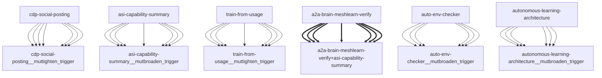

# Darwin Engine Report
_2026-10-01T19:16:12.530454+00:00 — evolutionary skill ecosystem_

**Population:** 163 Skills | **Offspring:** 5 | **Competitions:** 25

## Top 10 (fittest skills)

| Skill | Fitness | Usage | Age (days) | Mutationen W/L |
|---|---|---|---|---|
| auto-env-checker | 2432.77 | 2481 | 7 | 15/88 |
| autonomous-learning-architecture | 2183.73 | 2171 | 8 | 0/0 |
| cdp-social-posting | 1229.73 | 1217 | 8 | 0/0 |
| asi-capability-summary | 1092.77 | 1083 | 7 | 0/0 |
| train-from-usage | 985.67 | 979 | 10 | 0/4 |
| plugin-api | 952.77 | 943 | 7 | 0/0 |
| a2a-brain-meshlearn-verify | 794.8 | 785 | 6 | 0/0 |
| asi-identity | 321.67 | 312 | 10 | 0/0 |
| self-rewriter | 279.93 | 329 | 32 | 7/72 |
| darwin-harvested-openamer-cli-main-py | 122.17 | 68 | 25 | 30/15 |

## Bottom 5 (selection candidates)

- **darwin-harvested-tmp-buf-check-py** (Fitness 15.7, 9 days old)
- **darwin-harvested-tmp-cycle-census-py** (Fitness 15.7, 9 days old)
- **darwin-harvested-tmp-hook-update-md** (Fitness 15.7, 9 days old)
- **darwin-harvested-tmp-read-issue18-py** (Fitness 15.7, 9 days old)
- **darwin-harvested-tmp-tr-before-e2e-json** (Fitness 15.7, 9 days old)

## New mutations

- auto-env-checker → `auto-env-checker__mutbroaden_trigger` (op=broaden_trigger, applied=True)
- autonomous-learning-architecture → `autonomous-learning-architecture__mutbroaden_trigger` (op=broaden_trigger, applied=True)
- cdp-social-posting → `cdp-social-posting__muttighten_trigger` (op=tighten_trigger, applied=True)
- asi-capability-summary → `asi-capability-summary__mutbroaden_trigger` (op=broaden_trigger, applied=True)
- train-from-usage → `train-from-usage__muttighten_trigger` (op=tighten_trigger, applied=True)

## Competitions

- ⏳ `a2a-brain-meshlearn-verify+asi-capability-summary` (0) vs `None` (0)
- ⏳ `asi-capability-summary+asi-identity` (0) vs `None` (0)
- ⏳ `asi-capability-summary__mutbroaden_trigger` (1092.77) vs `asi-capability-summary` (1092.77)
- ⏳ `asi-capability-summary__muttighten_trigger` (1092.77) vs `asi-capability-summary` (1092.77)
- ⏳ `asi-identity+auto-env-checker` (0) vs `None` (0)
- ⏳ `auto-env-checker+autonomous-learning-architecture` (0) vs `None` (0)
- ⏳ `auto-env-checker+cdp-social-posting` (0) vs `None` (0)
- ⏳ `auto-env-checker__mutbroaden_trigger` (2432.77) vs `auto-env-checker` (2432.77)
- ⏳ `autonomous-learning-architecture__mutbroaden_trigger` (2183.73) vs `autonomous-learning-architecture` (2183.73)
- ⏳ `autonomous-learning-architecture__muttighten_trigger` (2183.73) vs `autonomous-learning-architecture` (2183.73)
- ⏳ `cdp-social-posting__muttighten_trigger` (1229.73) vs `cdp-social-posting` (1229.73)
- ⏳ `discord-server-management__mutadd_verification_step` (41.53) vs `discord-server-management` (41.53)
- ⏳ `discord-server-management__mutbroaden_trigger` (41.53) vs `discord-server-management` (41.53)
- ⏳ `discord-server-management__muttighten_trigger` (41.53) vs `discord-server-management` (41.53)
- ⏳ `github-readme-summary__mutbroaden_trigger` (32.67) vs `github-readme-summary` (32.67)
- ⏳ `github-readme-summary__muttighten_trigger` (32.67) vs `github-readme-summary` (32.67)
- ⏳ `openamer-plugin-development__muttighten_trigger` (30.93) vs `openamer-plugin-development` (30.93)
- ⏳ `plugin-api__mutbroaden_trigger` (952.77) vs `plugin-api` (952.77)
- ⏳ `plugin-api__muttighten_trigger` (952.77) vs `plugin-api` (952.77)
- ⏳ `train-from-usage__mutadd_pitfall` (985.67) vs `train-from-usage` (985.67)
- ⏳ `train-from-usage__mutadd_verification_step` (985.67) vs `train-from-usage` (985.67)
- ⏳ `train-from-usage__mutbroaden_trigger` (985.67) vs `train-from-usage` (985.67)
- ⏳ `train-from-usage__muttighten_trigger` (985.67) vs `train-from-usage` (985.67)
- ⏳ `undetectable-browsing__muttighten_trigger` (33.73) vs `undetectable-browsing` (33.73)
- ⏳ `vscode-extension-scaffold__mutbroaden_trigger` (34.67) vs `vscode-extension-scaffold` (34.67)

## Evolution Tree

```mermaid
graph TD
    cdp-social-posting["cdp-social-posting"] --> cdp-social-posting__muttighten_trigger["cdp-social-posting__muttighten_trigger"]
    asi-capability-summary["asi-capability-summary"] --> asi-capability-summary__mutbroaden_trigger["asi-capability-summary__mutbroaden_trigger"]
    train-from-usage["train-from-usage"] --> train-from-usage__muttighten_trigger["train-from-usage__muttighten_trigger"]
    a2a-brain-meshlearn-verify["a2a-brain-meshlearn-verify"] ==> a2a-brain-meshlearn-verify+asi-capability-summary["a2a-brain-meshlearn-verify+asi-capability-summary"]
    auto-env-checker["auto-env-checker"] --> auto-env-checker__mutbroaden_trigger["auto-env-checker__mutbroaden_trigger"]
    autonomous-learning-architecture["autonomous-learning-architecture"] --> autonomous-learning-architecture__mutbroaden_trigger["autonomous-learning-architecture__mutbroaden_trigger"]
    cdp-social-posting["cdp-social-posting"] --> cdp-social-posting__muttighten_trigger["cdp-social-posting__muttighten_trigger"]
    asi-capability-summary["asi-capability-summary"] --> asi-capability-summary__mutbroaden_trigger["asi-capability-summary__mutbroaden_trigger"]
    train-from-usage["train-from-usage"] --> train-from-usage__muttighten_trigger["train-from-usage__muttighten_trigger"]
    a2a-brain-meshlearn-verify["a2a-brain-meshlearn-verify"] ==> a2a-brain-meshlearn-verify+asi-capability-summary["a2a-brain-meshlearn-verify+asi-capability-summary"]
    auto-env-checker["auto-env-checker"] --> auto-env-checker__mutbroaden_trigger["auto-env-checker__mutbroaden_trigger"]
    autonomous-learning-architecture["autonomous-learning-architecture"] --> autonomous-learning-architecture__mutbroaden_trigger["autonomous-learning-architecture__mutbroaden_trigger"]
    cdp-social-posting["cdp-social-posting"] --> cdp-social-posting__muttighten_trigger["cdp-social-posting__muttighten_trigger"]
    asi-capability-summary["asi-capability-summary"] --> asi-capability-summary__mutbroaden_trigger["asi-capability-summary__mutbroaden_trigger"]
    train-from-usage["train-from-usage"] --> train-from-usage__muttighten_trigger["train-from-usage__muttighten_trigger"]
    a2a-brain-meshlearn-verify["a2a-brain-meshlearn-verify"] ==> a2a-brain-meshlearn-verify+asi-capability-summary["a2a-brain-meshlearn-verify+asi-capability-summary"]
    auto-env-checker["auto-env-checker"] --> auto-env-checker__mutbroaden_trigger["auto-env-checker__mutbroaden_trigger"]
    autonomous-learning-architecture["autonomous-learning-architecture"] --> autonomous-learning-architecture__mutbroaden_trigger["autonomous-learning-architecture__mutbroaden_trigger"]
    cdp-social-posting["cdp-social-posting"] --> cdp-social-posting__muttighten_trigger["cdp-social-posting__muttighten_trigger"]
    asi-capability-summary["asi-capability-summary"] --> asi-capability-summary__mutbroaden_trigger["asi-capability-summary__mutbroaden_trigger"]
    train-from-usage["train-from-usage"] --> train-from-usage__muttighten_trigger["train-from-usage__muttighten_trigger"]
    a2a-brain-meshlearn-verify["a2a-brain-meshlearn-verify"] ==> a2a-brain-meshlearn-verify+asi-capability-summary["a2a-brain-meshlearn-verify+asi-capability-summary"]
    auto-env-checker["auto-env-checker"] --> auto-env-checker__mutbroaden_trigger["auto-env-checker__mutbroaden_trigger"]
    autonomous-learning-architecture["autonomous-learning-architecture"] --> autonomous-learning-architecture__mutbroaden_trigger["autonomous-learning-architecture__mutbroaden_trigger"]
    cdp-social-posting["cdp-social-posting"] --> cdp-social-posting__muttighten_trigger["cdp-social-posting__muttighten_trigger"]
    asi-capability-summary["asi-capability-summary"] --> asi-capability-summary__mutbroaden_trigger["asi-capability-summary__mutbroaden_trigger"]
    train-from-usage["train-from-usage"] --> train-from-usage__muttighten_trigger["train-from-usage__muttighten_trigger"]
    a2a-brain-meshlearn-verify["a2a-brain-meshlearn-verify"] ==> a2a-brain-meshlearn-verify+asi-capability-summary["a2a-brain-meshlearn-verify+asi-capability-summary"]
    auto-env-checker["auto-env-checker"] --> auto-env-checker__mutbroaden_trigger["auto-env-checker__mutbroaden_trigger"]
    autonomous-learning-architecture["autonomous-learning-architecture"] --> autonomous-learning-architecture__mutbroaden_trigger["autonomous-learning-architecture__mutbroaden_trigger"]
    cdp-social-posting["cdp-social-posting"] --> cdp-social-posting__muttighten_trigger["cdp-social-posting__muttighten_trigger"]
    asi-capability-summary["asi-capability-summary"] --> asi-capability-summary__mutbroaden_trigger["asi-capability-summary__mutbroaden_trigger"]
    train-from-usage["train-from-usage"] --> train-from-usage__muttighten_trigger["train-from-usage__muttighten_trigger"]
    a2a-brain-meshlearn-verify["a2a-brain-meshlearn-verify"] ==> a2a-brain-meshlearn-verify+asi-capability-summary["a2a-brain-meshlearn-verify+asi-capability-summary"]
    auto-env-checker["auto-env-checker"] --> auto-env-checker__mutbroaden_trigger["auto-env-checker__mutbroaden_trigger"]
    autonomous-learning-architecture["autonomous-learning-architecture"] --> autonomous-learning-architecture__mutbroaden_trigger["autonomous-learning-architecture__mutbroaden_trigger"]
    cdp-social-posting["cdp-social-posting"] --> cdp-social-posting__muttighten_trigger["cdp-social-posting__muttighten_trigger"]
    asi-capability-summary["asi-capability-summary"] --> asi-capability-summary__mutbroaden_trigger["asi-capability-summary__mutbroaden_trigger"]
    train-from-usage["train-from-usage"] --> train-from-usage__muttighten_trigger["train-from-usage__muttighten_trigger"]
    a2a-brain-meshlearn-verify["a2a-brain-meshlearn-verify"] ==> a2a-brain-meshlearn-verify+asi-capability-summary["a2a-brain-meshlearn-verify+asi-capability-summary"]
```
