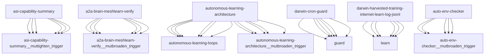

# Darwin Engine Report
_2026-10-10T20:15:55.098190+00:00 — evolutionary skill ecosystem_

**Population:** 1099 Skills | **Offspring:** 4 | **Competitions:** 28

## Top 10 (fittest skills)

| Skill | Fitness | Usage | Age (days) | Mutationen W/L |
|---|---|---|---|---|
| autonomous-learning-architecture | 2924.0 | 2612 | 0 | 148/0 |
| auto-env-checker | 2825.47 | 2871 | 16 | 15/88 |
| asi-capability-summary | 1932.47 | 1920 | 16 | 0/0 |
| learning-loop | 1745.37 | 1734 | 49 | 0/0 |
| a2a-brain-meshlearn-verify | 1634.5 | 1622 | 15 | 0/0 |
| cdp-social-posting | 1573.0 | 1557 | 0 | 0/0 |
| train-from-usage | 1097.37 | 1088 | 19 | 0/4 |
| plugin-api | 966.37 | 955 | 49 | 0/0 |
| darwin-cron-guard | 503.0 | 174 | 0 | 170/24 |
| darwin-harvested-training-internet-learn-log-jsonl | 473.0 | 149 | 0 | 166/21 |

## Bottom 5 (selection candidates)

- **tao-train-optical-inspection** (Fitness 8.0, 0 days old)
- **web-artifacts-builder** (Fitness 8.0, 0 days old)
- **xlsx** (Fitness 8.0, 0 days old)
- **cron-autotest-run-cron-entry** (Fitness 7.33, 20 days old)
- **systematic-debugging** (Fitness 6.37, 49 days old)

## New mutations

- autonomous-learning-architecture → `autonomous-learning-architecture__mutbroaden_trigger` (op=broaden_trigger, applied=True)
- auto-env-checker → `auto-env-checker__mutbroaden_trigger` (op=broaden_trigger, applied=True)
- asi-capability-summary → `asi-capability-summary__muttighten_trigger` (op=tighten_trigger, applied=True)
- a2a-brain-meshlearn-verify → `a2a-brain-meshlearn-verify__mutbroaden_trigger` (op=broaden_trigger, applied=True)

## Competitions

- ⏳ `a2a-brain-meshlearn-verify+asi-capability-summary` (0) vs `None` (0)
- ⏳ `a2a-brain-meshlearn-verify__mutbroaden_trigger` (1634.5) vs `a2a-brain-meshlearn-verify` (1634.5)
- ⏳ `a2a-brain-meshlearn-verify__muttighten_trigger` (1634.5) vs `a2a-brain-meshlearn-verify` (1634.5)
- ⏳ `asi-capability-summary+asi-identity` (0) vs `None` (0)
- ⏳ `asi-capability-summary__mutbroaden_trigger` (1932.47) vs `asi-capability-summary` (1932.47)
- ⏳ `asi-capability-summary__muttighten_trigger` (1932.47) vs `asi-capability-summary` (1932.47)
- ⏳ `asi-identity+auto-env-checker` (0) vs `None` (0)
- ⏳ `auto-env-checker+autonomous-learning-architecture` (0) vs `None` (0)
- ⏳ `auto-env-checker+cdp-social-posting` (0) vs `None` (0)
- ⏳ `auto-env-checker__mutbroaden_trigger` (2825.47) vs `auto-env-checker` (2825.47)
- ⏳ `autonomous-learning-architecture__mutbroaden_trigger` (2924.0) vs `autonomous-learning-architecture` (2924.0)
- ⏳ `autonomous-learning-architecture__muttighten_trigger` (2924.0) vs `autonomous-learning-architecture` (2924.0)
- ⏳ `cdp-social-posting__mutbroaden_trigger` (1573.0) vs `cdp-social-posting` (1573.0)
- ⏳ `cdp-social-posting__muttighten_trigger` (1573.0) vs `cdp-social-posting` (1573.0)
- ⏳ `discord-server-management__mutadd_verification_step` (60.23) vs `discord-server-management` (60.23)
- ⏳ `discord-server-management__mutbroaden_trigger` (60.23) vs `discord-server-management` (60.23)
- ⏳ `discord-server-management__muttighten_trigger` (60.23) vs `discord-server-management` (60.23)
- ⏳ `github-readme-summary__mutbroaden_trigger` (39.37) vs `github-readme-summary` (39.37)
- ⏳ `github-readme-summary__muttighten_trigger` (39.37) vs `github-readme-summary` (39.37)
- ⏳ `openamer-plugin-development__muttighten_trigger` (34.63) vs `openamer-plugin-development` (34.63)
- ⏳ `plugin-api__mutbroaden_trigger` (966.37) vs `plugin-api` (966.37)
- ⏳ `plugin-api__muttighten_trigger` (966.37) vs `plugin-api` (966.37)
- ⏳ `train-from-usage__mutadd_pitfall` (1097.37) vs `train-from-usage` (1097.37)
- ⏳ `train-from-usage__mutadd_verification_step` (1097.37) vs `train-from-usage` (1097.37)
- ⏳ `train-from-usage__mutbroaden_trigger` (1097.37) vs `train-from-usage` (1097.37)
- ⏳ `train-from-usage__muttighten_trigger` (1097.37) vs `train-from-usage` (1097.37)
- ⏳ `undetectable-browsing__muttighten_trigger` (42.43) vs `undetectable-browsing` (42.43)
- ⏳ `vscode-extension-scaffold__mutbroaden_trigger` (42.37) vs `vscode-extension-scaffold` (42.37)

## Evolution Tree

```mermaid
graph TD
    asi-capability-summary["asi-capability-summary"] --> asi-capability-summary__muttighten_trigger["asi-capability-summary__muttighten_trigger"]
    a2a-brain-meshlearn-verify["a2a-brain-meshlearn-verify"] --> a2a-brain-meshlearn-verify__mutbroaden_trigger["a2a-brain-meshlearn-verify__mutbroaden_trigger"]
    autonomous-learning-architecture["autonomous-learning-architecture"] --> autonomous-learning-loops["autonomous-learning-loops"]
    darwin-cron-guard["darwin-cron-guard"] --> guard["guard"]
    darwin-harvested-training-internet-learn-log-jsonl["darwin-harvested-training-internet-learn-log-jsonl"] --> learn["learn"]
    autonomous-learning-architecture["autonomous-learning-architecture"] --> autonomous-learning-architecture__mutbroaden_trigger["autonomous-learning-architecture__mutbroaden_trigger"]
    auto-env-checker["auto-env-checker"] --> auto-env-checker__mutbroaden_trigger["auto-env-checker__mutbroaden_trigger"]
    asi-capability-summary["asi-capability-summary"] --> asi-capability-summary__muttighten_trigger["asi-capability-summary__muttighten_trigger"]
    a2a-brain-meshlearn-verify["a2a-brain-meshlearn-verify"] --> a2a-brain-meshlearn-verify__mutbroaden_trigger["a2a-brain-meshlearn-verify__mutbroaden_trigger"]
    autonomous-learning-architecture["autonomous-learning-architecture"] --> autonomous-learning-loops["autonomous-learning-loops"]
    darwin-cron-guard["darwin-cron-guard"] --> guard["guard"]
    darwin-harvested-training-internet-learn-log-jsonl["darwin-harvested-training-internet-learn-log-jsonl"] --> learn["learn"]
    autonomous-learning-architecture["autonomous-learning-architecture"] --> autonomous-learning-architecture__mutbroaden_trigger["autonomous-learning-architecture__mutbroaden_trigger"]
    auto-env-checker["auto-env-checker"] --> auto-env-checker__mutbroaden_trigger["auto-env-checker__mutbroaden_trigger"]
    asi-capability-summary["asi-capability-summary"] --> asi-capability-summary__muttighten_trigger["asi-capability-summary__muttighten_trigger"]
    a2a-brain-meshlearn-verify["a2a-brain-meshlearn-verify"] --> a2a-brain-meshlearn-verify__mutbroaden_trigger["a2a-brain-meshlearn-verify__mutbroaden_trigger"]
    autonomous-learning-architecture["autonomous-learning-architecture"] --> autonomous-learning-loops["autonomous-learning-loops"]
    darwin-cron-guard["darwin-cron-guard"] --> guard["guard"]
    darwin-harvested-training-internet-learn-log-jsonl["darwin-harvested-training-internet-learn-log-jsonl"] --> learn["learn"]
    autonomous-learning-architecture["autonomous-learning-architecture"] --> autonomous-learning-architecture__mutbroaden_trigger["autonomous-learning-architecture__mutbroaden_trigger"]
    auto-env-checker["auto-env-checker"] --> auto-env-checker__mutbroaden_trigger["auto-env-checker__mutbroaden_trigger"]
    asi-capability-summary["asi-capability-summary"] --> asi-capability-summary__muttighten_trigger["asi-capability-summary__muttighten_trigger"]
    a2a-brain-meshlearn-verify["a2a-brain-meshlearn-verify"] --> a2a-brain-meshlearn-verify__mutbroaden_trigger["a2a-brain-meshlearn-verify__mutbroaden_trigger"]
    autonomous-learning-architecture["autonomous-learning-architecture"] --> autonomous-learning-loops["autonomous-learning-loops"]
    darwin-cron-guard["darwin-cron-guard"] --> guard["guard"]
    darwin-harvested-training-internet-learn-log-jsonl["darwin-harvested-training-internet-learn-log-jsonl"] --> learn["learn"]
    autonomous-learning-architecture["autonomous-learning-architecture"] --> autonomous-learning-architecture__mutbroaden_trigger["autonomous-learning-architecture__mutbroaden_trigger"]
    auto-env-checker["auto-env-checker"] --> auto-env-checker__mutbroaden_trigger["auto-env-checker__mutbroaden_trigger"]
    asi-capability-summary["asi-capability-summary"] --> asi-capability-summary__muttighten_trigger["asi-capability-summary__muttighten_trigger"]
    a2a-brain-meshlearn-verify["a2a-brain-meshlearn-verify"] --> a2a-brain-meshlearn-verify__mutbroaden_trigger["a2a-brain-meshlearn-verify__mutbroaden_trigger"]
    autonomous-learning-architecture["autonomous-learning-architecture"] --> autonomous-learning-loops["autonomous-learning-loops"]
    darwin-cron-guard["darwin-cron-guard"] --> guard["guard"]
    darwin-harvested-training-internet-learn-log-jsonl["darwin-harvested-training-internet-learn-log-jsonl"] --> learn["learn"]
    autonomous-learning-architecture["autonomous-learning-architecture"] --> autonomous-learning-architecture__mutbroaden_trigger["autonomous-learning-architecture__mutbroaden_trigger"]
    auto-env-checker["auto-env-checker"] --> auto-env-checker__mutbroaden_trigger["auto-env-checker__mutbroaden_trigger"]
    asi-capability-summary["asi-capability-summary"] --> asi-capability-summary__muttighten_trigger["asi-capability-summary__muttighten_trigger"]
    a2a-brain-meshlearn-verify["a2a-brain-meshlearn-verify"] --> a2a-brain-meshlearn-verify__mutbroaden_trigger["a2a-brain-meshlearn-verify__mutbroaden_trigger"]
    autonomous-learning-architecture["autonomous-learning-architecture"] --> autonomous-learning-loops["autonomous-learning-loops"]
    darwin-cron-guard["darwin-cron-guard"] --> guard["guard"]
    darwin-harvested-training-internet-learn-log-jsonl["darwin-harvested-training-internet-learn-log-jsonl"] --> learn["learn"]
```
