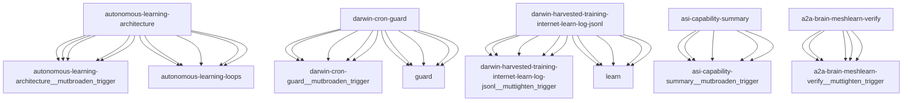

# Darwin Engine Report
_2026-10-27T01:36:16.398059+00:00 — evolutionary skill ecosystem_

**Population:** 1221 Skills | **Offspring:** 5 | **Competitions:** 33

## Top 10 (fittest skills)

| Skill | Fitness | Usage | Age (days) | Mutationen W/L |
|---|---|---|---|---|
| autonomous-learning-architecture | 2257.0 | 646 | 0 | 886/177 |
| darwin-cron-guard | 2095.0 | 280 | 0 | 913/25 |
| darwin-harvested-training-internet-learn-log-jsonl | 2077.0 | 274 | 0 | 905/21 |
| asi-capability-summary | 1074.93 | 1063 | 32 | 0/0 |
| a2a-brain-meshlearn-verify | 1068.53 | 1056 | 14 | 0/0 |
| auto-env-checker | 508.93 | 555 | 32 | 15/88 |
| learning-loop | 457.8 | 447 | 66 | 0/0 |
| cdp-social-posting | 390.57 | 375 | 13 | 0/0 |
| train-from-usage | 158.8 | 150 | 36 | 0/4 |
| mini-openamer | 157.6 | 145 | 12 | 0/0 |

## Bottom 5 (selection candidates)

- **tao-setup-nvidia-gpu-host** (Fitness 7.47, 16 days old)
- **tao-train-optical-inspection** (Fitness 7.47, 16 days old)
- **web-artifacts-builder** (Fitness 7.47, 16 days old)
- **xlsx** (Fitness 7.47, 16 days old)
- **cron-autotest-run-cron-entry** (Fitness 6.8, 36 days old)

## New mutations

- autonomous-learning-architecture → `autonomous-learning-architecture__mutbroaden_trigger` (op=broaden_trigger, applied=True)
- darwin-cron-guard → `darwin-cron-guard__mutbroaden_trigger` (op=broaden_trigger, applied=True)
- darwin-harvested-training-internet-learn-log-jsonl → `darwin-harvested-training-internet-learn-log-jsonl__muttighten_trigger` (op=tighten_trigger, applied=True)
- asi-capability-summary → `asi-capability-summary__mutbroaden_trigger` (op=broaden_trigger, applied=True)
- a2a-brain-meshlearn-verify → `a2a-brain-meshlearn-verify__muttighten_trigger` (op=tighten_trigger, applied=True)

## Competitions

- ⏳ `a2a-brain-meshlearn-verify+asi-capability-summary` (0) vs `None` (0)
- ⏳ `a2a-brain-meshlearn-verify__mutbroaden_trigger` (1068.53) vs `a2a-brain-meshlearn-verify` (1068.53)
- ⏳ `a2a-brain-meshlearn-verify__muttighten_trigger` (1068.53) vs `a2a-brain-meshlearn-verify` (1068.53)
- ⏳ `asi-capability-summary+asi-identity` (0) vs `None` (0)
- ⏳ `asi-capability-summary__mutbroaden_trigger` (1074.93) vs `asi-capability-summary` (1074.93)
- ⏳ `asi-capability-summary__muttighten_trigger` (1074.93) vs `asi-capability-summary` (1074.93)
- ⏳ `asi-identity+auto-env-checker` (0) vs `None` (0)
- ⏳ `auto-env-checker+autonomous-learning-architecture` (0) vs `None` (0)
- ⏳ `auto-env-checker+cdp-social-posting` (0) vs `None` (0)
- ⏳ `auto-env-checker__mutbroaden_trigger` (508.93) vs `auto-env-checker` (508.93)
- ⏳ `auto-env-checker__muttighten_trigger` (508.93) vs `auto-env-checker` (508.93)
- ⏳ `autonomous-learning-architecture__mutbroaden_trigger` (2257.0) vs `autonomous-learning-architecture` (2257.0)
- ⏳ `autonomous-learning-architecture__muttighten_trigger` (2257.0) vs `autonomous-learning-architecture` (2257.0)
- ⏳ `cdp-social-posting__mutbroaden_trigger` (390.57) vs `cdp-social-posting` (390.57)
- ⏳ `cdp-social-posting__muttighten_trigger` (390.57) vs `cdp-social-posting` (390.57)
- ⏳ `darwin-cron-guard__mutbroaden_trigger` (2095.0) vs `darwin-cron-guard` (2095.0)
- ⏳ `darwin-cron-guard__muttighten_trigger` (2095.0) vs `darwin-cron-guard` (2095.0)
- ⏳ `darwin-harvested-training-internet-learn-log-jsonl__mutbroaden_trigger` (2077.0) vs `darwin-harvested-training-internet-learn-log-jsonl` (2077.0)
- ⏳ `darwin-harvested-training-internet-learn-log-jsonl__muttighten_trigger` (2077.0) vs `darwin-harvested-training-internet-learn-log-jsonl` (2077.0)
- ⏳ `discord-server-management__mutadd_verification_step` (32.7) vs `discord-server-management` (32.7)
- ⏳ `discord-server-management__mutbroaden_trigger` (32.7) vs `discord-server-management` (32.7)
- ⏳ `discord-server-management__muttighten_trigger` (32.7) vs `discord-server-management` (32.7)
- ⏳ `github-readme-summary__mutbroaden_trigger` (24.47) vs `github-readme-summary` (24.47)
- ⏳ `github-readme-summary__muttighten_trigger` (24.47) vs `github-readme-summary` (24.47)
- ⏳ `openamer-plugin-development__muttighten_trigger` (22.5) vs `openamer-plugin-development` (22.5)
- ⏳ `plugin-api__mutbroaden_trigger` (36.8) vs `plugin-api` (36.8)
- ⏳ `plugin-api__muttighten_trigger` (36.8) vs `plugin-api` (36.8)
- ⏳ `train-from-usage__mutadd_pitfall` (158.8) vs `train-from-usage` (158.8)
- ⏳ `train-from-usage__mutadd_verification_step` (158.8) vs `train-from-usage` (158.8)
- ⏳ `train-from-usage__mutbroaden_trigger` (158.8) vs `train-from-usage` (158.8)
- ⏳ `train-from-usage__muttighten_trigger` (158.8) vs `train-from-usage` (158.8)
- ⏳ `undetectable-browsing__muttighten_trigger` (26.87) vs `undetectable-browsing` (26.87)
- ⏳ `vscode-extension-scaffold__mutbroaden_trigger` (23.8) vs `vscode-extension-scaffold` (23.8)

## Evolution Tree

```mermaid
graph TD
    autonomous-learning-architecture["autonomous-learning-architecture"] --> autonomous-learning-architecture__mutbroaden_trigger["autonomous-learning-architecture__mutbroaden_trigger"]
    darwin-cron-guard["darwin-cron-guard"] --> darwin-cron-guard__mutbroaden_trigger["darwin-cron-guard__mutbroaden_trigger"]
    darwin-harvested-training-internet-learn-log-jsonl["darwin-harvested-training-internet-learn-log-jsonl"] --> darwin-harvested-training-internet-learn-log-jsonl__muttighten_trigger["darwin-harvested-training-internet-learn-log-jsonl__muttighten_trigger"]
    asi-capability-summary["asi-capability-summary"] --> asi-capability-summary__mutbroaden_trigger["asi-capability-summary__mutbroaden_trigger"]
    a2a-brain-meshlearn-verify["a2a-brain-meshlearn-verify"] --> a2a-brain-meshlearn-verify__muttighten_trigger["a2a-brain-meshlearn-verify__muttighten_trigger"]
    autonomous-learning-architecture["autonomous-learning-architecture"] --> autonomous-learning-loops["autonomous-learning-loops"]
    darwin-cron-guard["darwin-cron-guard"] --> guard["guard"]
    darwin-harvested-training-internet-learn-log-jsonl["darwin-harvested-training-internet-learn-log-jsonl"] --> learn["learn"]
    autonomous-learning-architecture["autonomous-learning-architecture"] --> autonomous-learning-architecture__mutbroaden_trigger["autonomous-learning-architecture__mutbroaden_trigger"]
    darwin-cron-guard["darwin-cron-guard"] --> darwin-cron-guard__mutbroaden_trigger["darwin-cron-guard__mutbroaden_trigger"]
    darwin-harvested-training-internet-learn-log-jsonl["darwin-harvested-training-internet-learn-log-jsonl"] --> darwin-harvested-training-internet-learn-log-jsonl__muttighten_trigger["darwin-harvested-training-internet-learn-log-jsonl__muttighten_trigger"]
    asi-capability-summary["asi-capability-summary"] --> asi-capability-summary__mutbroaden_trigger["asi-capability-summary__mutbroaden_trigger"]
    a2a-brain-meshlearn-verify["a2a-brain-meshlearn-verify"] --> a2a-brain-meshlearn-verify__muttighten_trigger["a2a-brain-meshlearn-verify__muttighten_trigger"]
    autonomous-learning-architecture["autonomous-learning-architecture"] --> autonomous-learning-loops["autonomous-learning-loops"]
    darwin-cron-guard["darwin-cron-guard"] --> guard["guard"]
    darwin-harvested-training-internet-learn-log-jsonl["darwin-harvested-training-internet-learn-log-jsonl"] --> learn["learn"]
    autonomous-learning-architecture["autonomous-learning-architecture"] --> autonomous-learning-architecture__mutbroaden_trigger["autonomous-learning-architecture__mutbroaden_trigger"]
    darwin-cron-guard["darwin-cron-guard"] --> darwin-cron-guard__mutbroaden_trigger["darwin-cron-guard__mutbroaden_trigger"]
    darwin-harvested-training-internet-learn-log-jsonl["darwin-harvested-training-internet-learn-log-jsonl"] --> darwin-harvested-training-internet-learn-log-jsonl__muttighten_trigger["darwin-harvested-training-internet-learn-log-jsonl__muttighten_trigger"]
    asi-capability-summary["asi-capability-summary"] --> asi-capability-summary__mutbroaden_trigger["asi-capability-summary__mutbroaden_trigger"]
    a2a-brain-meshlearn-verify["a2a-brain-meshlearn-verify"] --> a2a-brain-meshlearn-verify__muttighten_trigger["a2a-brain-meshlearn-verify__muttighten_trigger"]
    autonomous-learning-architecture["autonomous-learning-architecture"] --> autonomous-learning-loops["autonomous-learning-loops"]
    darwin-cron-guard["darwin-cron-guard"] --> guard["guard"]
    darwin-harvested-training-internet-learn-log-jsonl["darwin-harvested-training-internet-learn-log-jsonl"] --> learn["learn"]
    autonomous-learning-architecture["autonomous-learning-architecture"] --> autonomous-learning-architecture__mutbroaden_trigger["autonomous-learning-architecture__mutbroaden_trigger"]
    darwin-cron-guard["darwin-cron-guard"] --> darwin-cron-guard__mutbroaden_trigger["darwin-cron-guard__mutbroaden_trigger"]
    darwin-harvested-training-internet-learn-log-jsonl["darwin-harvested-training-internet-learn-log-jsonl"] --> darwin-harvested-training-internet-learn-log-jsonl__muttighten_trigger["darwin-harvested-training-internet-learn-log-jsonl__muttighten_trigger"]
    asi-capability-summary["asi-capability-summary"] --> asi-capability-summary__mutbroaden_trigger["asi-capability-summary__mutbroaden_trigger"]
    a2a-brain-meshlearn-verify["a2a-brain-meshlearn-verify"] --> a2a-brain-meshlearn-verify__muttighten_trigger["a2a-brain-meshlearn-verify__muttighten_trigger"]
    autonomous-learning-architecture["autonomous-learning-architecture"] --> autonomous-learning-loops["autonomous-learning-loops"]
    darwin-cron-guard["darwin-cron-guard"] --> guard["guard"]
    darwin-harvested-training-internet-learn-log-jsonl["darwin-harvested-training-internet-learn-log-jsonl"] --> learn["learn"]
    autonomous-learning-architecture["autonomous-learning-architecture"] --> autonomous-learning-architecture__mutbroaden_trigger["autonomous-learning-architecture__mutbroaden_trigger"]
    darwin-cron-guard["darwin-cron-guard"] --> darwin-cron-guard__mutbroaden_trigger["darwin-cron-guard__mutbroaden_trigger"]
    darwin-harvested-training-internet-learn-log-jsonl["darwin-harvested-training-internet-learn-log-jsonl"] --> darwin-harvested-training-internet-learn-log-jsonl__muttighten_trigger["darwin-harvested-training-internet-learn-log-jsonl__muttighten_trigger"]
    asi-capability-summary["asi-capability-summary"] --> asi-capability-summary__mutbroaden_trigger["asi-capability-summary__mutbroaden_trigger"]
    a2a-brain-meshlearn-verify["a2a-brain-meshlearn-verify"] --> a2a-brain-meshlearn-verify__muttighten_trigger["a2a-brain-meshlearn-verify__muttighten_trigger"]
    autonomous-learning-architecture["autonomous-learning-architecture"] --> autonomous-learning-loops["autonomous-learning-loops"]
    darwin-cron-guard["darwin-cron-guard"] --> guard["guard"]
    darwin-harvested-training-internet-learn-log-jsonl["darwin-harvested-training-internet-learn-log-jsonl"] --> learn["learn"]
```
