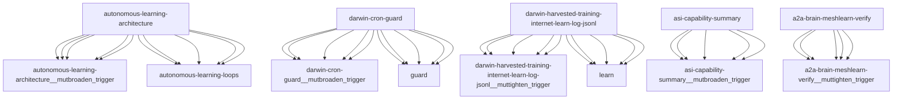

# Darwin Engine Report
_2026-11-05T11:07:29.074719+00:00 — evolutionary skill ecosystem_

**Population:** 1262 Skills | **Offspring:** 5 | **Competitions:** 33

## Top 10 (fittest skills)

| Skill | Fitness | Usage | Age (days) | Mutationen W/L |
|---|---|---|---|---|
| autonomous-learning-architecture | 2958.0 | 606 | 0 | 1318/300 |
| darwin-cron-guard | 2955.0 | 279 | 0 | 1345/28 |
| darwin-harvested-training-internet-learn-log-jsonl | 2938.0 | 273 | 0 | 1336/21 |
| asi-capability-summary | 855.63 | 844 | 41 | 0/0 |
| a2a-brain-meshlearn-verify | 850.2 | 838 | 24 | 0/0 |
| auto-env-checker | 465.63 | 512 | 41 | 15/88 |
| learning-loop | 442.5 | 432 | 75 | 0/0 |
| cdp-social-posting | 347.27 | 332 | 22 | 0/0 |
| mini-openamer | 172.3 | 160 | 21 | 0/0 |
| train-from-usage | 111.5 | 103 | 45 | 0/4 |

## Bottom 5 (selection candidates)

- **tao-setup-nvidia-gpu-host** (Fitness 7.13, 26 days old)
- **tao-train-optical-inspection** (Fitness 7.13, 26 days old)
- **web-artifacts-builder** (Fitness 7.13, 26 days old)
- **xlsx** (Fitness 7.13, 26 days old)
- **cron-autotest-run-cron-entry** (Fitness 6.5, 45 days old)

## New mutations

- autonomous-learning-architecture → `autonomous-learning-architecture__mutbroaden_trigger` (op=broaden_trigger, applied=True)
- darwin-cron-guard → `darwin-cron-guard__mutbroaden_trigger` (op=broaden_trigger, applied=True)
- darwin-harvested-training-internet-learn-log-jsonl → `darwin-harvested-training-internet-learn-log-jsonl__muttighten_trigger` (op=tighten_trigger, applied=True)
- asi-capability-summary → `asi-capability-summary__mutbroaden_trigger` (op=broaden_trigger, applied=True)
- a2a-brain-meshlearn-verify → `a2a-brain-meshlearn-verify__muttighten_trigger` (op=tighten_trigger, applied=True)

## Competitions

- ⏳ `a2a-brain-meshlearn-verify+asi-capability-summary` (0) vs `None` (0)
- ⏳ `a2a-brain-meshlearn-verify__mutbroaden_trigger` (850.2) vs `a2a-brain-meshlearn-verify` (850.2)
- ⏳ `a2a-brain-meshlearn-verify__muttighten_trigger` (850.2) vs `a2a-brain-meshlearn-verify` (850.2)
- ⏳ `asi-capability-summary+asi-identity` (0) vs `None` (0)
- ⏳ `asi-capability-summary__mutbroaden_trigger` (855.63) vs `asi-capability-summary` (855.63)
- ⏳ `asi-capability-summary__muttighten_trigger` (855.63) vs `asi-capability-summary` (855.63)
- ⏳ `asi-identity+auto-env-checker` (0) vs `None` (0)
- ⏳ `auto-env-checker+autonomous-learning-architecture` (0) vs `None` (0)
- ⏳ `auto-env-checker+cdp-social-posting` (0) vs `None` (0)
- ⏳ `auto-env-checker__mutbroaden_trigger` (465.63) vs `auto-env-checker` (465.63)
- ⏳ `auto-env-checker__muttighten_trigger` (465.63) vs `auto-env-checker` (465.63)
- ⏳ `autonomous-learning-architecture__mutbroaden_trigger` (2958.0) vs `autonomous-learning-architecture` (2958.0)
- ⏳ `autonomous-learning-architecture__muttighten_trigger` (2958.0) vs `autonomous-learning-architecture` (2958.0)
- ⏳ `cdp-social-posting__mutbroaden_trigger` (347.27) vs `cdp-social-posting` (347.27)
- ⏳ `cdp-social-posting__muttighten_trigger` (347.27) vs `cdp-social-posting` (347.27)
- ⏳ `darwin-cron-guard__mutbroaden_trigger` (2955.0) vs `darwin-cron-guard` (2955.0)
- ⏳ `darwin-cron-guard__muttighten_trigger` (2955.0) vs `darwin-cron-guard` (2955.0)
- ⏳ `darwin-harvested-training-internet-learn-log-jsonl__mutbroaden_trigger` (2938.0) vs `darwin-harvested-training-internet-learn-log-jsonl` (2938.0)
- ⏳ `darwin-harvested-training-internet-learn-log-jsonl__muttighten_trigger` (2938.0) vs `darwin-harvested-training-internet-learn-log-jsonl` (2938.0)
- ⏳ `discord-server-management__mutadd_verification_step` (25.37) vs `discord-server-management` (25.37)
- ⏳ `discord-server-management__mutbroaden_trigger` (25.37) vs `discord-server-management` (25.37)
- ⏳ `discord-server-management__muttighten_trigger` (25.37) vs `discord-server-management` (25.37)
- ⏳ `github-readme-summary__mutbroaden_trigger` (21.17) vs `github-readme-summary` (21.17)
- ⏳ `github-readme-summary__muttighten_trigger` (21.17) vs `github-readme-summary` (21.17)
- ⏳ `openamer-plugin-development__muttighten_trigger` (20.9) vs `openamer-plugin-development` (20.9)
- ⏳ `plugin-api__mutbroaden_trigger` (28.5) vs `plugin-api` (28.5)
- ⏳ `plugin-api__muttighten_trigger` (28.5) vs `plugin-api` (28.5)
- ⏳ `train-from-usage__mutadd_pitfall` (111.5) vs `train-from-usage` (111.5)
- ⏳ `train-from-usage__mutadd_verification_step` (111.5) vs `train-from-usage` (111.5)
- ⏳ `train-from-usage__mutbroaden_trigger` (111.5) vs `train-from-usage` (111.5)
- ⏳ `train-from-usage__muttighten_trigger` (111.5) vs `train-from-usage` (111.5)
- ⏳ `undetectable-browsing__muttighten_trigger` (21.57) vs `undetectable-browsing` (21.57)
- ⏳ `vscode-extension-scaffold__mutbroaden_trigger` (18.5) vs `vscode-extension-scaffold` (18.5)

## Evolution Tree

```mermaid
graph TD
    autonomous-learning-architecture["autonomous-learning-architecture"] --> autonomous-learning-architecture__mutbroaden_trigger["autonomous-learning-architecture__mutbroaden_trigger"]
    darwin-cron-guard["darwin-cron-guard"] --> darwin-cron-guard__mutbroaden_trigger["darwin-cron-guard__mutbroaden_trigger"]
    darwin-harvested-training-internet-learn-log-jsonl["darwin-harvested-training-internet-learn-log-jsonl"] --> darwin-harvested-training-internet-learn-log-jsonl__muttighten_trigger["darwin-harvested-training-internet-learn-log-jsonl__muttighten_trigger"]
    asi-capability-summary["asi-capability-summary"] --> asi-capability-summary__mutbroaden_trigger["asi-capability-summary__mutbroaden_trigger"]
    a2a-brain-meshlearn-verify["a2a-brain-meshlearn-verify"] --> a2a-brain-meshlearn-verify__muttighten_trigger["a2a-brain-meshlearn-verify__muttighten_trigger"]
    autonomous-learning-architecture["autonomous-learning-architecture"] --> autonomous-learning-loops["autonomous-learning-loops"]
    darwin-cron-guard["darwin-cron-guard"] --> guard["guard"]
    darwin-harvested-training-internet-learn-log-jsonl["darwin-harvested-training-internet-learn-log-jsonl"] --> learn["learn"]
    autonomous-learning-architecture["autonomous-learning-architecture"] --> autonomous-learning-architecture__mutbroaden_trigger["autonomous-learning-architecture__mutbroaden_trigger"]
    darwin-cron-guard["darwin-cron-guard"] --> darwin-cron-guard__mutbroaden_trigger["darwin-cron-guard__mutbroaden_trigger"]
    darwin-harvested-training-internet-learn-log-jsonl["darwin-harvested-training-internet-learn-log-jsonl"] --> darwin-harvested-training-internet-learn-log-jsonl__muttighten_trigger["darwin-harvested-training-internet-learn-log-jsonl__muttighten_trigger"]
    asi-capability-summary["asi-capability-summary"] --> asi-capability-summary__mutbroaden_trigger["asi-capability-summary__mutbroaden_trigger"]
    a2a-brain-meshlearn-verify["a2a-brain-meshlearn-verify"] --> a2a-brain-meshlearn-verify__muttighten_trigger["a2a-brain-meshlearn-verify__muttighten_trigger"]
    autonomous-learning-architecture["autonomous-learning-architecture"] --> autonomous-learning-loops["autonomous-learning-loops"]
    darwin-cron-guard["darwin-cron-guard"] --> guard["guard"]
    darwin-harvested-training-internet-learn-log-jsonl["darwin-harvested-training-internet-learn-log-jsonl"] --> learn["learn"]
    autonomous-learning-architecture["autonomous-learning-architecture"] --> autonomous-learning-architecture__mutbroaden_trigger["autonomous-learning-architecture__mutbroaden_trigger"]
    darwin-cron-guard["darwin-cron-guard"] --> darwin-cron-guard__mutbroaden_trigger["darwin-cron-guard__mutbroaden_trigger"]
    darwin-harvested-training-internet-learn-log-jsonl["darwin-harvested-training-internet-learn-log-jsonl"] --> darwin-harvested-training-internet-learn-log-jsonl__muttighten_trigger["darwin-harvested-training-internet-learn-log-jsonl__muttighten_trigger"]
    asi-capability-summary["asi-capability-summary"] --> asi-capability-summary__mutbroaden_trigger["asi-capability-summary__mutbroaden_trigger"]
    a2a-brain-meshlearn-verify["a2a-brain-meshlearn-verify"] --> a2a-brain-meshlearn-verify__muttighten_trigger["a2a-brain-meshlearn-verify__muttighten_trigger"]
    autonomous-learning-architecture["autonomous-learning-architecture"] --> autonomous-learning-loops["autonomous-learning-loops"]
    darwin-cron-guard["darwin-cron-guard"] --> guard["guard"]
    darwin-harvested-training-internet-learn-log-jsonl["darwin-harvested-training-internet-learn-log-jsonl"] --> learn["learn"]
    autonomous-learning-architecture["autonomous-learning-architecture"] --> autonomous-learning-architecture__mutbroaden_trigger["autonomous-learning-architecture__mutbroaden_trigger"]
    darwin-cron-guard["darwin-cron-guard"] --> darwin-cron-guard__mutbroaden_trigger["darwin-cron-guard__mutbroaden_trigger"]
    darwin-harvested-training-internet-learn-log-jsonl["darwin-harvested-training-internet-learn-log-jsonl"] --> darwin-harvested-training-internet-learn-log-jsonl__muttighten_trigger["darwin-harvested-training-internet-learn-log-jsonl__muttighten_trigger"]
    asi-capability-summary["asi-capability-summary"] --> asi-capability-summary__mutbroaden_trigger["asi-capability-summary__mutbroaden_trigger"]
    a2a-brain-meshlearn-verify["a2a-brain-meshlearn-verify"] --> a2a-brain-meshlearn-verify__muttighten_trigger["a2a-brain-meshlearn-verify__muttighten_trigger"]
    autonomous-learning-architecture["autonomous-learning-architecture"] --> autonomous-learning-loops["autonomous-learning-loops"]
    darwin-cron-guard["darwin-cron-guard"] --> guard["guard"]
    darwin-harvested-training-internet-learn-log-jsonl["darwin-harvested-training-internet-learn-log-jsonl"] --> learn["learn"]
    autonomous-learning-architecture["autonomous-learning-architecture"] --> autonomous-learning-architecture__mutbroaden_trigger["autonomous-learning-architecture__mutbroaden_trigger"]
    darwin-cron-guard["darwin-cron-guard"] --> darwin-cron-guard__mutbroaden_trigger["darwin-cron-guard__mutbroaden_trigger"]
    darwin-harvested-training-internet-learn-log-jsonl["darwin-harvested-training-internet-learn-log-jsonl"] --> darwin-harvested-training-internet-learn-log-jsonl__muttighten_trigger["darwin-harvested-training-internet-learn-log-jsonl__muttighten_trigger"]
    asi-capability-summary["asi-capability-summary"] --> asi-capability-summary__mutbroaden_trigger["asi-capability-summary__mutbroaden_trigger"]
    a2a-brain-meshlearn-verify["a2a-brain-meshlearn-verify"] --> a2a-brain-meshlearn-verify__muttighten_trigger["a2a-brain-meshlearn-verify__muttighten_trigger"]
    autonomous-learning-architecture["autonomous-learning-architecture"] --> autonomous-learning-loops["autonomous-learning-loops"]
    darwin-cron-guard["darwin-cron-guard"] --> guard["guard"]
    darwin-harvested-training-internet-learn-log-jsonl["darwin-harvested-training-internet-learn-log-jsonl"] --> learn["learn"]
```
