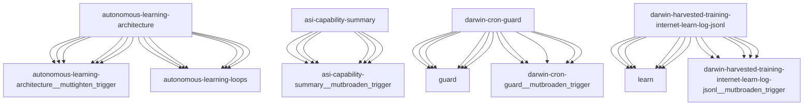

# Darwin Engine Report
_2026-11-10T19:22:47.003671+00:00 — evolutionary skill ecosystem_

**Population:** 1288 Skills | **Offspring:** 4 | **Competitions:** 33

## Top 10 (fittest skills)

| Skill | Fitness | Usage | Age (days) | Mutationen W/L |
|---|---|---|---|---|
| darwin-cron-guard | 3552.0 | 278 | 0 | 1654/48 |
| darwin-harvested-training-internet-learn-log-jsonl | 3530.0 | 271 | 0 | 1633/21 |
| autonomous-learning-architecture | 3295.0 | 355 | 0 | 1615/306 |
| learning-loop | 421.33 | 411 | 80 | 0/0 |
| asi-capability-summary | 286.43 | 275 | 47 | 0/0 |
| a2a-brain-meshlearn-verify | 286.03 | 274 | 29 | 0/0 |
| auto-env-checker | 208.43 | 255 | 47 | 15/88 |
| mini-openamer | 207.1 | 195 | 27 | 0/0 |
| cdp-social-posting | 90.07 | 75 | 28 | 0/0 |
| dream-cycle | 74.67 | 64 | 70 | 0/0 |

## Bottom 5 (selection candidates)

- **tao-train-optical-inspection** (Fitness 6.97, 31 days old)
- **web-artifacts-builder** (Fitness 6.97, 31 days old)
- **xlsx** (Fitness 6.97, 31 days old)
- **cron-autotest-run-cron-entry** (Fitness 6.3, 51 days old)
- **self-rewriter** (Fitness -2.4, 72 days old)

## New mutations

- darwin-cron-guard → `darwin-cron-guard__mutbroaden_trigger` (op=broaden_trigger, applied=True)
- darwin-harvested-training-internet-learn-log-jsonl → `darwin-harvested-training-internet-learn-log-jsonl__mutbroaden_trigger` (op=broaden_trigger, applied=True)
- autonomous-learning-architecture → `autonomous-learning-architecture__muttighten_trigger` (op=tighten_trigger, applied=True)
- asi-capability-summary → `asi-capability-summary__mutbroaden_trigger` (op=broaden_trigger, applied=True)

## Competitions

- ⏳ `a2a-brain-meshlearn-verify+asi-capability-summary` (0) vs `None` (0)
- ⏳ `a2a-brain-meshlearn-verify__mutbroaden_trigger` (286.03) vs `a2a-brain-meshlearn-verify` (286.03)
- ⏳ `a2a-brain-meshlearn-verify__muttighten_trigger` (286.03) vs `a2a-brain-meshlearn-verify` (286.03)
- ⏳ `asi-capability-summary+asi-identity` (0) vs `None` (0)
- ⏳ `asi-capability-summary__mutbroaden_trigger` (286.43) vs `asi-capability-summary` (286.43)
- ⏳ `asi-capability-summary__muttighten_trigger` (286.43) vs `asi-capability-summary` (286.43)
- ⏳ `asi-identity+auto-env-checker` (0) vs `None` (0)
- ⏳ `auto-env-checker+autonomous-learning-architecture` (0) vs `None` (0)
- ⏳ `auto-env-checker+cdp-social-posting` (0) vs `None` (0)
- ⏳ `auto-env-checker__mutbroaden_trigger` (208.43) vs `auto-env-checker` (208.43)
- ⏳ `auto-env-checker__muttighten_trigger` (208.43) vs `auto-env-checker` (208.43)
- ⏳ `autonomous-learning-architecture__mutbroaden_trigger` (3295.0) vs `autonomous-learning-architecture` (3295.0)
- ⏳ `autonomous-learning-architecture__muttighten_trigger` (3295.0) vs `autonomous-learning-architecture` (3295.0)
- ⏳ `cdp-social-posting__mutbroaden_trigger` (90.07) vs `cdp-social-posting` (90.07)
- ⏳ `cdp-social-posting__muttighten_trigger` (90.07) vs `cdp-social-posting` (90.07)
- ⏳ `darwin-cron-guard__mutbroaden_trigger` (3552.0) vs `darwin-cron-guard` (3552.0)
- ⏳ `darwin-cron-guard__muttighten_trigger` (3552.0) vs `darwin-cron-guard` (3552.0)
- ⏳ `darwin-harvested-training-internet-learn-log-jsonl__mutbroaden_trigger` (3530.0) vs `darwin-harvested-training-internet-learn-log-jsonl` (3530.0)
- ⏳ `darwin-harvested-training-internet-learn-log-jsonl__muttighten_trigger` (3530.0) vs `darwin-harvested-training-internet-learn-log-jsonl` (3530.0)
- ⏳ `discord-server-management__mutadd_verification_step` (15.2) vs `discord-server-management` (15.2)
- ⏳ `discord-server-management__mutbroaden_trigger` (15.2) vs `discord-server-management` (15.2)
- ⏳ `discord-server-management__muttighten_trigger` (15.2) vs `discord-server-management` (15.2)
- ⏳ `github-readme-summary__mutbroaden_trigger` (19.0) vs `github-readme-summary` (19.0)
- ⏳ `github-readme-summary__muttighten_trigger` (19.0) vs `github-readme-summary` (19.0)
- ⏳ `openamer-plugin-development__muttighten_trigger` (20.73) vs `openamer-plugin-development` (20.73)
- ⏳ `plugin-api__mutbroaden_trigger` (21.33) vs `plugin-api` (21.33)
- ⏳ `plugin-api__muttighten_trigger` (21.33) vs `plugin-api` (21.33)
- ⏳ `train-from-usage__mutadd_pitfall` (28.33) vs `train-from-usage` (28.33)
- ⏳ `train-from-usage__mutadd_verification_step` (28.33) vs `train-from-usage` (28.33)
- ⏳ `train-from-usage__mutbroaden_trigger` (28.33) vs `train-from-usage` (28.33)
- ⏳ `train-from-usage__muttighten_trigger` (28.33) vs `train-from-usage` (28.33)
- ⏳ `undetectable-browsing__muttighten_trigger` (18.4) vs `undetectable-browsing` (18.4)
- ⏳ `vscode-extension-scaffold__mutbroaden_trigger` (16.33) vs `vscode-extension-scaffold` (16.33)

## Evolution Tree

```mermaid
graph TD
    autonomous-learning-architecture["autonomous-learning-architecture"] --> autonomous-learning-architecture__muttighten_trigger["autonomous-learning-architecture__muttighten_trigger"]
    asi-capability-summary["asi-capability-summary"] --> asi-capability-summary__mutbroaden_trigger["asi-capability-summary__mutbroaden_trigger"]
    darwin-cron-guard["darwin-cron-guard"] --> guard["guard"]
    darwin-harvested-training-internet-learn-log-jsonl["darwin-harvested-training-internet-learn-log-jsonl"] --> learn["learn"]
    autonomous-learning-architecture["autonomous-learning-architecture"] --> autonomous-learning-loops["autonomous-learning-loops"]
    darwin-cron-guard["darwin-cron-guard"] --> darwin-cron-guard__mutbroaden_trigger["darwin-cron-guard__mutbroaden_trigger"]
    darwin-harvested-training-internet-learn-log-jsonl["darwin-harvested-training-internet-learn-log-jsonl"] --> darwin-harvested-training-internet-learn-log-jsonl__mutbroaden_trigger["darwin-harvested-training-internet-learn-log-jsonl__mutbroaden_trigger"]
    autonomous-learning-architecture["autonomous-learning-architecture"] --> autonomous-learning-architecture__muttighten_trigger["autonomous-learning-architecture__muttighten_trigger"]
    asi-capability-summary["asi-capability-summary"] --> asi-capability-summary__mutbroaden_trigger["asi-capability-summary__mutbroaden_trigger"]
    darwin-cron-guard["darwin-cron-guard"] --> guard["guard"]
    darwin-harvested-training-internet-learn-log-jsonl["darwin-harvested-training-internet-learn-log-jsonl"] --> learn["learn"]
    autonomous-learning-architecture["autonomous-learning-architecture"] --> autonomous-learning-loops["autonomous-learning-loops"]
    darwin-cron-guard["darwin-cron-guard"] --> darwin-cron-guard__mutbroaden_trigger["darwin-cron-guard__mutbroaden_trigger"]
    darwin-harvested-training-internet-learn-log-jsonl["darwin-harvested-training-internet-learn-log-jsonl"] --> darwin-harvested-training-internet-learn-log-jsonl__mutbroaden_trigger["darwin-harvested-training-internet-learn-log-jsonl__mutbroaden_trigger"]
    autonomous-learning-architecture["autonomous-learning-architecture"] --> autonomous-learning-architecture__muttighten_trigger["autonomous-learning-architecture__muttighten_trigger"]
    asi-capability-summary["asi-capability-summary"] --> asi-capability-summary__mutbroaden_trigger["asi-capability-summary__mutbroaden_trigger"]
    darwin-cron-guard["darwin-cron-guard"] --> guard["guard"]
    darwin-harvested-training-internet-learn-log-jsonl["darwin-harvested-training-internet-learn-log-jsonl"] --> learn["learn"]
    autonomous-learning-architecture["autonomous-learning-architecture"] --> autonomous-learning-loops["autonomous-learning-loops"]
    darwin-cron-guard["darwin-cron-guard"] --> darwin-cron-guard__mutbroaden_trigger["darwin-cron-guard__mutbroaden_trigger"]
    darwin-harvested-training-internet-learn-log-jsonl["darwin-harvested-training-internet-learn-log-jsonl"] --> darwin-harvested-training-internet-learn-log-jsonl__mutbroaden_trigger["darwin-harvested-training-internet-learn-log-jsonl__mutbroaden_trigger"]
    autonomous-learning-architecture["autonomous-learning-architecture"] --> autonomous-learning-architecture__muttighten_trigger["autonomous-learning-architecture__muttighten_trigger"]
    asi-capability-summary["asi-capability-summary"] --> asi-capability-summary__mutbroaden_trigger["asi-capability-summary__mutbroaden_trigger"]
    darwin-cron-guard["darwin-cron-guard"] --> guard["guard"]
    darwin-harvested-training-internet-learn-log-jsonl["darwin-harvested-training-internet-learn-log-jsonl"] --> learn["learn"]
    autonomous-learning-architecture["autonomous-learning-architecture"] --> autonomous-learning-loops["autonomous-learning-loops"]
    darwin-cron-guard["darwin-cron-guard"] --> darwin-cron-guard__mutbroaden_trigger["darwin-cron-guard__mutbroaden_trigger"]
    darwin-harvested-training-internet-learn-log-jsonl["darwin-harvested-training-internet-learn-log-jsonl"] --> darwin-harvested-training-internet-learn-log-jsonl__mutbroaden_trigger["darwin-harvested-training-internet-learn-log-jsonl__mutbroaden_trigger"]
    autonomous-learning-architecture["autonomous-learning-architecture"] --> autonomous-learning-architecture__muttighten_trigger["autonomous-learning-architecture__muttighten_trigger"]
    asi-capability-summary["asi-capability-summary"] --> asi-capability-summary__mutbroaden_trigger["asi-capability-summary__mutbroaden_trigger"]
    darwin-cron-guard["darwin-cron-guard"] --> guard["guard"]
    darwin-harvested-training-internet-learn-log-jsonl["darwin-harvested-training-internet-learn-log-jsonl"] --> learn["learn"]
    autonomous-learning-architecture["autonomous-learning-architecture"] --> autonomous-learning-loops["autonomous-learning-loops"]
    darwin-cron-guard["darwin-cron-guard"] --> darwin-cron-guard__mutbroaden_trigger["darwin-cron-guard__mutbroaden_trigger"]
    darwin-harvested-training-internet-learn-log-jsonl["darwin-harvested-training-internet-learn-log-jsonl"] --> darwin-harvested-training-internet-learn-log-jsonl__mutbroaden_trigger["darwin-harvested-training-internet-learn-log-jsonl__mutbroaden_trigger"]
    autonomous-learning-architecture["autonomous-learning-architecture"] --> autonomous-learning-architecture__muttighten_trigger["autonomous-learning-architecture__muttighten_trigger"]
    asi-capability-summary["asi-capability-summary"] --> asi-capability-summary__mutbroaden_trigger["asi-capability-summary__mutbroaden_trigger"]
    darwin-cron-guard["darwin-cron-guard"] --> guard["guard"]
    darwin-harvested-training-internet-learn-log-jsonl["darwin-harvested-training-internet-learn-log-jsonl"] --> learn["learn"]
    autonomous-learning-architecture["autonomous-learning-architecture"] --> autonomous-learning-loops["autonomous-learning-loops"]
```
