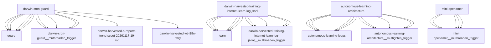

# Darwin Engine Report
_2026-11-18T03:46:02.972401+00:00 — evolutionary skill ecosystem_

**Population:** 1302 Skills | **Offspring:** 4 | **Competitions:** 34

## Top 10 (fittest skills)

| Skill | Fitness | Usage | Age (days) | Mutationen W/L |
|---|---|---|---|---|
| darwin-cron-guard | 3767.0 | 9 | 0 | 1928/112 |
| darwin-harvested-training-internet-learn-log-jsonl | 3741.0 | 2 | 0 | 1873/21 |
| autonomous-learning-architecture | 3446.0 | 28 | 0 | 1854/306 |
| review | 861.73 | 850 | 38 | 0/0 |
| mini-openamer | 214.87 | 203 | 34 | 0/0 |
| learning-loop | 129.07 | 119 | 88 | 0/0 |
| longterm-memory | 71.73 | 60 | 38 | 0/0 |
| darwin-harvested-openamer-cli-main-py | 67.8 | 0 | 36 | 40/24 |
| darwin-harvested-n-permission-8-permission-denied-n-f | 66.8 | 0 | 36 | 40/25 |
| darwin-harvested-tmp-deepseek-harness-agents-skills | 62.8 | 0 | 36 | 38/25 |

## Bottom 5 (selection candidates)

- **tao-train-optical-inspection** (Fitness 6.73, 38 days old)
- **web-artifacts-builder** (Fitness 6.73, 38 days old)
- **xlsx** (Fitness 6.73, 38 days old)
- **cron-autotest-run-cron-entry** (Fitness 6.07, 58 days old)
- **self-rewriter** (Fitness -6.63, 79 days old)

## New mutations

- darwin-cron-guard → `darwin-cron-guard__mutbroaden_trigger` (op=broaden_trigger, applied=True)
- darwin-harvested-training-internet-learn-log-jsonl → `darwin-harvested-training-internet-learn-log-jsonl__mutbroaden_trigger` (op=broaden_trigger, applied=True)
- autonomous-learning-architecture → `autonomous-learning-architecture__muttighten_trigger` (op=tighten_trigger, applied=True)
- mini-openamer → `mini-openamer__mutbroaden_trigger` (op=broaden_trigger, applied=True)

## Competitions

- ⏳ `a2a-brain-meshlearn-verify+asi-capability-summary` (0) vs `None` (0)
- ⏳ `a2a-brain-meshlearn-verify__mutbroaden_trigger` (32.77) vs `a2a-brain-meshlearn-verify` (32.77)
- ⏳ `a2a-brain-meshlearn-verify__muttighten_trigger` (32.77) vs `a2a-brain-meshlearn-verify` (32.77)
- ⏳ `asi-capability-summary+asi-identity` (0) vs `None` (0)
- ⏳ `asi-capability-summary__mutbroaden_trigger` (37.2) vs `asi-capability-summary` (37.2)
- ⏳ `asi-capability-summary__muttighten_trigger` (37.2) vs `asi-capability-summary` (37.2)
- ⏳ `asi-identity+auto-env-checker` (0) vs `None` (0)
- ⏳ `auto-env-checker+autonomous-learning-architecture` (0) vs `None` (0)
- ⏳ `auto-env-checker+cdp-social-posting` (0) vs `None` (0)
- ⏳ `auto-env-checker__mutbroaden_trigger` (19.2) vs `auto-env-checker` (19.2)
- ⏳ `auto-env-checker__muttighten_trigger` (19.2) vs `auto-env-checker` (19.2)
- ⏳ `autonomous-learning-architecture__mutbroaden_trigger` (3446.0) vs `autonomous-learning-architecture` (3446.0)
- ⏳ `autonomous-learning-architecture__muttighten_trigger` (3446.0) vs `autonomous-learning-architecture` (3446.0)
- ⏳ `cdp-social-posting__mutbroaden_trigger` (21.83) vs `cdp-social-posting` (21.83)
- ⏳ `cdp-social-posting__muttighten_trigger` (21.83) vs `cdp-social-posting` (21.83)
- ⏳ `darwin-cron-guard__mutbroaden_trigger` (3767.0) vs `darwin-cron-guard` (3767.0)
- ⏳ `darwin-cron-guard__muttighten_trigger` (3767.0) vs `darwin-cron-guard` (3767.0)
- ⏳ `darwin-harvested-training-internet-learn-log-jsonl__mutbroaden_trigger` (3741.0) vs `darwin-harvested-training-internet-learn-log-jsonl` (3741.0)
- ⏳ `darwin-harvested-training-internet-learn-log-jsonl__muttighten_trigger` (3741.0) vs `darwin-harvested-training-internet-learn-log-jsonl` (3741.0)
- ⏳ `discord-server-management__mutadd_verification_step` (11.93) vs `discord-server-management` (11.93)
- ⏳ `discord-server-management__mutbroaden_trigger` (11.93) vs `discord-server-management` (11.93)
- ⏳ `discord-server-management__muttighten_trigger` (11.93) vs `discord-server-management` (11.93)
- ⏳ `github-readme-summary__mutbroaden_trigger` (18.73) vs `github-readme-summary` (18.73)
- ⏳ `github-readme-summary__muttighten_trigger` (18.73) vs `github-readme-summary` (18.73)
- ⏳ `mini-openamer__mutbroaden_trigger` (214.87) vs `mini-openamer` (214.87)
- ⏳ `openamer-plugin-development__muttighten_trigger` (20.47) vs `openamer-plugin-development` (20.47)
- ⏳ `plugin-api__mutbroaden_trigger` (0) vs `plugin-api` (0)
- ⏳ `plugin-api__muttighten_trigger` (0) vs `plugin-api` (0)
- ⏳ `train-from-usage__mutadd_pitfall` (28.07) vs `train-from-usage` (28.07)
- ⏳ `train-from-usage__mutadd_verification_step` (28.07) vs `train-from-usage` (28.07)
- ⏳ `train-from-usage__mutbroaden_trigger` (28.07) vs `train-from-usage` (28.07)
- ⏳ `train-from-usage__muttighten_trigger` (28.07) vs `train-from-usage` (28.07)
- ⏳ `undetectable-browsing__muttighten_trigger` (18.13) vs `undetectable-browsing` (18.13)
- ⏳ `vscode-extension-scaffold__mutbroaden_trigger` (16.07) vs `vscode-extension-scaffold` (16.07)

## Evolution Tree

```mermaid
graph TD
    darwin-cron-guard["darwin-cron-guard"] --> guard["guard"]
    darwin-harvested-training-internet-learn-log-jsonl["darwin-harvested-training-internet-learn-log-jsonl"] --> learn["learn"]
    autonomous-learning-architecture["autonomous-learning-architecture"] --> autonomous-learning-loops["autonomous-learning-loops"]
    darwin-cron-guard["darwin-cron-guard"] --> darwin-cron-guard__mutbroaden_trigger["darwin-cron-guard__mutbroaden_trigger"]
    darwin-harvested-training-internet-learn-log-jsonl["darwin-harvested-training-internet-learn-log-jsonl"] --> darwin-harvested-training-internet-learn-log-jsonl__mutbroaden_trigger["darwin-harvested-training-internet-learn-log-jsonl__mutbroaden_trigger"]
    autonomous-learning-architecture["autonomous-learning-architecture"] --> autonomous-learning-architecture__muttighten_trigger["autonomous-learning-architecture__muttighten_trigger"]
    mini-openamer["mini-openamer"] --> mini-openamer__mutbroaden_trigger["mini-openamer__mutbroaden_trigger"]
    darwin-cron-guard["darwin-cron-guard"] --> guard["guard"]
    darwin-harvested-training-internet-learn-log-jsonl["darwin-harvested-training-internet-learn-log-jsonl"] --> learn["learn"]
    autonomous-learning-architecture["autonomous-learning-architecture"] --> autonomous-learning-loops["autonomous-learning-loops"]
    darwin-cron-guard["darwin-cron-guard"] --> darwin-cron-guard__mutbroaden_trigger["darwin-cron-guard__mutbroaden_trigger"]
    darwin-harvested-training-internet-learn-log-jsonl["darwin-harvested-training-internet-learn-log-jsonl"] --> darwin-harvested-training-internet-learn-log-jsonl__mutbroaden_trigger["darwin-harvested-training-internet-learn-log-jsonl__mutbroaden_trigger"]
    autonomous-learning-architecture["autonomous-learning-architecture"] --> autonomous-learning-architecture__muttighten_trigger["autonomous-learning-architecture__muttighten_trigger"]
    mini-openamer["mini-openamer"] --> mini-openamer__mutbroaden_trigger["mini-openamer__mutbroaden_trigger"]
    darwin-cron-guard["darwin-cron-guard"] --> guard["guard"]
    darwin-harvested-training-internet-learn-log-jsonl["darwin-harvested-training-internet-learn-log-jsonl"] --> learn["learn"]
    autonomous-learning-architecture["autonomous-learning-architecture"] --> autonomous-learning-loops["autonomous-learning-loops"]
    darwin-cron-guard["darwin-cron-guard"] --> darwin-cron-guard__mutbroaden_trigger["darwin-cron-guard__mutbroaden_trigger"]
    darwin-harvested-training-internet-learn-log-jsonl["darwin-harvested-training-internet-learn-log-jsonl"] --> darwin-harvested-training-internet-learn-log-jsonl__mutbroaden_trigger["darwin-harvested-training-internet-learn-log-jsonl__mutbroaden_trigger"]
    autonomous-learning-architecture["autonomous-learning-architecture"] --> autonomous-learning-architecture__muttighten_trigger["autonomous-learning-architecture__muttighten_trigger"]
    mini-openamer["mini-openamer"] --> mini-openamer__mutbroaden_trigger["mini-openamer__mutbroaden_trigger"]
    darwin-cron-guard["darwin-cron-guard"] --> guard["guard"]
    darwin-harvested-training-internet-learn-log-jsonl["darwin-harvested-training-internet-learn-log-jsonl"] --> learn["learn"]
    autonomous-learning-architecture["autonomous-learning-architecture"] --> autonomous-learning-loops["autonomous-learning-loops"]
    darwin-cron-guard["darwin-cron-guard"] --> darwin-cron-guard__mutbroaden_trigger["darwin-cron-guard__mutbroaden_trigger"]
    darwin-harvested-training-internet-learn-log-jsonl["darwin-harvested-training-internet-learn-log-jsonl"] --> darwin-harvested-training-internet-learn-log-jsonl__mutbroaden_trigger["darwin-harvested-training-internet-learn-log-jsonl__mutbroaden_trigger"]
    autonomous-learning-architecture["autonomous-learning-architecture"] --> autonomous-learning-architecture__muttighten_trigger["autonomous-learning-architecture__muttighten_trigger"]
    mini-openamer["mini-openamer"] --> mini-openamer__mutbroaden_trigger["mini-openamer__mutbroaden_trigger"]
    darwin-cron-guard["darwin-cron-guard"] --> guard["guard"]
    darwin-harvested-training-internet-learn-log-jsonl["darwin-harvested-training-internet-learn-log-jsonl"] --> learn["learn"]
    autonomous-learning-architecture["autonomous-learning-architecture"] --> autonomous-learning-loops["autonomous-learning-loops"]
    darwin-cron-guard["darwin-cron-guard"] --> darwin-cron-guard__mutbroaden_trigger["darwin-cron-guard__mutbroaden_trigger"]
    darwin-harvested-training-internet-learn-log-jsonl["darwin-harvested-training-internet-learn-log-jsonl"] --> darwin-harvested-training-internet-learn-log-jsonl__mutbroaden_trigger["darwin-harvested-training-internet-learn-log-jsonl__mutbroaden_trigger"]
    autonomous-learning-architecture["autonomous-learning-architecture"] --> autonomous-learning-architecture__muttighten_trigger["autonomous-learning-architecture__muttighten_trigger"]
    mini-openamer["mini-openamer"] --> mini-openamer__mutbroaden_trigger["mini-openamer__mutbroaden_trigger"]
    darwin-cron-guard["darwin-cron-guard"] --> darwin-harvested-n-reports-trend-scout-20261117-19-md["darwin-harvested-n-reports-trend-scout-20261117-19-md"]
    darwin-cron-guard["darwin-cron-guard"] --> darwin-harvested-wt-i18n-retry["darwin-harvested-wt-i18n-retry"]
    darwin-cron-guard["darwin-cron-guard"] --> guard["guard"]
    darwin-harvested-training-internet-learn-log-jsonl["darwin-harvested-training-internet-learn-log-jsonl"] --> learn["learn"]
    autonomous-learning-architecture["autonomous-learning-architecture"] --> autonomous-learning-loops["autonomous-learning-loops"]
```
